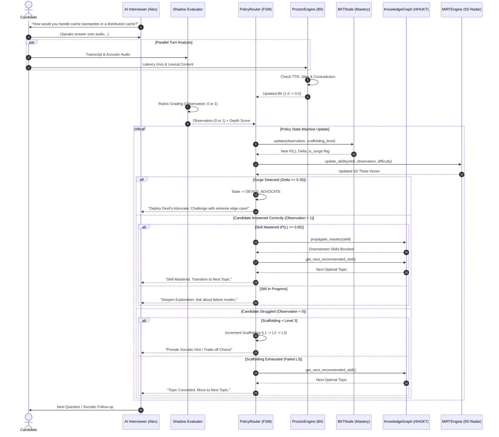
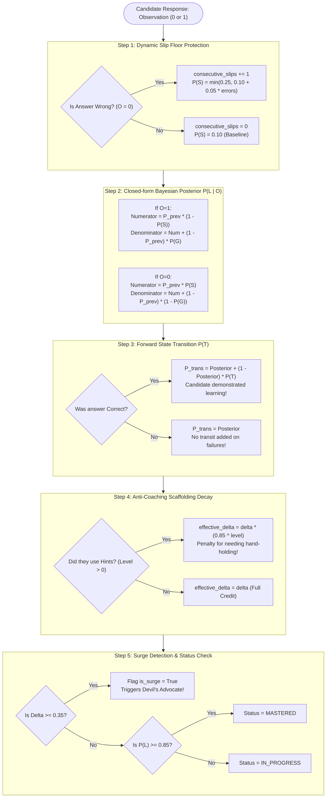
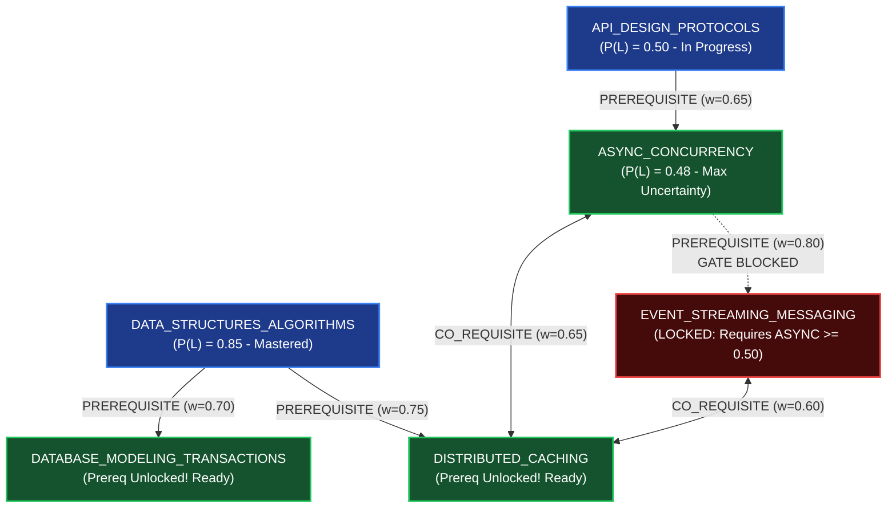
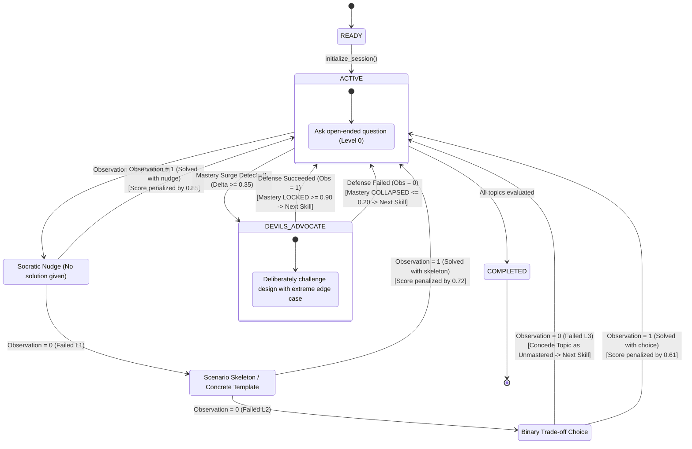
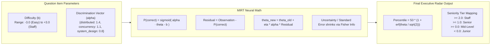
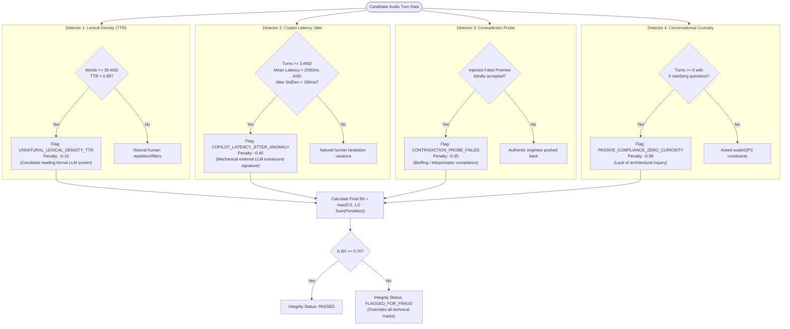

# Socratic Interview Engine — Visual Architectural Guide
**Phases 1 to 5: Mathematical Foundations & Core Routing Engines**

---

## 1. Master System Flow: What Happens on Every Turn?

In a live interview, when the candidate speaks, five engines work together in milliseconds to evaluate, score, proctor, and route the conversation.

---

## 2. Engine 1: Bayesian Knowledge Tracing (BKT) — `app/bkt_engine.py`

### Why do we need it?
In classical tests, an answer is either 100% correct or 0% wrong. But in an interview:
- A candidate might get a question right by a lucky guess or memorized buzzword (**Guess rate $P(G)$**).
- A great senior engineer might stumble on a small syntax detail (**Slip rate $P(S)$**).
- Interviews are dialogues where people learn as they speak (**Transit rate $P(T)$**).

BKT maintains a continuous belief probability $P(L) \in [0.001, 0.999]$ representing the true probability that the candidate has mastered the concept.

### The Key Calibrations We Made:
| Parameter | Classroom BKT | Our Interview Engine | Why We Changed It |
|---|---|---|---|
| **$P(G)$ (Guess)** | `0.05` | `0.20` | Candidates can bluff or recite buzzwords. $0.05$ caused 1 correct answer to give instant 95% mastery. |
| **$P(T)$ (Transit)** | `0.15` (unconditional) | `0.05` (conditional on $O=1$) | Failing a question in an interview does not magically teach the candidate distributed systems. |
| **Slip Floor** | Fixed `0.10` | Dynamic `0.10 -> 0.25` | Consecutive failures cannot be excused as "accidental slips". |

---

## 3. Engine 2: Hierarchical Heterogeneous Knowledge Graph (HHGKT) — `app/graph_engine.py`

### Why do we need it?
An engineer's knowledge is not a flat list of independent questions. Skills depend on each other hierarchically.

The Knowledge Graph manages two key relationships:
1. **`PREREQUISITE` (Directed $A \to B$):** Skill A must have $P(L) \ge 0.50$ before the interviewer is allowed to ask about Skill B.
2. **`CO_REQUISITE` (Bidirectional $A \leftrightarrow B$):** Synergistic skills that reinforce each other.

### The Two Core Graph Algorithms:

#### 1. Mastery Propagation (Message Passing)
When a candidate masters DSA ($P(L) \ge 0.85$), confidence automatically flows downstream:
$$\text{Influence} = (P(L_{\text{DSA}}) - 0.50) \times \text{weight} \times 0.40$$
- If you prove you know Hash Maps and Trees, your initial prior for **Distributed Caching** automatically jumps from `0.40 -> 0.52`.

#### 2. Active Information Gain (Question Selection)
To avoid wasting interview time, the graph recommends the topic with **Maximum Uncertainty** (closest to $P(L) = 0.50$):
$$\text{Uncertainty} = 1.0 - |P(L) - 0.50|$$
- If Skill A is at `0.85` (already known) and Skill B is at `0.48` (uncertain): the engine **picks Skill B** to maximize knowledge gained per turn.

---

## 4. Engine 3: Policy Router & Finite State Machine (FSM) — `app/policy_router.py`

### Why do we need it?
An AI interviewer cannot just ask random questions. It needs a deterministic pedagogical strategy:
- When should it give a hint?
- What kind of hint?
- When should it attack a suspicious claim?
- When should it stop and move to the next topic?

---

## 5. Engine 4: Multidimensional Item Response Theory (MIRT) — `app/mirt_engine.py`

### Why do we need it?
BKT tells us if someone knows *Distributed Caching*. But hiring managers need to know:
> *"Is this person a Mid-level or a Staff engineer in System Design?"*

MIRT maps every turn onto a continuous **5-Dimensional Ability Vector ($\boldsymbol{\theta}$)**:
1. `algorithms`
2. `system_design`
3. `concurrency`
4. `databases`
5. `distributed_systems`

### The Difference Between Classical Scoring and MIRT:
- **Classical Test:** Getting an easy question right gives 1 point. Getting an impossible question right gives 1 point.
- **MIRT:** 
  - If you solve a **Difficulty $+1.8$** question, $\theta$ jumps significantly.
  - If you fail a **Difficulty $+1.8$** question, the model expected you to struggle anyway, so your score **barely drops**!

---

## 6. Engine 5: Behavioral Proctor Engine (BII) — `app/proctor_engine.py`

### Why do we need it?
In remote AI interviews, candidates can cheat using:
1. **ChatGPT/Claude screens** (reading pre-generated text).
2. **Audio transcription copilots** (listening through headphones).
3. **Memorized buzzwords without real comprehension**.

The Proctor Engine monitors behavioral acoustics and linguistics to maintain the **Behavioral Integrity Index ($\text{BII}$)**:
- Starts at **`1.00`** (flawless integrity).
- If $\text{BII} < \mathbf{0.70}$, the candidate is classified as **`FLAGGED_FOR_FRAUD`** (automatic disqualification regardless of technical score).

---

## 7. Complete Summary Table

| Engine | File | Mathematical Foundation | Core Role in Interview |
|---|---|---|---|
| **BKT Engine** | `app/bkt_engine.py` | Closed-form Bayesian Probability & Scaffolding Decay | Tracks **per-skill latent mastery** $P(L) \in [0, 1]$ |
| **Knowledge Graph** | `app/graph_engine.py` | Graph Message Passing & Active Information Gain | Enforces **prerequisites** & picks the optimal next question |
| **Policy Router** | `app/policy_router.py` | Deterministic Finite State Machine (FSM) | Directs the interviewer (**Hints, Devil's Advocate, Transitions**) |
| **MIRT Engine** | `app/mirt_engine.py` | Multidimensional Item Response Theory & Fisher Info | Computes **5D Engineering Ability Radar** & Percentiles |
| **Proctor Engine** | `app/proctor_engine.py` | Shannon Entropy, Acoustic Jitter & Contradiction Probing | Detects **AI teleprompter cheating** via BII score |

---

## What Comes Next in Phase 6?
Now that the scoring, graph navigation, policy directing, ability radar, and fraud proctoring are completely built and verified, we are ready for **Phase 6: The Shadow Evaluator (`app/evaluator_engine.py`)**. 

The Shadow Evaluator is the background listener that sends the candidate's transcript to **Gemini 2.5 Flash**, grades it against multidimensional rubrics in under 6.5 seconds, and outputs the `observation` (`0` or `1`) and `depth_score` that feeds directly into all the engines above!
