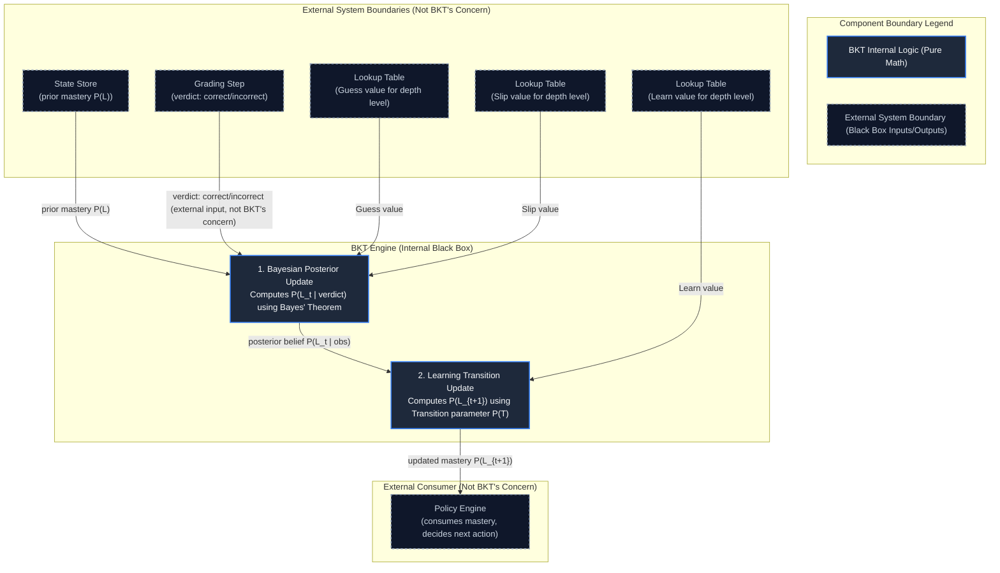
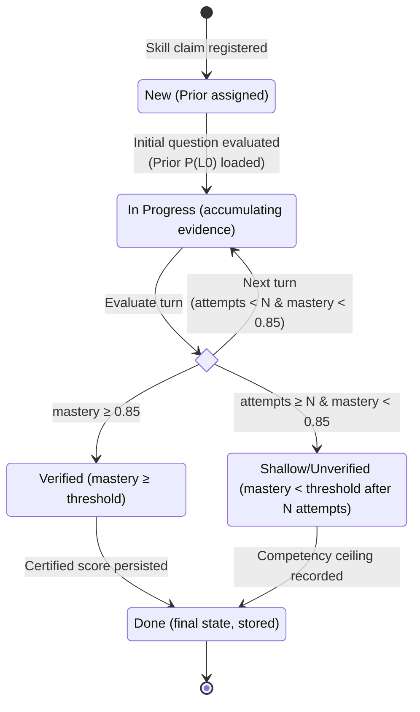
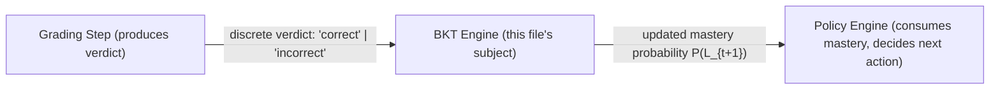

# Bayesian Knowledge Tracing (BKT) Engine

## 1. Executive Summary
Bayesian Knowledge Tracing (BKT) is a specialized Hidden Markov Model that dynamically infers the unobservable latent probability that a candidate genuinely understands a specific skill concept. Formulated originally by Corbett & Anderson (1994), BKT updates its belief state after every graded answer via closed-form Bayesian probability equations rather than heuristic scoring. It is the established standard in real-world intelligent tutoring systems (such as Carnegie Learning's Cognitive Tutor) and is maintained in open-source reference implementations such as `pyBKT`. In this interview architecture, BKT serves as the mathematical memory layer, isolating mastery calculations from language processing.

---

## 2. The Four Parameters

| Parameter | Symbol | Plain-English Meaning | Why It Exists (what fails without it) |
| :--- | :---: | :--- | :--- |
| **Prior** | $P(L_0)$ | Initial probability that the candidate possesses mastery of the skill before answering any questions. | Without it, the system has no baseline starting point and would have to arbitrarily assume either total ignorance or perfect competence. |
| **Learn** | $P(T)$ | Probability that an unknowledgeable candidate transitions to mastery during or immediately following the question turn. | Without it, mastery estimates would remain strictly static over time, unable to model candidate reasoning or mid-interview concept acquisition. |
| **Guess** | $P(G)$ | Probability that an unknowledgeable candidate produces a correct answer by chance, deduction, or surface buzzwords. | Without it, every lucky answer would instantly be mistaken for true mastery, creating vulnerability to fluent bluffers. |
| **Slip** | $P(S)$ | Probability that a candidate who genuinely understands the concept produces an incorrect answer due to a typo or slip. | Without it, a single nervous slip or slight phrasing error would unfairly collapse a skilled candidate's score back to zero. |

---

## 3. Internal Mechanism Diagram

The BKT Engine operates as an isolated mathematical unit. It takes prior state and question parameters alongside an external verdict, executes a two-phase Bayesian update, and outputs a revised mastery probability to the Policy Engine.



---

## 4. The Formulas

```
====================================================================================================
1. POSTERIOR UPDATE IF OBSERVED VERDICT IS CORRECT:
====================================================================================================
                         P(L_{t-1}) * (1 - P(S))
   P(L_t | Correct) = -----------------------------------------------------------
                       P(L_{t-1}) * (1 - P(S)) + (1 - P(L_{t-1})) * P(G)

   // P(L_{t-1}) : Prior mastery probability before this turn
   // (1 - P(S)) : Likelihood of a correct response given candidate has mastery (1 - Slip)
   // (1 - P(L)) : Probability candidate does not currently possess mastery
   // P(G)       : Likelihood of a correct response despite lacking mastery (Guess)

====================================================================================================
2. POSTERIOR UPDATE IF OBSERVED VERDICT IS INCORRECT:
====================================================================================================
                           P(L_{t-1}) * P(S)
   P(L_t | Incorrect) = ---------------------------------------------------------
                         P(L_{t-1}) * P(S) + (1 - P(L_{t-1})) * (1 - P(G))

   // P(S)       : Probability of an incorrect answer despite possessing mastery (Slip)
   // (1 - P(G)) : Probability of an incorrect answer given candidate lacks mastery (1 - Guess)

====================================================================================================
3. LEARNING TRANSITION UPDATE:
====================================================================================================
   P(L_{t+1}) = P(L_t | obs) + (1 - P(L_t | obs)) * P(T)

   // P(L_{t+1})    : Final mastery passed to the next turn / Policy Engine
   // P(L_t | obs)  : Posterior belief computed in Step 1 or Step 2 above
   // (1 - P(L|obs)): Remaining unlearned probability mass
   // P(T)          : Probability of acquiring or clarifying the concept during this turn (Learn)
```

---

## 5. Worked Numeric Example

This walkthrough traces a realistic multi-turn progression across escalating difficulty levels ($L1 \rightarrow L2 \rightarrow L3$), demonstrating how correct verdicts boost mastery while an incorrect response mathematically checks unearned escalation.

| Turn | Depth Level | Prior Mastery $P(L_{t-1})$ | Verdict | Guess Used $P(G)$ | Slip Used $P(S)$ | Learn $P(T)$ | Posterior (post-Bayes) $P(L_t \mid \text{obs})$ | Final Mastery (post-Learn) $P(L_{t+1})$ |
| :---: | :---: | :---: | :---: | :---: | :---: | :---: | :---: | :---: |
| **1** | **L1** (Foundational) | `0.3000` | `correct` | `0.30` | `0.05` | `0.05` | `0.5758` | **`0.5970`** |
| **2** | **L2** (Intermediate) | `0.5970` | `correct` | `0.20` | `0.10` | `0.05` | `0.8695` | **`0.8761`** |
| **3** | **L3** (Advanced) | `0.8761` | `incorrect` | `0.10` | `0.15` | `0.05` | `0.5409` | **`0.5638`** |
| **4** | **L3** (Re-probe) | `0.5638` | `correct` | `0.10` | `0.15` | `0.05` | `0.9166` | **`0.9208`** |

*Note: In Turn 3, when the candidate failed an L3 question, the high slip penalty ($0.15$) and low guess probability ($0.10$) caused mastery to contract sharply from $0.8761$ down to $0.5638$, demonstrating BKT's active resistance to unverified mastery.*

---

## 6. Input Source Mapping — Where Every Number Actually Comes From

This table specifies the definitive operational source and timing for all data consumed by the BKT Engine.

| Input Variable | Literal System Source | When It Is Set |
| :--- | :--- | :--- |
| **Initial Prior $P(L_0)$** | Static configuration table (`depth_level_params`) stored in code/database, keyed by skill difficulty baseline. | Configured once during system deployment by domain designers; never dynamically computed per-candidate. |
| **Guess $P(G)$ per Depth (L1–L4)** | Static configuration table (`depth_level_params`). Configured higher for L1 (0.30) where vocabulary guessing is easy; lower for L4 (0.05) where guessing is near impossible. | Defined statically before interview execution based on question formatting and cognitive depth reasoning. |
| **Slip $P(S)$ per Depth (L1–L4)** | Static configuration table (`depth_level_params`). Configured lower for L1 (0.05) where answers are simple; higher for L3/L4 (0.15–0.20) where syntax slips or minor oversights occur. | Defined statically before interview execution based on domain difficulty calibration. |
| **Learn $P(T)$ per Depth (L1–L4)** | Static configuration table (`depth_level_params`). Configured conservatively (typically 0.05) to model modest interview reflection. | Defined statically before interview execution. |
| **Verdict (`correct` / `incorrect`)** | External grading module (Gemini classification against an immutable locked rubric). | Generated dynamically at runtime after each answer; consumed strictly as an exogenous label by BKT without modifying its value. |
| **Mastery-in-Progress $P(L_t)$ (Turn 2+)** | Carried forward directly from the BKT Engine's own previous turn output for that specific skill session. | Passed dynamically between consecutive turns of the active skill; never re-fetched from the static lookup table. |

---

## 7. State Diagram — Mastery Lifecycle for ONE Skill

The Policy Engine tracks a skill through discrete states based on thresholds evaluated over BKT's continuous output.



---

## 8. Where BKT Fits in the Larger System

BKT serves solely as the intermediate mathematical transformer between observation grading and policy orchestration.



---

## 9. One-Paragraph Summary for Memorization

Bayesian Knowledge Tracing (BKT) is a specialized two-state Hidden Markov Model established by Corbett & Anderson (1994) that mathematically estimates a candidate's unobservable latent mastery of a discrete technical skill over time. It solves the vulnerability of static scoring to noisy single observations by separating genuine competence from lucky guesses and accidental slips. At each turn, BKT takes five inputs—the prior mastery probability carried over from the previous turn, the discrete grading verdict (`correct` or `incorrect`) supplied by an external grader, and three fixed parameter values (Guess, Slip, and Learn) sourced from a designer-calibrated lookup table indexed by question depth level (L1–L4). It executes a two-step closed-form mathematical update—first applying Bayes' theorem to compute evidence posterior belief, and then applying a transition function for latent learning—to output a single calibrated posterior mastery value $P(L_{t+1})$ directly to the Policy Engine for deterministic routing.
