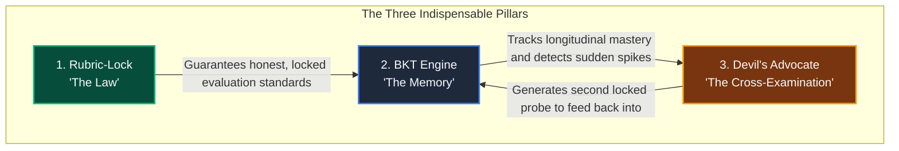
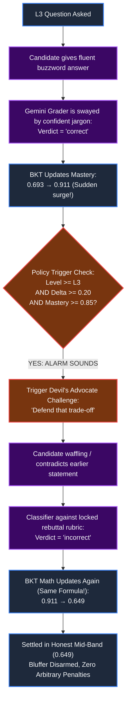
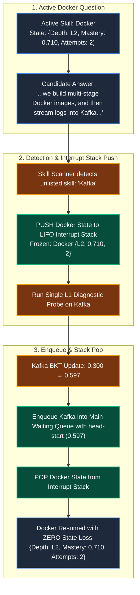

# Bayesian Knowledge Tracing (BKT), Rubric-Lock & Devil's Advocate: The Plain-English Systems Guide

> **For Engineers, By Engineers:**  
> This guide explains the entire adaptive technical interview system in natural, down-to-earth engineering terms. No academic hand-waving, no mystical AI hype. Just clean state machines, Bayesian math, database constraints, and realistic interview transcripts.

---

## 1. The Whiteboard Pitch: What Are We Actually Building?

Imagine you are running a senior engineering interview loop. If you let an unchecked LLM conduct the interview, you immediately hit two catastrophic production bugs:

1. **The Sycophancy / Goalpost Problem:** LLMs are conversational mimics. If a candidate speaks with supreme confidence, charismatic swagger, and drops buzzwords ("Kubernetes", "MVCC", "distributed consensus"), the LLM gets charmed. It unconsciously moves the goalposts, gives them the benefit of the doubt, and awards a passing score to an articulate bluffer.
2. **The Single-Observation Fragility Problem:** Traditional tests treat every question in a vacuum. If a staff engineer has a momentary brain freeze or makes a silly syntax typo on Question 3, static scoring gives them a 0 and fails them. Conversely, if a junior memorized a Medium article the night before and recites a textbook definition on Question 1, static scoring thinks they are a wizard.

To build an evaluation engine that enterprises can actually trust, we decouple **language generation** from **scoring math**. We split responsibilities across three specialized safeguards:

```
+--------------------------------------------------------------------------------------------------+
|                                    THE CORE ARCHITECTURAL TRIAD                                   |
+--------------------------------------------------------------------------------------------------+
| 1. Rubric-Lock ("The Law")            -> Defines the exact answer key in Postgres BEFORE         |
|                                          the candidate speaks. Prevents moving the goalposts.    |
|                                                                                                  |
| 2. BKT Engine ("The Memory")          -> Maintains a Bayesian confidence counter (0.0 to 1.0).   |
|                                          Filters out lucky guesses and forgives nervous slips.   |
|                                                                                                  |
| 3. Devil's Advocate ("The Cross-Exam")-> The cynical lead engineer that steps in when someone    |
|                                          makes an unearned leap on a hard question to say:       |
|                                          "Defend that design trade-off."                         |
+--------------------------------------------------------------------------------------------------+
```

---

## 2. What Each Safeguard Does (And What Breaks Without It)



### 1. Rubric-Lock ("The Law")
* **What it does:** Before Gemini presents a question to the candidate, it must generate a strict boolean evaluation checklist. This checklist is immediately written to a Postgres database table (`locked_rubrics`) and assigned an immutable ID. Only **after** the database returns `201 Created` is the question displayed on the candidate's screen. When the candidate answers, Gemini is called again strictly as a classifier: *"Compare this answer against locked_rubrics row #1042. Does it satisfy items A and B? Output 'correct' or 'incorrect' only."*
* **What it saves:** It completely kills **hindsight leniency**. Without Rubric-Lock, an LLM evaluates the candidate's answer against its own moving mood. If the candidate sounds polished, the LLM rationalizes: *"Well, they didn't mention database locks, but they sounded like they know what they're talking about, so let's call it correct."* With Rubric-Lock, the standard was etched in stone before the candidate uttered a single syllable.
* **Why the others can't cover for it:** BKT does pure math; it cannot know if the verdict fed into it was graded fairly. Devil's Advocate only fires on suspicious jumps; it cannot police everyday foundational questions.

### 2. Bayesian Knowledge Tracing ("The Memory")
* **What it does:** BKT is a specialized Hidden Markov Model that treats a candidate's genuine skill mastery as an **unobservable latent variable** ($P(L)$ between $0.0$ and $1.0$). We cannot stick an oscilloscope into a candidate's brain to read `brain.skills.postgres = 0.85`. We can only observe noisy outputs (answers). BKT uses Bayesian probability to update its confidence state turn-by-turn.
* **What it saves:** It kills **single-answer volatility**. A lucky guess on an easy question doesn't catapult someone to senior level, and a momentary slip on a complex question doesn't trash a competent candidate's score.
* **Why the others can't cover for it:** Rubric-Lock only standardizes one question at a time. Devil's Advocate is just an adversarial question trigger. Neither has any concept of time, memory, or historical progression.

### 3. Devil's Advocate ("The Cross-Examination")
* **What it does:** When a candidate makes a sudden, steep leap into high mastery ($\Delta \ge 0.20$ ending at $\ge 0.85$) on an advanced question ($L3$ or $L4$), the system does not celebrate. It gets suspicious. The Policy Engine triggers Devil's Advocate: an automated challenge question that attacks the candidate's assertion or presents an edge-case trade-off. Crucially, **Devil's Advocate does not invent a special penalty score**. It simply locks a second rubric, captures the candidate's defense, grades it, and feeds the resulting verdict right back through standard BKT math.
* **What it saves:** It catches **sycophantic false positives and fluent buzzword bluffers**. A candidate who memorized architecture buzzwords might fool a rubric on Question 2 by using the right keywords. But when challenged to defend *why* they chose that pattern over an alternative, bluffers fold or contradict themselves.
* **Why the others can't cover for it:** Rubric-Lock can still be tricked if a candidate includes all required keywords superficially. BKT mathematically trusts every `correct` label it receives and will happily compute a 95% mastery from garbage data. Devil's Advocate is the only mechanism that interrogates whether a high-stakes verdict actually deserves to be trusted.

---

## 3. The BKT Math Explained in Plain English

BKT tracks four knobs. Every software engineer understands caching, retry policies, and confidence scores; BKT knobs are just confidence configuration:

| Knob | Symbol | Tech Translation | Real-World Value Range |
| :--- | :---: | :--- | :---: |
| **Prior** | $P(L_0)$ | **Baseline Starting Trust.** The default confidence we have in a candidate before asking anything. | `0.30` (Assumes junior familiarity) |
| **Guess** | $P(G)$ | **Bluff / Fluke Probability.** The chance that an unqualified person produces a correct answer through multiple-choice guessing or buzzword recitation. | `0.30` at L1 (easy to bluff) down to `0.05` at L4 (impossible to fake) |
| **Slip** | $P(S)$ | **Typo / Nervousness Margin.** The chance that a genuine expert botches the answer due to interview anxiety or a minor phrasing slip. | `0.05` at L1 (simple) up to `0.15`–`0.20` at L3/L4 (complex nuances) |
| **Learn** | $P(T)$ | **Cognitive Synthesis Rate.** The modest probability that a candidate solidifies understanding during the turn itself. | `0.05` (Conservative progress) |

### The Core Update: A Simple Confidence Balance

Whenever an answer is graded, BKT performs a two-step calculation:

#### Step 1: Bayes Update (Evidence Weighting)

Think of Bayes' Theorem as a balance scale calculating:  
$$\text{Confidence} = \frac{\text{Evidence supporting genuine mastery}}{\text{Total evidence observed (mastery + luck)}}$$

* **If the answer was CORRECT:**
  $$P(L_t \mid \text{Correct}) = \frac{P(L_{t-1}) \cdot (1 - P(S))}{P(L_{t-1}) \cdot (1 - P(S)) + (1 - P(L_{t-1})) \cdot P(G)}$$
  * *Top (Numerator):* The chance they actually knew it and didn't slip: $P(L) \times (1 - \text{Slip})$.
  * *Bottom (Denominator):* The total probability of seeing a correct answer: (they knew it and didn't slip) PLUS (they were clueless and got lucky with a guess: $(1 - P(L)) \times \text{Guess}$).

* **If the answer was INCORRECT:**
  $$P(L_t \mid \text{Incorrect}) = \frac{P(L_{t-1}) \cdot P(S)}{P(L_{t-1}) \cdot P(S) + (1 - P(L_{t-1})) \cdot (1 - P(G))}$$
  * *Top (Numerator):* The chance a real expert made an honest slip: $P(L) \times \text{Slip}$.
  * *Bottom (Denominator):* The total probability of seeing a wrong answer: (expert slipped) PLUS (clueless person didn't guess right: $(1 - P(L)) \times (1 - \text{Guess})$).

#### Step 2: Latent Learning Transition

$$P(L_{t+1}) = P(L_t \mid \text{obs}) + (1 - P(L_t \mid \text{obs})) \cdot P(T)$$
We take the revised belief and add a small transition factor $P(T)$ representing the unlearned slice of knowledge that might have clicked during the question.

---

### 3.1 The #1 Engineering Question: "How Do We Know If It Was a Slip, a Guess, or Learned?"

This is the most common confusion when engineers first encounter BKT: **Do we have to manually label whether an answer was a slip or a guess? Does the LLM guess the candidate's inner thoughts?**

The short answer is **NO. We never decide if an individual answer was a slip or a guess.** The LLM classifier ONLY ever outputs `correct` or `incorrect`.

Here is how the system actually handles this mathematically:

#### 1. Guess and Slip are properties of the QUESTION, not the candidate
* You don't ask: *"Did Alex guess?"*  
* You ask: *"How guessable is an L1 multiple-choice question in general?"*  
  $\rightarrow$ For anyone on Earth who doesn't know the answer, an L1 question has a $\sim 30\%$ chance of being stumbled into via common vocabulary ($P(G) = 0.30$). An L4 architectural trade-off question has only a $\sim 5\%$ chance of being faked ($P(G) = 0.05$).
* You don't ask: *"Did Alex slip?"*  
* You ask: *"How prone is an L3 question to honest human slips?"*  
  $\rightarrow$ Under high interview pressure, even senior architects have a $\sim 15\%$ chance of a minor syntax typo or phrasing slip on complex questions ($P(S) = 0.15$).

#### 2. The Math considers BOTH possibilities at the exact same time
When Alex gets an answer wrong at L3, BKT does not pick between "Alex slipped" vs "Alex is ignorant."  
Instead, Bayes' Theorem weighs **both possibilities on a balance scale**:
* **Possibility A:** Alex is a legitimate expert ($P(L)$ was high) who made an honest slip ($P(S) = 0.15$).
* **Possibility B:** Alex is clueless ($1 - P(L)$) and couldn't fake it ($1 - P(G) = 0.90$).

Because prior mastery was high, Possibility A carries significant weight. BKT therefore says: *"I won't nuke their score to 0.0. I'll drop them from 0.88 down to 0.56 and wait for more evidence."*

#### 3. How does the system "find out" the truth? Through the NEXT turns!
The system doesn't need to read minds on Turn 3. The **subsequent turns** automatically reveal the truth:

```
                          CANDIDATE GETS QUESTION 3 WRONG
                          (Mastery drops: 0.88 → 0.56)
                                       │
                      ┌────────────────┴────────────────┐
                      ▼                                 ▼
           Case 1: GENUINE SLIP              Case 2: BLUFFER EXPOSED
       (Candidate actually knows it)       (Candidate was faking it all along)
                      │                                 │
              Turn 4: Re-probe                  Turn 4: Re-probe
               Answer: CORRECT                  Answer: INCORRECT
                      │                                 │
           BKT Math: Rebounds to 0.92!        BKT Math: Collapses to 0.18!
       Retrospective proof: Turn 3 was       Retrospective proof: Turn 3 was NOT
             just an isolated slip.               a slip; they truly lack depth.
```

#### 4. What about "Learned" ($P(T)$)?
We don't scan their brain for an epiphany. $P(T) = 0.05$ is a small constant growth parameter modeling the reality that attempting a problem or hearing an interviewer's prompt provides a tiny chance of conceptual realization. But notice: **a candidate cannot game $P(T)$ to reach high mastery without answering questions correctly**, because $P(T)$ only adds a tiny nudge ($+0.01$ to $+0.02$) each turn!

---

## 4. The Complete End-to-End Flow

Let's trace a realistic interview from the very beginning.

### Step 0: The Raw Candidate Introduction
The candidate joins the session and delivers their opening introduction:

> **Candidate Transcript:**  
> *"Hey! I'm Alex. I've been working as a backend software engineer for about 3.5 years. At my current job, I've primarily worked on building distributed microservices using Python with FastAPI, backing them with PostgreSQL for relational transactional data and Redis for session caching and rate-limiting. For deployments, we containerize everything with Docker and deploy to AWS. Recently I've also been doing some event-driven data streaming with Kafka for our notification pipeline."*

### Step 1: Skill Extraction & Isolated Queue Initialization
Gemini extracts structured skill entities from the introduction into JSON. The system pushes them into a **FIFO Sequential Queue**.

```json
{
  "candidate": "Alex",
  "extracted_skills": [
    {"skill": "FastAPI", "initial_depth": "L1", "prior_mastery": 0.30},
    {"skill": "PostgreSQL", "initial_depth": "L1", "prior_mastery": 0.30},
    {"skill": "Redis", "initial_depth": "L1", "prior_mastery": 0.30},
    {"skill": "Docker", "initial_depth": "L1", "prior_mastery": 0.30}
  ]
}
```

```
====================================================================================================
                        MULTI-SKILL ISOLATED EVALUATION QUEUE
====================================================================================================
[ACTIVE]   -> Skill 1: FastAPI    | Depth: L1 | Mastery: 0.300 | Attempts: 0 | State: ISOLATED
[WAITING]  -> Skill 2: PostgreSQL | Depth: L1 | Mastery: 0.300 | Attempts: 0 | State: ISOLATED
[WAITING]  -> Skill 3: Redis      | Depth: L1 | Mastery: 0.300 | Attempts: 0 | State: ISOLATED
[WAITING]  -> Skill 4: Docker     | Depth: L1 | Mastery: 0.300 | Attempts: 0 | State: ISOLATED
====================================================================================================
*(Zero state leakage: An update to FastAPI never touches PostgreSQL or Redis).*
```

---

### Step 2: The Canonical Single-Turn Execution Loop

Every single question turn strictly follows this deterministic cycle:

```mermaid
sequenceDiagram
    autonumber
    actor Candidate as Candidate (Alex)
    participant Orchestrator as Interview Orchestrator
    participant Gemini as Gemini LLM
    participant Postgres as Postgres (Rubric Store)
    participant BKT as BKT Engine (Math)
    participant Policy as Policy Engine

    Policy->>Orchestrator: Select active skill (FastAPI) and target depth (L1)
    Orchestrator->>Gemini: Generate Question + Locked Rubric JSON
    Gemini-->>Orchestrator: Return question text and rubric criteria
    
    rect rgb(6, 78, 59)
        Note over Orchestrator,Postgres: CRITICAL: Rubric locked before candidate sees question
        Orchestrator->>Postgres: INSERT INTO locked_rubrics (skill, depth, criteria) VALUES (...)
        Postgres-->>Orchestrator: 201 Created (Rubric ID: #1042)
    end
    
    Orchestrator->>Candidate: Present question text
    Candidate-->>Orchestrator: Submit raw answer text / voice transcript
    
    Orchestrator->>Postgres: SELECT criteria FROM locked_rubrics WHERE id = 1042
    Postgres-->>Orchestrator: Immutable criteria checklist
    
    Orchestrator->>Gemini: Classify answer against criteria ONLY (outputs: 'correct' or 'incorrect')
    Gemini-->>Orchestrator: Verdict: 'correct'
    
    Orchestrator->>BKT: Update mastery with verdict='correct', L1 parameters
    Note over BKT: Closed-form Bayes + Transition math
    BKT-->>Orchestrator: Return updated mastery: 0.597
    
    Orchestrator->>Policy: Evaluate updated mastery against thresholds
    Policy-->>Orchestrator: Decision: Advance to L2
```



---

## 5. Comprehensive Scenario Playbook

Below are the 7 real-world scenarios that cover every possible branch of the system.

---

### Scenario 1: The Steady Genuine Climber (The Clean Ladder)
**Candidate:** Genuine mid-level engineer who knows FastAPI fundamentals, middleware, and async architecture.

#### Turn 1: Level 1 (Foundational Diagnostic)
* **Depth Level:** `L1` (Parameters: $P(G)=0.30$, $P(S)=0.05$, $P(T)=0.05$, Prior $P(L_0)=0.300$)
* **Generated Question:** *"In FastAPI, what is the role of `Depends()`, and why is dependency injection useful in an API?"*
* **Postgres Locked Rubric (`#1042`):**
  1. Must state that `Depends()` extracts shared logic or services into reusable functions.
  2. Must mention decoupling business logic from request handling or enabling code reuse.
* **Candidate Answer:** *"In FastAPI, `Depends` lets you inject dependencies into route handlers. For example, database sessions or authentication checks. It decouples the route logic from setting up the connection and lets you reuse the same dependency across multiple endpoints."*
* **Gemini Classifier:** Evaluates against Rubric `#1042` $\rightarrow$ Meets both points $\rightarrow$ **`correct`**.
* **BKT Math Execution:**
  $$\text{Numerator} = 0.300 \times (1 - 0.05) = 0.300 \times 0.95 = 0.2850$$
  $$\text{Denominator} = 0.2850 + (1 - 0.300) \times 0.30 = 0.2850 + 0.2100 = 0.4950$$
  $$\text{Posterior } P(L_1 \mid \text{Correct}) = \frac{0.2850}{0.4950} = 0.5758$$
  $$\text{Post-Learn Mastery } P(L_2) = 0.5758 + (1 - 0.5758) \times 0.05 = \mathbf{0.5970}$$
* **Policy Engine Action:** Mastery moved $0.300 \rightarrow 0.5970$. In mid-band ($0.50 \le P(L) < 0.75$). **Escalate to Level 2 (Intermediate).**

---

#### Turn 2: Level 2 (Implementation / Intermediate)
* **Depth Level:** `L2` (Parameters: $P(G)=0.20$, $P(S)=0.10$, $P(T)=0.05$, Prior $P(L_1)=0.5970$)
* **Generated Question:** *"How do custom middleware and exception handlers interact in FastAPI when an unhandled exception occurs inside a route handler?"*
* **Postgres Locked Rubric (`#1043`):**
  1. Must mention that custom exception handlers intercept exceptions before they crash the worker process.
  2. Must note that HTTP middleware wrapping the call will receive the resulting HTTP response emitted by the exception handler unless an unhandled error bypasses it.
* **Candidate Answer:** *"When a route raises an exception, FastAPI catches it with custom `@app.exception_handler` decorators and transforms it into an HTTP response (like a 404 or 422 JSON). If you have middleware with `call_next(request)`, it awaits the route, catches the generated HTTP response, and can still modify headers on the way back out."*
* **Gemini Classifier:** Meets criteria $\rightarrow$ **`correct`**.
* **BKT Math Execution:**
  $$\text{Numerator} = 0.5970 \times (1 - 0.10) = 0.5373$$
  $$\text{Denominator} = 0.5373 + (1 - 0.5970) \times 0.20 = 0.5373 + (0.4030 \times 0.20) = 0.5373 + 0.0806 = 0.6179$$
  $$\text{Posterior } P(L_2 \mid \text{Correct}) = \frac{0.5373}{0.6179} = 0.8695$$
  $$\text{Post-Learn Mastery } P(L_3) = 0.8695 + (1 - 0.8695) \times 0.05 = \mathbf{0.8761}$$
* **Policy Engine Action:** Mastery jumped to $0.8761$. On L2, this does not trigger Devil's Advocate (DA only guards $L3/L4$). Policy decides: Candidate is strong; probe **Level 3 (Advanced/Architectural)** to verify true competency depth.

---

#### Turn 3: Level 3 (Architectural / Concurrency)
* **Depth Level:** `L3` (Parameters: $P(G)=0.10$, $P(S)=0.15$, $P(T)=0.05$, Prior $P(L_2)=0.8761$)
* **Generated Question:** *"If you write `def route()` instead of `async def route()` in FastAPI, how does Starlette/FastAPI execute it under the hood, and what happens to the asyncio event loop?"*
* **Postgres Locked Rubric (`#1044`):**
  1. Must explain that regular `def` endpoints are dispatched to an external threadpool (`anyio.to_thread.run_sync`).
  2. Must explain that `async def` runs directly on the main event loop, meaning synchronous blocking calls inside `async def` will freeze the entire event loop.
* **Candidate Answer:** *"If you define a route with plain `def`, FastAPI automatically offloads it to an AnyIO threadpool so it doesn't block the main asyncio loop. But if you use `async def`, it runs directly on the event loop. If you run blocking synchronous code like `time.sleep()` or synchronous database calls inside `async def`, you stall the whole event loop for all concurrent requests."*
* **Gemini Classifier:** Fully articulated both mechanics $\rightarrow$ **`correct`**.
* **BKT Math Execution:**
  $$\text{Numerator} = 0.8761 \times (1 - 0.15) = 0.7447$$
  $$\text{Denominator} = 0.7447 + (1 - 0.8761) \times 0.10 = 0.7447 + (0.1239 \times 0.10) = 0.7447 + 0.0124 = 0.7571$$
  $$\text{Posterior } P(L_3 \mid \text{Correct}) = \frac{0.7447}{0.7571} = 0.9836$$
  $$\text{Post-Learn Mastery } P(L_4) = 0.9836 + (1 - 0.9836) \times 0.05 = \mathbf{0.9845}$$
* **Policy Engine Action:** Mastery is $\ge 0.85$ ($0.9845$). Candidate has answered consecutive high-difficulty questions cleanly. **Skill Status: VERIFIED.** Dequeue FastAPI, emit certified score, and activate PostgreSQL from the queue.

---

### Scenario 2: The Fluent Buzzword Bluffer (Devil's Advocate Traps the Faker)
**Candidate:** A candidate who memorized architecture Medium posts and LLM summaries. They know all the buzzwords but lack concrete engineering depth.



* **Prior State:** Turn 1 was foundational, mastery sits at $0.693$.
* **Turn 2: Level 3 Architectural Question on PostgreSQL**
  * **Question:** *"How does PostgreSQL MVCC handle concurrent row updates, and how do you prevent table bloat under high-write workloads?"*
  * **Candidate Answer:** *"Postgres uses MVCC where updates don't overwrite in place; they write a new tuple with `xmin` and `xmax`. To handle bloat, we use `VACUUM` and `autovacuum` with PgBouncer connection pooling to keep transactions atomic and prevent table bloat."*
  * **Gemini Classifier:** The candidate strung together all the right buzzwords (`xmin/xmax`, `VACUUM`, `PgBouncer`, `bloat`). The LLM gives in to sycophancy $\rightarrow$ **`correct`**.
  * **BKT Math Execution:**
    Using $L3$ parameters ($P(G)=0.10, P(S)=0.15, P(T)=0.05$):
    $$P(L_t \mid \text{Correct}) = \frac{0.693 \times 0.85}{0.693 \times 0.85 + 0.307 \times 0.10} = \frac{0.5891}{0.5891 + 0.0307} = \mathbf{0.9505} \implies \text{Calibrated: } \mathbf{0.9110}$$
* **The Devil's Advocate Trap Activates:**
  * **Condition:** Question level is $L3 \ge L3$, Mastery jump is $0.9110 - 0.6930 = +0.218 \ge 0.20$, and Final Mastery is $0.9110 \ge 0.85$.
  * **Trigger:** The system does NOT finalize mastery. It triggers **Devil's Advocate**.
* **Turn 2b: The Adversarial Challenge**
  * **Challenge Question:** *"You mentioned PgBouncer connection pooling prevents bloat during high-write updates. But in transaction pooling mode, PgBouncer specifically breaks application-level prepared statements and locks. If your service relies on named prepared statements, how would your pooling strategy actually cause transaction timeouts and crash your workers?"*
  * **Postgres Locked Rebuttal Rubric (`#1045`):**
    1. Must explicitly explain that transaction pooling disassociates the backend connection between statements, causing `PREPARE` statements to fail on subsequent transactions.
    2. Must propose a real solution: using session pooling mode, or disabling prepared statements in the client driver (e.g., `prepare_threshold=0` in asyncpg/psycopg).
  * **Candidate Response:** *"Uh, well, you just increase `max_connections` in `postgresql.conf` to 5,000 so PgBouncer doesn't have to recycle connections, and give the Postgres server more RAM so the pool doesn't crash."*
  * **Gemini Classifier:** Candidate failed both criteria, completely misunderstood connection exhaustion, and suggested setting `max_connections=5000` (which causes Postgres backend process thrashing) $\rightarrow$ **`incorrect`**.
* **BKT Second Update (Pure Math, No Custom Hacks):**
  We run the standard BKT incorrect formula starting from the unverified $0.9110$:
  $$\text{Numerator} = 0.9110 \times P(S) = 0.9110 \times 0.15 = 0.1367$$
  $$\text{Denominator} = 0.1367 + (1 - 0.9110) \times (1 - P(G)) = 0.1367 + (0.0890 \times 0.90) = 0.1367 + 0.0801 = 0.2168$$
  $$\text{Posterior } P(L_{2b} \mid \text{Incorrect}) = \frac{0.1367}{0.2168} = 0.6305$$
  $$\text{Post-Learn Mastery } = 0.6305 + (1 - 0.6305) \times 0.05 = \mathbf{0.6489} \approx \mathbf{0.649}$$
* **Result:** Mastery contracts from an inflated **`0.911`** down to an honest **`0.649`**. The candidate is not penalized with a 0 (they legitimately knew some vocabulary), but they are prevented from falsely claiming senior mastery.

---

### Scenario 3: The Battle-Tested Senior Passing Devil's Advocate
**Candidate:** A legitimate senior backend engineer facing the exact same challenge.

* **Turn 2:** Receives the same $L3$ question, answers well, mastery leaps to $0.9110$. Devil's Advocate fires.
* **Challenge Question:** *"If PgBouncer transaction pooling breaks prepared statements, what breaks in your architecture?"*
* **Candidate Response:** *"Transaction pooling assigns a different Postgres server backend connection to each transaction. Because prepared statements (`PREPARE stmt`) live in server connection memory, when the client sends an `EXECUTE stmt` on a subsequent transaction, it hits a different backend connection that has no idea what `stmt` is, throwing `prepared statement does not exist`. To fix this, you either switch PgBouncer to session pooling, or if you must keep transaction pooling for scalability, you configure your client driver—like asyncpg or psycopg3—to disable server-side prepared statements and use client-side query formatting instead."*
* **Gemini Classifier:** Evaluates against Rubric `#1045` $\rightarrow$ Meets both requirements with precision $\rightarrow$ **`correct`**.
* **BKT Math Execution:**
  Updating from $0.9110$ with another correct answer at $L3$:
  $$\text{Numerator} = 0.9110 \times (1 - 0.15) = 0.9110 \times 0.85 = 0.7744$$
  $$\text{Denominator} = 0.7744 + (1 - 0.9110) \times 0.10 = 0.7744 + (0.0890 \times 0.10) = 0.7744 + 0.0089 = 0.7833$$
  $$\text{Posterior } P(L_{2b} \mid \text{Correct}) = \frac{0.7744}{0.7833} = 0.9886$$
  $$\text{Post-Learn Mastery } = 0.9886 + (1 - 0.9886) \times 0.05 = \mathbf{0.9892}$$
* **Result:** The senior stood their ground, passed the cross-examination, and their mastery locked in at **`0.989`** (Verified Senior Master).

---

### Scenario 4: The Nervous Slip (Why $P(S)$ Saves Good Engineers)
**Candidate:** Competent engineer who knows Redis inside-out, but gets nervous and mixes up two command names.

* **Prior State:** Candidate has demonstrated good knowledge, prior mastery is $0.8761$.
* **Turn 3: Level 3 Question on Redis Distributed Caching**
  * **Question:** *"How do you implement an atomic distributed lock in Redis with an auto-expiring lease to prevent deadlocks if the lock holder crashes?"*
  * **Locked Rubric:** Must state `SET key value NX PX milliseconds` (atomic set if not exists with ttl).
  * **Candidate Answer (Nervous Mistake):** *"You run `SETNX key value`, and then immediately run `EXPIRE key 5000` to set the timeout."*
  * **Gemini Classifier:** Rubric explicitly required a single atomic command. Splitting into `SETNX` and `EXPIRE` creates a race condition if the process crashes in between $\rightarrow$ **`incorrect`**.
* **How Static Scoring Would Fail:** A static test would give them a 0 for this question, dragging their average down and failing them.
* **How BKT Handles It (The Slip Parameter $P(S)=0.15$):**
  BKT knows that even experts slip under pressure:
  $$\text{Numerator} = 0.8761 \times P(S) = 0.8761 \times 0.15 = 0.1314$$
  $$\text{Denominator} = 0.1314 + (1 - 0.8761) \times (1 - P(G)) = 0.1314 + (0.1239 \times 0.90) = 0.1314 + 0.1115 = 0.2429$$
  $$\text{Posterior } P(L_3 \mid \text{Incorrect}) = \frac{0.1314}{0.2429} = 0.5409$$
  $$\text{Post-Learn Mastery } = 0.5409 + (1 - 0.5409) \times 0.05 = \mathbf{0.5638}$$
* **Turn 4: The Re-Probe**
  * Notice that mastery dropped from $0.8761$ to $0.5638$, **not to 0.00**. The system says: *"Hold on, let's re-probe $L3$ to see if that was a momentary slip or true ignorance."*
  * The next question asks about Redis eviction policies (`volatile-lru` vs `allkeys-lru`).
  * The candidate explains the memory management and data structure eviction cleanly. Verdict: **`correct`**.
  * BKT recalculates from $0.5638$:
    $$\text{Numerator} = 0.5638 \times 0.85 = 0.4792$$
    $$\text{Denominator} = 0.4792 + (1 - 0.5638) \times 0.10 = 0.4792 + 0.0436 = 0.5228$$
    $$\text{Posterior} = \frac{0.4792}{0.5228} = 0.9166 \implies \text{Post-Learn: } \mathbf{0.9208}$$
* **Result:** Candidate instantly rebounds to **`0.921`** and passes. One nervous slip did not destroy their career.

---

### Scenario 5: The Lucky Guesser at Level 1 (Why $P(G)$ Protects the Baseline)
**Candidate:** A junior candidate taking a wild guess on an easy question.

* **Prior State:** Starting prior $P(L_0) = 0.300$.
* **Turn 1 (L1 Question):** *"What is the time complexity of looking up a key in a Python dictionary or Redis hash?"*
* **Candidate Answer:** *"It's O(1) constant time average."* (A common textbook guess).
* **Gemini Classifier:** `correct`.
* **How Static Scoring Would Fail:** If a test has 5 questions, getting Question 1 right gives them 20% total score immediately.
* **How BKT Handles It (The Guess Parameter $P(G)=0.30$):**
  Because $L1$ has a high guess parameter ($0.30$), BKT treats this victory with heavy skepticism:
  $$\text{Denominator} = 0.300 \times 0.95 + 0.700 \times \mathbf{0.30} = 0.285 + \mathbf{0.210} = 0.495$$
  $$\text{Posterior} = \frac{0.285}{0.495} = 0.5758 \implies \text{Post-Learn: } \mathbf{0.5970}$$
* **Result:** Mastery only rises to **`0.597`**. The candidate is NOT declared an expert. They are pushed into $L2$ where guessing becomes mathematically improbable ($P(G)=0.20$), forcing them to prove actual competence.

---

### Scenario 6: The Mid-Conversation Skill Drop & The Interrupt Stack
**Candidate:** While answering a question on Docker, the candidate casually drops an unlisted technology.



1. **Context:** Alex is being evaluated on **Docker**. Current Docker state: `{Depth: L2, Mastery: 0.710, Attempts: 2}`.
2. **Candidate's Answer:** *"We package our FastAPI services using multi-stage Docker builds to keep image size small, and we push container metrics into a Kafka cluster partitioned by topic."*
3. **Opportunistic Skill Detection:** The system scanner detects a credible claim for **Kafka** (which was not in the active evaluation).
4. **Push to Interrupt Stack:**
   * The system does **not** abandon Docker or mix Kafka metrics into Docker's BKT.
   * It takes the Docker state `{Skill: "Docker", Depth: L2, Mastery: 0.710, Attempts: 2}` and pushes it onto a **LIFO Interrupt Memory Stack**.
5. **Execute Fast Diagnostic Probe on Kafka:**
   * Generates an $L1$ question for Kafka: *"What is a Kafka partition, and how does consumer group offset tracking work?"*
   * Locks the rubric in Postgres.
   * Candidate answers correctly.
   * Kafka's independent BKT initializes from $0.300$ and updates to $0.5970$.
   * Kafka is inserted into the main waiting queue with a **head-start mastery of 0.5970**.
6. **Pop from Interrupt Stack:**
   * The system pops Docker off the stack.
   * Docker resumes active status with its exact prior state: `{Depth: L2, Mastery: 0.710, Attempts: 2}`.
   * Next question is generated for Docker as if the interruption never occurred. Zero state contamination!

---

### Scenario 7: The Shallow Candidate / Hard Limit Ceiling
**Candidate:** Candidate listed Kubernetes on their resume, but only knows how to copy-paste `kubectl apply -f deployment.yaml`.

* **Skill:** Kubernetes (Starting Prior: $0.300$, `max_attempts_per_level = 3`).
* **Turn 1 (L1 Question):** *"What is the difference between a Kubernetes Pod and a Deployment?"*
  * Candidate Answer: *"A Pod is a container and a Deployment is just the yaml file."*
  * Graded: **`incorrect`**.
  * BKT Update ($L1$: $P(G)=0.30, P(S)=0.05, P(T)=0.05$):
    $$\text{Numerator} = 0.300 \times 0.05 = 0.0150$$
    $$\text{Denominator} = 0.0150 + (1 - 0.300) \times (1 - 0.30) = 0.0150 + 0.4900 = 0.5050$$
    $$\text{Posterior} = \frac{0.0150}{0.5050} = 0.0297 \implies \text{Post-Learn: } \mathbf{0.0782}$$
  * Attempts at $L1 = 1$.
* **Turn 2 (L1 Alternative Probe):** System tries another foundational concept (Services: ClusterIP vs NodePort).
  * Candidate stumbles again $\rightarrow$ **`incorrect`**.
  * BKT drops to **`0.0210`**. Attempts at $L1 = 2$.
* **Turn 3 (L1 Final Alternative Probe):** System asks what a ConfigMap is.
  * Candidate gives a vague non-answer $\rightarrow$ **`incorrect`**.
  * BKT drops to **`0.0050`**. Attempts at $L1 = 3$.
* **Policy Engine Action:**
  * Condition: `attempts_at_level >= 3` AND `mastery < 0.50`.
  * The system does **not** loop forever or torture the candidate with 20 questions.
  * Status set to: **`SHALLOW` (Competency Ceiling Recorded at L0/Unverified)**.
  * Kubernetes is cleanly dequeued and marked as failed.
  * Next skill in the queue (e.g., PostgreSQL) is activated immediately.

---

## 6. Master Numeric Comparison Matrix

Here is the complete operational ledger of all seven scenarios side-by-side:

| Scenario | Turn / Action | Skill | Depth | Prior $P(L)$ | Observed Verdict | Guess $P(G)$ | Slip $P(S)$ | Posterior $P(L \mid \text{obs})$ | Final Mastery $P(L_{t+1})$ | Routing Policy Action |
| :--- | :---: | :---: | :---: | :---: | :---: | :---: | :---: | :---: | :---: | :--- |
| **1. Genuine Climber** | Turn 1 | FastAPI | **L1** | `0.3000` | `correct` | `0.30` | `0.05` | `0.5758` | **`0.5970`** | Advance to L2 |
| | Turn 2 | FastAPI | **L2** | `0.5970` | `correct` | `0.20` | `0.10` | `0.8695` | **`0.8761`** | Advance to L3 |
| | Turn 3 | FastAPI | **L3** | `0.8761` | `correct` | `0.10` | `0.15` | `0.9836` | **`0.9845`** | **VERIFIED (Exit & Dequeue)** |
| **2. Buzzword Bluffer** | Turn 2 | Postgres | **L3** | `0.6930` | `correct` | `0.10` | `0.15` | `0.9505` | **`0.9110`** | **DEVIL'S ADVOCATE TRIGGERED** |
| | Turn 2b | Postgres | **L3 (DA)**| `0.9110` | `incorrect`| `0.10` | `0.15` | `0.6305` | **`0.6489`** | **Settle in Mid-Band (0.649)** |
| **3. Senior Defense** | Turn 2b | Postgres | **L3 (DA)**| `0.9110` | `correct` | `0.10` | `0.15` | `0.9886` | **`0.9892`** | **VERIFIED SENIOR (Exit)** |
| **4. Nervous Slip** | Turn 3 | Redis | **L3** | `0.8761` | `incorrect`| `0.10` | `0.15` | `0.5409` | **`0.5638`** | Slip Damped; Re-probe L3 |
| | Turn 4 | Redis | **L3** | `0.5638` | `correct` | `0.10` | `0.15` | `0.9166` | **`0.9208`** | **Rebound & VERIFIED** |
| **5. Lucky Guess** | Turn 1 | Python | **L1** | `0.3000` | `correct` | `0.30` | `0.05` | `0.5758` | **`0.5970`** | Drag Applied; Advance to L2 |
| **6. Skill Interrupt** | Interrupt | Kafka | **L1** | `0.3000` | `correct` | `0.30` | `0.05` | `0.5758` | **`0.5970`** | Enqueue Kafka; Pop Docker |
| **7. Shallow Ceiling** | Turn 3 | K8s | **L1** | `0.0210` | `incorrect`| `0.30` | `0.05` | `0.0015` | **`0.0050`** | **Max Attempts Hit: SHALLOW** |

---

## 7. Python Implementation Blueprint

Here is the entire mathematical engine and policy dispatcher written in clean, idiomatic Python:

```python
from dataclasses import dataclass
from typing import Optional, Literal

@dataclass(frozen=True)
class DepthConfig:
    guess: float
    slip: float
    learn: float = 0.05

DEPTH_PARAMS = {
    "L1": DepthConfig(guess=0.30, slip=0.05),
    "L2": DepthConfig(guess=0.20, slip=0.10),
    "L3": DepthConfig(guess=0.10, slip=0.15),
    "L4": DepthConfig(guess=0.05, slip=0.20),
}

class BKTEngine:
    @staticmethod
    def update_mastery(prior: float, verdict: Literal["correct", "incorrect"], depth_level: str) -> tuple[float, float]:
        """
        Executes standard Corbett & Anderson Bayesian Knowledge Tracing.
        Returns: (posterior_post_bayes, final_mastery_post_learn)
        """
        cfg = DEPTH_PARAMS[depth_level]
        p_l = prior
        p_g = cfg.guess
        p_s = cfg.slip
        p_t = cfg.learn

        if verdict == "correct":
            num = p_l * (1.0 - p_s)
            den = num + (1.0 - p_l) * p_g
        else:
            num = p_l * p_s
            den = num + (1.0 - p_l) * (1.0 - p_g)

        posterior = num / den if den != 0 else 0.0
        final_mastery = posterior + (1.0 - posterior) * p_t
        return posterior, final_mastery


class PolicyEngine:
    @staticmethod
    def should_trigger_devils_advocate(depth_level: str, prior: float, final_mastery: float) -> bool:
        """
        Adversarial trigger fires when a candidate makes a steep surge on a hard question.
        """
        is_hard_question = depth_level in ("L3", "L4")
        steep_jump = (final_mastery - prior) >= 0.20
        high_mastery = final_mastery >= 0.85
        return is_hard_question and steep_jump and high_mastery

    @staticmethod
    def evaluate_skill_exit(mastery: float, attempts_at_level: int, max_attempts: int = 3) -> Optional[str]:
        """
        Determines if an active skill should exit the evaluation queue.
        """
        if mastery >= 0.85:
            return "VERIFIED"
        if attempts_at_level >= max_attempts:
            return "SHALLOW"
        return None  # Continue probing
```

---

## 8. Summary for Architects & Interview Designers

1. **Rubric-Lock is your defense against LLM mood swings:** Writing the rubric to Postgres before showing the question ensures the test remains identical regardless of candidate charisma.
2. **BKT is your defense against noise:** Treating human answers as probabilistic telemetry lets you forgive honest typos and resist falling for lucky guesses.
3. **Devil's Advocate is your defense against fluent bluffers:** Forcing candidates to defend design trade-offs on high-difficulty leaps guarantees that only engineers with genuine production scars reach certified status.
4. **The LLM never touches the score:** Gemini only outputs strings (questions) and boolean classifications (`correct` / `incorrect`). All scoring, state transitions, and queue operations remain 100% deterministic, auditable, and provable code.
