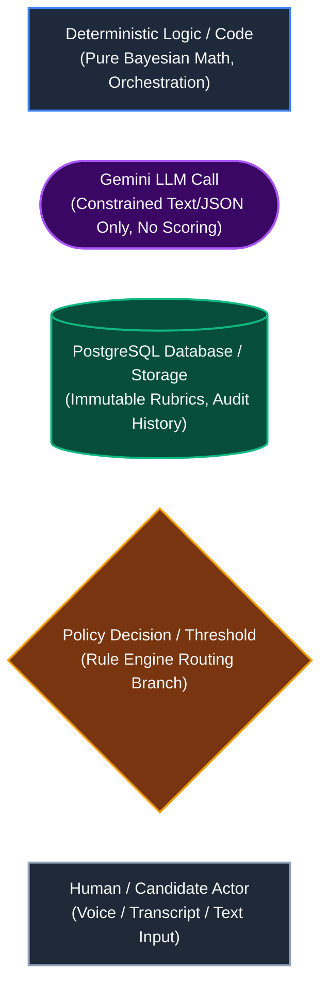
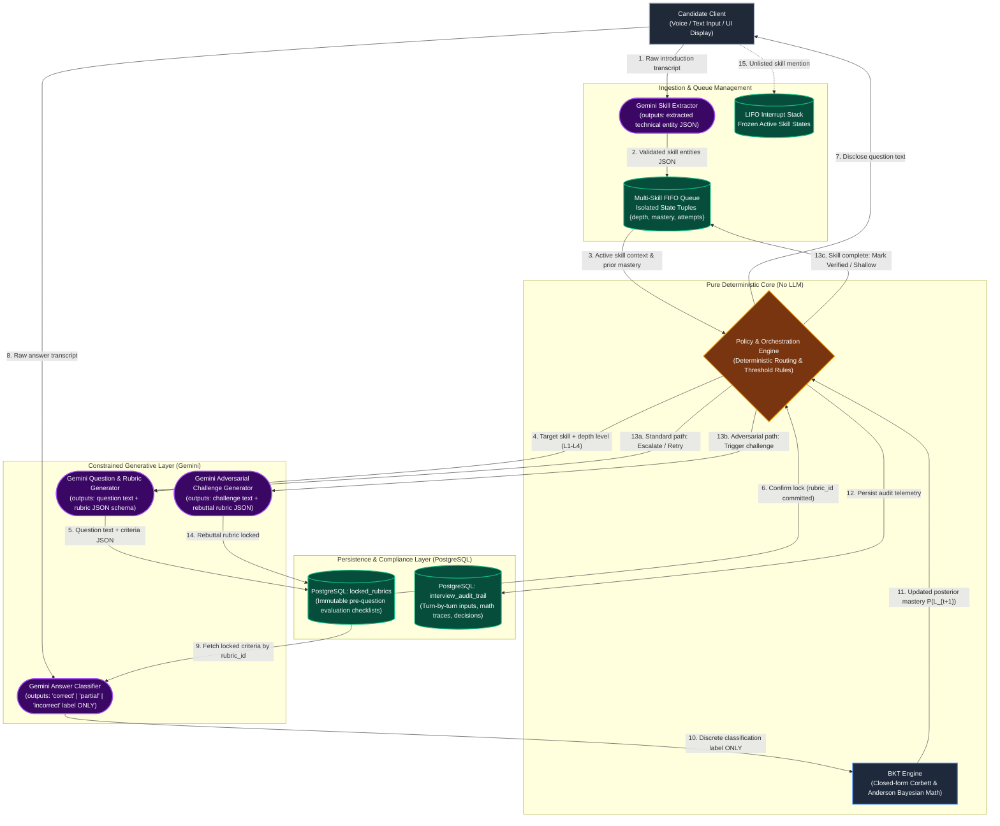
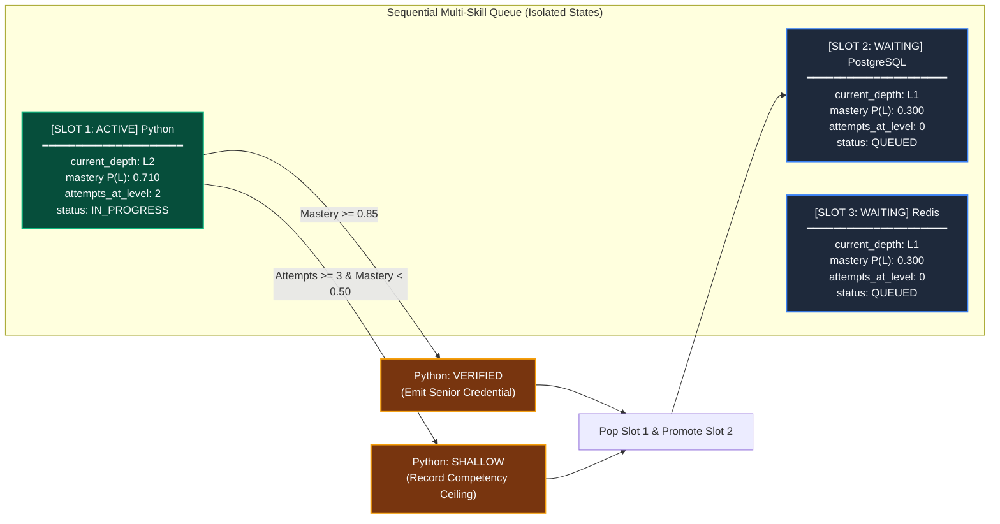
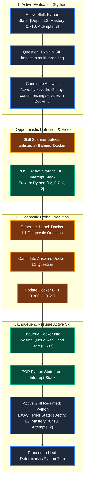

# Adaptive Technical Interview System: Architectural Specification & Theoretical Foundations
**Document Reference:** AIS-ARCH-2026-V1  
**Target Audience:** Engineering Leadership, Technical Product Managers, Hiring Architects  
**Core Subject:** Decoupling Language Generation from Assessment Math via Rubric-Lock, Bayesian Knowledge Tracing (BKT), and Devil's Advocate Verification

---

## Executive Summary

Current AI-assisted interview solutions suffer from two fatal vulnerabilities when deployed in production technical screening:
1. **Sycophancy & Goalpost Drift:** Large Language Models (LLMs) are conversational mimics. When an articulate candidate uses confident phrasing and technical jargon, an unconstrained LLM retroactively softens its evaluation criteria, awarding high scores to superficial bluffers.
2. **Single-Observation Volatility:** Traditional scoring models evaluate questions in isolation. A single typographical slip or momentary interview freeze unfairly fails a qualified engineer, while a memorized textbook recitation on an easy question can falsely classify a junior candidate as a senior practitioner.

This architecture solves both failure modes by strictly **decoupling natural language processing from evaluation mathematics and state progression**. The system operates across three tightly integrated pillars:
* **Rubric-Lock ("The Law"):** Generates and commits an immutable, atomic boolean evaluation checklist into a PostgreSQL database *before* a question is displayed to the candidate, eliminating hindsight leniency.
* **Bayesian Knowledge Tracing / BKT ("The Memory"):** A specialized Hidden Markov Model that treats candidate competence as an unobservable latent probability $P(L)$. BKT continuously filters out lucky guesses and forgives honest human slips using closed-form probability equations.
* **Devil's Advocate ("The Cross-Examination"):** A deterministic policy trigger that detects steep, unearned mastery surges on advanced questions and forces the candidate to defend trade-offs under adversarial conditions.

**Gemini is strictly restricted to constrained text generation and discrete classification (`correct`, `partial`, `incorrect`).** Gemini never calculates scores, never sets mastery thresholds, and never directs candidate routing. All scoring, state transitions, and evaluation queues remain 100% deterministic, auditable, and provable in software.

---

## 1. Visual Notation & Architectural Legend

All architectural and workflow diagrams across this specification strictly adhere to the following semantic shapes and color standards:



---

## 2. In-Depth Theoretical Foundations: The Core Triad

```
+--------------------------------------------------------------------------------------------------+
|                                    THE CORE ARCHITECTURAL TRIAD                                   |
+--------------------------------------------------------------------------------------------------+
| 1. Rubric-Lock ("The Law")            -> Defines the exact answer key in Postgres BEFORE         |
|                                          the candidate speaks. Prevents moving the goalposts.    |
|                                                                                                  |
| 2. BKT Engine ("The Memory")          -> Maintains a Bayesian confidence counter (0.0 to 1.0).   |
|                                          Filters out lucky guesses and forgives nervous slips.   |
|                                                                                                  |
| 3. Devil's Advocate ("The Cross-Exam")-> The cynical lead engineer that steps in when someone    |
|                                          makes an unearned leap on a hard question to say:       |
|                                          "Defend that design trade-off."                         |
+--------------------------------------------------------------------------------------------------+
```

### 2.1 Rubric-Lock ("The Law")

#### The Problem It Solves
When an LLM is asked to simultaneously interview and grade, it suffers from **hindsight leniency**. If an applicant sounds confident, uses advanced terminology, and maintains a polite demeanor, the LLM subconsciously adjusts its expectations downward: *"They didn't mention connection pooling, but they sound experienced, so I will give them full credit."* Conversely, for a hesitant speaker, the LLM hardens its standards.

#### Technical Mechanism
1. **Pre-Publication Generation:** Before any question is dispatched to the candidate's browser or voice client, Gemini generates both the question text and a strict, machine-readable JSON evaluation rubric.
2. **Database Lock Commit:** The rubric payload is written to PostgreSQL inside an ACID transaction into the `locked_rubrics` table. The database generates an immutable `rubric_id` and timestamp.
3. **Dispatch Gate:** The client conversation layer receives the question text *only after* the database returns `201 Created`.
4. **Constrained Classification:** When the candidate's response is received, a separate Gemini instance is invoked strictly as a boolean/ternary classifier. The prompt receives only:
   - The candidate's raw answer transcript.
   - The frozen criteria fetched by `rubric_id`.
   - Instructions to emit **only** a discrete label: `correct`, `partial`, or `incorrect`.

```sql
-- PostgreSQL Schema for Immutable Rubrics
CREATE TABLE locked_rubrics (
    rubric_id UUID PRIMARY KEY DEFAULT gen_random_uuid(),
    session_id UUID NOT NULL,
    skill_name VARCHAR(64) NOT NULL,
    depth_level VARCHAR(8) NOT NULL, -- L1, L2, L3, L4
    question_text TEXT NOT NULL,
    required_criteria JSONB NOT NULL,
    prohibited_misconceptions JSONB NOT NULL,
    created_at TIMESTAMP WITH TIME ZONE DEFAULT NOW(),
    CONSTRAINT locked_immutable CHECK (created_at IS NOT NULL)
);
```

#### Why The Other Mechanisms Cannot Cover It
* **BKT** does not evaluate answers; it only accepts discrete labels (`correct`/`incorrect`) and performs probability updates. If the input label is corrupt due to grader leniency, BKT reliably computes an invalid mastery score.
* **Devil's Advocate** only activates conditionally on steep leaps at high difficulty levels; it cannot police foundational or intermediate questions.

---

### 2.2 Bayesian Knowledge Tracing / BKT ("The Memory")

#### Theoretical Background
Bayesian Knowledge Tracing (Corbett & Anderson, 1994) is an established Hidden Markov Model (HMM) widely implemented in cognitive tutoring platforms (e.g., Carnegie Learning, pyBKT). In technical assessment, true candidate competency is an **unobservable latent variable** ($P(L) \in [0.0, 1.0]$). One cannot inspect a candidate's mental state directly; the system can only record noisy observable responses. BKT maintains a mathematical belief state over time, isolating mastery tracking from natural language variability.

#### The Four Core Parameters

| Parameter | Symbol | Engineering Meaning | Calibration Range | Role in System Stability |
| :--- | :---: | :--- | :---: | :--- |
| **Prior** | $P(L_0)$ | **Baseline Starting Trust.** Initial probability of mastery before seeing any candidate answers. | `0.30` | Prevents the system from arbitrarily assuming either total ignorance (0.0) or complete mastery (1.0). |
| **Guess** | $P(G)$ | **Bluff / Fluke Probability.** Probability that an unqualified candidate produces a correct answer via guessing or buzzword repetition. | `0.30` (L1) down to `0.05` (L4) | Prevents a candidate who recites a memorized answer on an easy question from instantly being classified as an expert. |
| **Slip** | $P(S)$ | **Typo / Nervousness Margin.** Probability that a qualified candidate answers incorrectly due to nervousness or a minor syntactic mistake. | `0.05` (L1) up to `0.20` (L4) | Prevents a minor syntax omission or slip on an advanced question from unfairly destroying a senior engineer's score. |
| **Learn** | $P(T)$ | **Cognitive Transition Rate.** Probability of acquiring or clarifying understanding during the turn itself. | `0.05` | Models modest mid-interview concept consolidation without allowing candidate score inflation without correct answers. |

#### Engineering Resolution: How Do We Distinguish a Slip from a Guess?
A frequent misconception is asking: *"Does the LLM guess whether the candidate slipped or guessed?"*  
The answer is **NO. The system never labels individual answers as slips or guesses.**
* **Guess and Slip are properties of question difficulty, not candidate psychology.**
  - An L1 foundational question has simple vocabulary that an unknowledgeable candidate can stumble into ($P(G) = 0.30$).
  - An L4 distributed systems trade-off question cannot be guessed by chance ($P(G) = 0.05$).
  - An L3 question with detailed syntax carries higher slip potential under interview pressure ($P(S) = 0.15$).
* **Bayes' Theorem weighs both hypotheses simultaneously.** When a candidate fails a question, the formula balances:
  $$\text{Evidence of an expert who slipped} \quad \text{vs.} \quad \text{Evidence of an unqualified candidate failing}$$
  If prior mastery was high, the numerator preserves confidence: the score drops from $0.88 \rightarrow 0.56$, not to $0.00$.
* **Subsequent turns reveal the ground truth.** If the candidate slipped, they will answer the next turn correctly, rebounding to $>0.90$. If they were bluffing, they will fail the re-probe, collapsing mastery toward zero.

#### The Mathematical Formulation

```
====================================================================================================
1. BAYESIAN POSTERIOR UPDATE (Evidence Accumulation)
====================================================================================================
If the observed verdict is CORRECT:
                       P(L_{t-1}) * (1 - P(S))
   P(L_t | Correct) = -----------------------------------------------------------
                       P(L_{t-1}) * (1 - P(S)) + (1 - P(L_{t-1})) * P(G)

   // P(L_{t-1}) : Prior mastery probability carried forward from previous turn
   // (1 - P(S)) : Likelihood of answering correctly given true mastery (1 - Slip)
   // (1 - P(L)) : Probability the candidate does not currently possess true mastery
   // P(G)       : Likelihood of answering correctly by chance or buzzwords (Guess)

----------------------------------------------------------------------------------------------------
If the observed verdict is INCORRECT:
                         P(L_{t-1}) * P(S)
   P(L_t | Incorrect) = ---------------------------------------------------------
                         P(L_{t-1}) * P(S) + (1 - P(L_{t-1})) * (1 - P(G))

   // P(S)       : Likelihood of answering incorrectly despite true mastery (Slip)
   // (1 - P(G)) : Likelihood of answering incorrectly given lack of mastery (1 - Guess)

====================================================================================================
2. LATENT LEARNING TRANSITION UPDATE
====================================================================================================
   P(L_{t+1}) = P(L_t | obs) + (1 - P(L_t | obs)) * P(T)

   // P(L_{t+1})   : Calibrated final mastery exported to the Policy Engine
   // P(L_t | obs) : Posterior belief computed in Phase 1 above
   // P(T)         : Latent transition parameter (Learn)
====================================================================================================
```

#### Calibrated Parameter Matrix by Depth Level

```
+--------------------------------------------------------------------------------------------------+
| STATIC DIFFICULTY CALIBRATION TABLE (depth_level_params)                                         |
+-------+--------------------+----------------+---------------+----------------+-------------------+
| Level | Cognitive Depth    | Guess P(G)     | Slip P(S)     | Learn P(T)     | Description       |
+-------+--------------------+----------------+---------------+----------------+-------------------+
| L1    | Foundational       | 0.30           | 0.05          | 0.05           | Syntax & Defs     |
| L2    | Implementation     | 0.20           | 0.10          | 0.05           | Mechanics & APIs  |
| L3    | Architectural      | 0.10           | 0.15          | 0.05           | Concurrency & Sys |
| L4    | Trade-Off Analysis | 0.05           | 0.20          | 0.05           | High-Scale Design |
+-------+--------------------+----------------+---------------+----------------+-------------------+
```

---

### 2.3 Devil's Advocate ("The Cross-Examination")

#### The Problem It Solves
In complex engineering interviews, candidates can memorize architectural patterns from blogs or study guides. When asked an L3 question, an articulate bluffer can name-drop appropriate buzzwords (*"We use MVCC, autovacuum, and connection pooling"*). An LLM grader evaluating against a rubric may register all required keywords and issue a `correct` verdict.

Because L3 questions have a low Guess parameter ($P(G) = 0.10$), BKT treats a `correct` verdict on L3 as strong evidence of mastery, causing candidate mastery to surge sharply ($>0.90$). Without an adversarial countermeasure, this false positive permanently locks in senior credentials.

#### Trigger Specification
The Policy Engine monitors all state transitions after each BKT update. Devil's Advocate fires **only** when all three deterministic conditions are met:
1. **Difficulty Constraint:** Current question depth $\ge L3$ (Advanced / Architectural).
2. **Surge Constraint:** Single-turn mastery leap $\Delta = P(L_{t+1}) - P(L_{t-1}) \ge 0.20$ (or cumulative surge across 2 turns $\ge 0.35$).
3. **Threshold Constraint:** Resulting mastery $P(L_{t+1}) \ge 0.85$ (would otherwise trigger skill verification).

```
====================================================================================================
                    DETERMINISTIC DEVIL'S ADVOCATE TRIGGER LOGIC
====================================================================================================
def evaluate_devils_advocate(depth_level: str, prior: float, post_mastery: float) -> bool:
    is_advanced_level = depth_level in ("L3", "L4")
    is_steep_surge    = (post_mastery - prior) >= 0.20
    is_near_exit      = post_mastery >= 0.85
    return is_advanced_level and is_steep_surge and is_near_exit
====================================================================================================
```

#### Seamless BKT Integration (No Heuristic Score Penalties)
A critical feature of this architecture is that **Devil's Advocate does not invent arbitrary score penalties or override BKT.**
1. The Policy Engine directs Gemini to synthesize a counter-factual challenge question attacking the candidate's proposed design or exposing an edge-case trade-off.
2. A new rebuttal rubric is generated and committed to PostgreSQL (`locked_rubrics`).
3. The candidate responds to the challenge.
4. Gemini classifies the defense against the locked rebuttal rubric (`correct` or `incorrect`).
5. **The resulting verdict is processed through standard BKT equations using the exact same formulas.**
   - If the candidate defends the trade-off (`correct`): BKT confirms the jump, locking mastery at $>0.98$ (Senior Verified).
   - If the bluffer folds or contradicts themselves (`incorrect`): Standard BKT mathematics contracts mastery from $0.911 \rightarrow \mathbf{0.649}$, placing them honestly into mid-band competence without bias.

---

### 2.4 Component Interaction Matrix: Why All Three Are Essential

| Component | Analogy | Primary Failure Mode Prevented | Consequence If Component Is Removed | Why Other Two Components Cannot Compensate |
| :--- | :--- | :--- | :--- | :--- |
| **Rubric-Lock** | **"The Law"** | **Hindsight Leniency & Goalpost Shifting:** Graders softening criteria when charmed by confident vocabulary. | Grader standards fluctuate turn-by-turn. Inconsistent labels inject corrupted evidence into BKT. | BKT only calculates math; it cannot know if a label was fair. Devil's Advocate only fires selectively and cannot police standard questions. |
| **BKT Engine** | **"The Memory"** | **Single-Answer Noise & Volatility:** Overreacting to an isolated lucky guess or failing an expert over a nervous typo. | Assessment collapses into static scoring. An L1 guess looks identical to multi-turn proven competence. | Rubric-Lock only standardizes one question at a time. Devil's Advocate only generates challenges; neither tracks temporal belief states. |
| **Devil's Advocate** | **"The Cross-Examination"** | **Sycophantic False Positives & Fluent Bluffing:** Candidates stringing together architecture keywords without conceptual depth. | Fluent bluffers easily pass L3 rubrics, triggering unearned high mastery that permanently stands. | Rubric-Lock can be satisfied superficially by keyword coverage. BKT mathematically trusts every `correct` label and blindly amplifies false positives. |

---

## 3. Primary Architectural Block Diagram: System Modules & Data Flow

This block diagram maps all modules, datastores, execution planes, and data contracts across the assessment system:



---

## 4. Technical Workflow Diagram: Input to Final Output

This sequence diagram illustrates the chronological lifecycle of a single question-and-answer cycle, highlighting the database lock barrier and Bayesian execution:

```mermaid
sequenceDiagram
    autonumber
    actor Candidate as Candidate UI / Audio
    participant Orch as Interview Orchestrator
    participant Policy as Policy Engine (Deterministic)
    participant Gemini as Gemini LLM (Constrained)
    participant Postgres as PostgreSQL (Rubric Store)
    participant BKT as BKT Engine (Pure Math)

    Note over Policy,Orch: PHASE 1: DETERMINISTIC DEPTH SELECTION
    Policy->>Orch: Select Active Skill (e.g. FastAPI) & Target Depth (L1-L4)
    
    Note over Orch,Gemini: PHASE 2: QUESTION & RUBRIC SYNTHESIS
    Orch->>Gemini: Request Question + Boolean Checklist for (Skill, Depth)
    Gemini-->>Orch: Return payload {question_text, criteria_checklist_json}

    rect rgb(6, 78, 59)
        Note over Orch,Postgres: PHASE 3: IMMUTABLE RUBRIC LOCK (BARRIER)
        Orch->>Postgres: INSERT INTO locked_rubrics (skill, depth, criteria) VALUES (...)
        Postgres-->>Orch: 201 Created (Committed rubric_id: #R1042)
        Note over Orch: Question DISPATCH BLOCKED until DB commit is confirmed
    end

    Note over Orch,Candidate: PHASE 4: QUESTION PRESENTATION & RESPONSE
    Orch->>Candidate: Transmit question_text to candidate UI / audio pipeline
    Candidate-->>Orch: Candidate submits raw answer (transcript / text)

    Note over Orch,Gemini: PHASE 5: CONSTRAINED CLASSIFICATION
    Orch->>Postgres: SELECT criteria FROM locked_rubrics WHERE id = #R1042
    Postgres-->>Orch: Return immutable checklist criteria
    Orch->>Gemini: Classify candidate answer against locked checklist ONLY
    Gemini-->>Orch: Emit discrete label: 'correct' | 'partial' | 'incorrect' ONLY

    Note over Orch,BKT: PHASE 6: PURE BAYESIAN UPDATE
    Orch->>BKT: Submit observation (verdict, depth_level, prior_mastery)
    Note over BKT: 1. Bayes Posterior: P(L|obs) = num / den<br/>2. Latent Learn: P(L_next) = P(L|obs) + (1-P(L|obs))*P(T)
    BKT-->>Orch: Return calibrated updated mastery P(L_{t+1})

    Note over Orch,Policy: PHASE 7: DETERMINISTIC POLICY ROUTING
    Orch->>Policy: Evaluate updated mastery against state thresholds
    alt Mastery surge >= 0.20 AND Depth >= L3 AND Mastery >= 0.85
        Policy-->>Orch: Action: TRIGGER DEVIL'S ADVOCATE (Challenge Turn)
    else Mastery >= 0.85
        Policy-->>Orch: Action: SKILL VERIFIED (Promote to next skill)
    else Attempts >= 3 AND Mastery < 0.50
        Policy-->>Orch: Action: SKILL SHALLOW (Ceiling recorded, advance queue)
    else Mastery in mid-band
        Policy-->>Orch: Action: ESCALATE DEPTH / RE-PROBE (Next standard turn)
    end
    Orch->>Candidate: Display next turn prompt / interview status feedback
```



---

## 5. Multi-Skill Queue Architecture & State Isolation

A real technical assessment evaluates multiple domains (e.g., Python, PostgreSQL, Redis, Docker). The system organizes these competencies into a **Strictly Isolated FIFO Queue**.



### State Isolation Guarantees
* **Zero Cross-Contamination:** An update to Python mastery never alters PostgreSQL or Redis parameters.
* **Independent Calibration:** Each skill maintains its own parameter tuple:
  $$\text{Skill State} = \langle \text{SkillName}, \, \text{CurrentDepth}, \, P(L_t), \, \text{AttemptsAtDepth}, \, \text{Status} \rangle$$
* **Deterministic Completion:** A skill exits the active slot **only** upon satisfying one of two terminal conditions:
  1. **Verified:** Mastery reaches $\ge 0.85$.
  2. **Shallow Ceiling:** Reaches maximum attempts (3) without meeting the progression threshold.

---

## 6. Mid-Conversation New-Skill Interrupt Stack (LIFO Architecture)

Candidates frequently introduce technical tools that were not part of their original resume intake (e.g., introducing Docker while answering a question on Python threading). Rather than losing this information or derailing the primary skill, the orchestrator employs an **Interrupt Memory Stack**.



### Stack Operation Lifecycle
1. **Detection:** The opportunistic skill extractor scans the candidate's transcript for technical entities not present in the active queue.
2. **Context Freeze (PUSH):** The active skill state (`Python: {L2, P(L)=0.710, attempts=2}`) is serialized and pushed onto the LIFO stack.
3. **Targeted Diagnostic Probe:** The system runs exactly **one** L1 diagnostic cycle on the newly detected skill (`Docker`), locking a dedicated rubric and executing a standard BKT update.
4. **Queue Insertion:** The discovered skill is inserted into the main waiting queue with an earned **head-start prior** ($0.597$).
5. **Context Restoration (POP):** The stack pops the frozen skill (`Python`). Python resumes evaluation with zero state contamination, exactly where it was paused.

---

## 7. Worked Mathematical Proof: Step-by-Step Multi-Turn Trace

To demonstrate how BKT prevents unearned escalation while forgiving honest mistakes, we trace four consecutive turns across escalating difficulty:

```
====================================================================================================
NUMERICAL WORKTHROUGH PARAMETERS:
Baseline Prior P(L_0) = 0.300 | Constant Learn Transition P(T) = 0.050
L1 Parameters: Guess P(G) = 0.30 | Slip P(S) = 0.05
L2 Parameters: Guess P(G) = 0.20 | Slip P(S) = 0.10
L3 Parameters: Guess P(G) = 0.10 | Slip P(S) = 0.15
====================================================================================================
```

### Turn 1: Level 1 Foundational Question (Verdict: `correct`)
* Candidate correctly identifies FastAPI `Depends()` dependency injection syntax.
* **Phase 1: Bayesian Posterior Calculation**
  $$\text{Numerator} = P(L_0) \times (1 - P(S)) = 0.300 \times (1 - 0.05) = 0.300 \times 0.95 = 0.2850$$
  $$\text{Denominator} = 0.2850 + (1 - P(L_0)) \times P(G) = 0.2850 + (1 - 0.300) \times 0.30 = 0.2850 + 0.2100 = 0.4950$$
  $$P(L_1 \mid \text{Correct}) = \frac{0.2850}{0.4950} \approx 0.5758$$
* **Phase 2: Learning Transition**
  $$P(L_1^+) = 0.5758 + (1 - 0.5758) \times 0.05 = 0.5758 + 0.0212 = \mathbf{0.5970}$$
* **Policy Routing:** Mastery moved $0.300 \rightarrow 0.5970$. Level 1 cleared; escalate to Level 2.

### Turn 2: Level 2 Implementation Question (Verdict: `correct`)
* Candidate correctly explains middleware execution wrapping `call_next(request)` and exception handling.
* **Phase 1: Bayesian Posterior Calculation**
  $$\text{Numerator} = P(L_1^+) \times (1 - P(S)) = 0.5970 \times (1 - 0.10) = 0.5970 \times 0.90 = 0.5373$$
  $$\text{Denominator} = 0.5373 + (1 - P(L_1^+)) \times P(G) = 0.5373 + (1 - 0.5970) \times 0.20 = 0.5373 + 0.0806 = 0.6179$$
  $$P(L_2 \mid \text{Correct}) = \frac{0.5373}{0.6179} \approx 0.8695$$
* **Phase 2: Learning Transition**
  $$P(L_2^+) = 0.8695 + (1 - 0.8695) \times 0.05 = 0.8695 + 0.0065 = \mathbf{0.8761}$$
* **Policy Routing:** Mastery reached $0.8761$. On Level 2, Devil's Advocate does not trigger; candidate escalates to Level 3.

### Turn 3: Level 3 Architectural Question (Verdict: `incorrect` / Nervous Slip)
* Candidate makes a minor mistake explaining threadpool dispatching for synchronous endpoints.
* **Phase 1: Bayesian Posterior Calculation**
  $$\text{Numerator} = P(L_2^+) \times P(S) = 0.8761 \times 0.15 = 0.1314$$
  $$\text{Denominator} = 0.1314 + (1 - P(L_2^+)) \times (1 - P(G)) = 0.1314 + (1 - 0.8761) \times (1 - 0.10) = 0.1314 + 0.1115 = 0.2429$$
  $$P(L_3 \mid \text{Incorrect}) = \frac{0.1314}{0.2429} \approx 0.5409$$
* **Phase 2: Learning Transition**
  $$P(L_3^+) = 0.5409 + (1 - 0.5409) \times 0.05 = 0.5409 + 0.0229 = \mathbf{0.5638}$$
* **Policy Routing:** Mastery drops from $0.8761 \rightarrow 0.5638$. **Notice: mastery does NOT drop to 0.00.** The system recognizes the prior strong record and schedules a Level 3 alternative re-probe.

### Turn 4: Level 3 Alternative Re-probe (Verdict: `correct`)
* Candidate cleanly articulates asyncio event loop mechanics under concurrency.
* **Phase 1: Bayesian Posterior Calculation**
  $$\text{Numerator} = P(L_3^+) \times (1 - P(S)) = 0.5638 \times (1 - 0.15) = 0.5638 \times 0.85 = 0.4792$$
  $$\text{Denominator} = 0.4792 + (1 - P(L_3^+)) \times P(G) = 0.4792 + (1 - 0.5638) \times 0.10 = 0.4792 + 0.0436 = 0.5228$$
  $$P(L_4 \mid \text{Correct}) = \frac{0.4792}{0.5228} \approx 0.9166$$
* **Phase 2: Learning Transition**
  $$P(L_4^+) = 0.9166 + (1 - 0.9166) \times 0.05 = 0.9166 + 0.0042 = \mathbf{0.9208}$$
* **Policy Routing:** Mastery rebounds to **`0.921`**. Retrospective mathematical proof confirms Turn 3 was merely an isolated slip. Candidate achieves **VERIFIED** status.

---

## 8. Summary Architectural Ledger

| Metric / Attribute | Naive LLM Interview System | This Architecture (BKT + Rubric-Lock + Devil's Advocate) |
| :--- | :--- | :--- |
| **Grading Consistency** | Variable; influenced by applicant charm and tone. | Immutable; pinned to a PostgreSQL transaction record before question dispatch. |
| **Bluff Resistance** | Poor; vulnerable to buzzword recitation. | High; Devil's Advocate forces cross-examination on high-stakes leaps. |
| **Noise Resilience** | Fragile; single mistake drops overall score. | Robust; Bayesian slip parameter dampens penalty and schedules re-probes. |
| **Auditability** | Non-reproducible; LLM outputs change across runs. | Fully auditable; all state updates driven by closed-form algebraic formulas. |
| **Scoring Governance** | LLM acts as judge, jury, and scorekeeper. | LLM restricted to classification; scoring governed 100% by deterministic code. |
