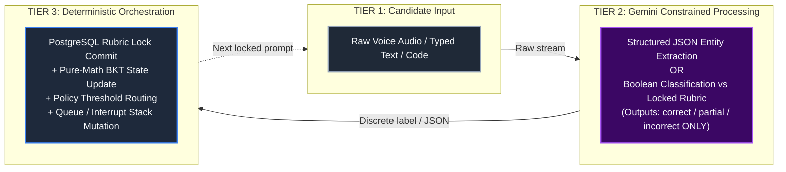
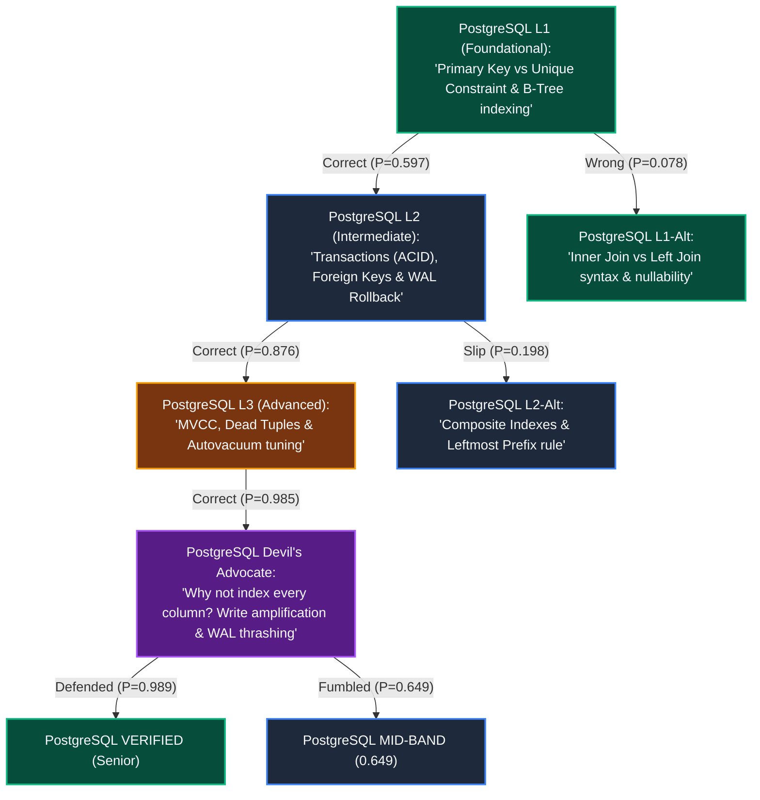
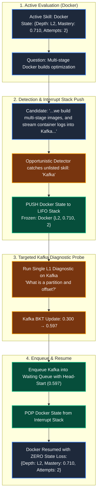

# Adaptive Technical Interview System: Operational Workflow & Scenario Playbook
**Document Reference:** AIS-OPS-2026-V1  
**Target Audience:** Engineering Managers, Hiring Committee Leads, Assessment Operators  
**Core Subject:** End-to-End Operational Traces, 3-Tier State Execution (Candidate Input → Gemini → Orchestration), and Failure Mode Scenario Playbooks

---

## Executive Summary & Managerial Handover

This operational manual provides a complete, turn-by-turn verification playbook for the Adaptive Technical Interview System. While **Report 1** establishes the theoretical mathematics and system architecture, this document details how the engine performs under live candidate conditions.

Every single interaction in this playbook strictly follows a **3-Tier Execution Pipeline**:
1. **Tier 1: Candidate Input:** The raw, unconstrained verbal transcript or typed code/text delivered by the candidate.
2. **Tier 2: Gemini Constrained Processing:** Strictly bound language analysis—either extracting structured entities into typed JSON schemas or classifying candidate responses against frozen criteria as `correct`, `partial`, or `incorrect`. **Gemini never calculates scores, evaluates mastery, or routes queues.**
3. **Tier 3: Deterministic Orchestration:** The central coordinator executing atomic PostgreSQL rubric locks, Corbett & Anderson Bayesian Knowledge Tracing updates, deterministic Policy Engine threshold evaluations, and queue/stack state routing.

This document walks through realistic engineering candidates (from junior interns to senior distributed systems architects) to prove that the system prevents bluffing, protects against nervous slips, and guarantees 100% reproducible hiring telemetry.

---

## 1. The Standard 3-Tier Execution Framework

To ensure architectural compliance, every turn within every scenario strictly follows the sequence below:



```
====================================================================================================
                        THE 3-TIER OPERATIONAL INVARIANT
====================================================================================================
[1. CANDIDATE INPUT]  -> What the human says or types (unpredictable, natural language).
[2. GEMINI ANALYSIS]  -> Constrained NLP strictly bounded by schema or locked rubrics. NO SCORING.
[3. ORCHESTRATION]    -> Deterministic code: Postgres transactions, BKT closed-form equations,
                         threshold evaluations, and FIFO queue / LIFO stack state mutations.
====================================================================================================
```

---

## 2. High-Level Master Workflow Diagram: Dual-Path Execution

This flowchart maps the primary operational journey of candidate **Sarah Chen** on her first evaluated skill (**FastAPI**), contrasting **Path A (The Genuine Engineer / Mastery Ascent)** against **Path B (The Struggling / Shallow Candidate)**:

```mermaid
flowchart TD
    classDef intake fill:#0F172A,stroke:#94A3B8,stroke-width:2px,color:#F8FAFC;
    classDef correct fill:#064E3B,stroke:#10B981,stroke-width:2px,color:#F8FAFC;
    classDef wrong fill:#78350F,stroke:#EF4444,stroke-width:2px,color:#F8FAFC;
    classDef neutral fill:#1E293B,stroke:#3B82F6,stroke-width:2px,color:#F8FAFC;
    classDef decision fill:#581C87,stroke:#A855F7,stroke-width:2px,color:#F8FAFC;

    Intro["1. Candidate Input: Sarah Chen Introduction<br/>(Claims: FastAPI, PostgreSQL, Redis, Docker)"]:::intake
    GeminiParse["2. Gemini Parsing: Strict JSON Schema Extraction"]:::neutral
    QueueInit["3. Orchestration: Initialize FIFO Queue<br/>FastAPI ACTIVE (L1, P=0.300)"]:::neutral
    Intro --> GeminiParse --> QueueInit

    %% TURN 1
    QueueInit --> Q1["Turn 1 (L1 Diagnostic): 'Depends() & DI role'<br/>Committed Rubric: #R101"]:::neutral
    Q1 --> A1_Correct["🟢 Path A (Correct):<br/>Explains DI, decoupling, test mocks"]:::correct
    Q1 --> A1_Wrong["🔴 Path B (Wrong):<br/>Confuses Depends() with caching decorators"]:::wrong

    %% PATH A TURN 1
    A1_Correct --> BKT_A1["Orchestration: BKT Update<br/>0.300 → 0.597 (Posterior: 0.576)"]:::correct
    BKT_A1 --> Pol_A1{"Policy Check:<br/>Mastery in mid-band (0.597)<br/>Escalate to L2"}:::decision

    %% PATH B TURN 1
    A1_Wrong --> BKT_B1["Orchestration: BKT Update<br/>0.300 → 0.078 (Posterior: 0.030)"]:::wrong
    BKT_B1 --> Pol_B1{"Policy Check:<br/>Attempt 1 failed.<br/>Generate L1-Alt Probe"}:::decision

    %% PATH A TURN 2
    Pol_A1 --> Q2_A["Turn 2 (L2 Intermediate): 'Middleware vs Exception Handlers'<br/>Committed Rubric: #R102"]:::neutral
    Q2_A --> A2_Correct["🟢 Path A (Correct):<br/>Explains call_next & custom handler lifecycle"]:::correct
    Q2_A --> A2_Slip["🔴 Path A-Slip (Nervous Slip):<br/>Claims middleware kills Python process"]:::wrong

    A2_Correct --> BKT_A2["Orchestration: BKT Update<br/>0.597 → 0.876 (Posterior: 0.870)"]:::correct
    BKT_A2 --> Pol_A2{"Policy Check:<br/>High mastery (0.876)<br/>Escalate to L3"}:::decision

    A2_Slip --> BKT_A2_Slip["Orchestration: Slip Damped<br/>0.597 → 0.198"]:::wrong
    BKT_A2_Slip --> Pol_A2_Slip{"Policy Check:<br/>Re-probe L2 with Alt"}:::decision

    %% PATH B TURN 1-ALT
    Pol_B1 --> Q1_Alt["Turn 1-Alt (L1 Alternative): 'Path vs Query Params'<br/>Committed Rubric: #R101-ALT"]:::neutral
    Q1_Alt --> B1_Recov["🟢 Sub-path B1 (Recovers):<br/>Explains Pydantic typing & 422 errors"]:::correct
    Q1_Alt --> B1_Fail["🔴 Sub-path B2 (Fails again):<br/>Claims params are identical"]:::wrong

    B1_Recov --> BKT_B1_Recov["Orchestration: BKT Rebound<br/>0.078 → 0.251 (Attempts: 2)"]:::correct
    B1_Fail --> BKT_B1_Fail["Orchestration: BKT Collapse<br/>0.078 → 0.015 (Attempts: 2)"]:::wrong
    BKT_B1_Fail --> Pol_B_Shallow{"3rd Attempt Fails?<br/>Max attempts hit: SHALLOW"}:::decision
    Pol_B_Shallow --> Exit_Shallow["FastAPI: SHALLOW<br/>Record ceiling (L0), Dequeue to Postgres"]:::wrong

    %% PATH A TURN 3
    Pol_A2 --> Q3_A["Turn 3 (L3 Advanced): 'async def vs def & Threadpool'<br/>Committed Rubric: #R103"]:::neutral
    Q3_A --> A3_Correct["🟢 Path A (Correct):<br/>Explains AnyIO worker threads vs event loop"]:::correct
    A3_Correct --> BKT_A3["Orchestration: BKT Update<br/>0.876 → 0.985 (Sudden Surge!)"]:::correct

    BKT_A3 --> DA_Check{"Policy Trigger Check:<br/>Level >= L3 AND Jump >= 0.20<br/>AND Mastery >= 0.85?<br/>DEVIL'S ADVOCATE FIRES!"}:::decision

    %% DEVIL'S ADVOCATE
    DA_Check --> Q_DA["Turn 3-DA (Challenge): 'Why not blocking sync calls in async def?'<br/>Committed Rubric: #R104"]:::neutral
    Q_DA --> DA_Senior["🟢 Defense A1 (Senior Defense):<br/>Articulates event loop stalling under 100 conns"]:::correct
    Q_DA --> DA_Bluffer["🔴 Defense A2 (Bluffer Collapse):<br/>Claims asyncio magically makes DB calls async"]:::wrong

    DA_Senior --> BKT_DA_Senior["Orchestration: BKT Update<br/>0.985 → 0.998"]:::correct
    BKT_DA_Senior --> Exit_Verified["FastAPI: VERIFIED (Senior)<br/>Emit Credential, Dequeue to PostgreSQL"]:::correct

    DA_Bluffer --> BKT_DA_Bluffer["Orchestration: BKT Update (Same Math!)<br/>0.985 → 0.649"]:::wrong
    BKT_DA_Bluffer --> Exit_Mid["FastAPI: COMPETENT MID (0.649)<br/>Record Ceiling (L2), Dequeue to PostgreSQL"]:::neutral
```



---

## 3. End-to-End Candidate Intake & Queue Initialization

### Step 0: The Intake Interaction

#### Tier 1: Candidate Input
Candidate **Sarah Chen** joins the assessment session and submits her verbal introduction:

```
+--------------------------------------------------------------------------------------------------+
| CANDIDATE AUDIO / TEXT TRANSCRIPT: SARAH CHEN                                                    |
+--------------------------------------------------------------------------------------------------+
| "Hi! I'm Sarah. I'm a final-year Computer Science student and I've been interning as a backend    |
| engineer for the past 8 months. During my internship, I built RESTful APIs using Python with     |
| FastAPI, using PostgreSQL for relational data persistence and schema migrations via Alembic.     |
| For caching user sessions and rate-limiting auth endpoints, we integrated Redis. In our devops   |
| pipeline, I wrote Dockerfiles to containerize each service for staging deployment on AWS. I'm    |
| really eager to work on high-throughput backend services and clean API architecture!"             |
+--------------------------------------------------------------------------------------------------+
```

#### Tier 2: Gemini Constrained Processing
The orchestrator feeds the transcript into Gemini with a strict JSON schema enforcement prompt:

```json
{
  "candidate_name": "Sarah Chen",
  "extracted_skills": [
    {
      "skill_name": "FastAPI",
      "initial_depth": "L1",
      "baseline_prior": 0.300,
      "context": "RESTful APIs, routing, framework usage"
    },
    {
      "skill_name": "PostgreSQL",
      "initial_depth": "L1",
      "baseline_prior": 0.300,
      "context": "Relational storage, migrations, Alembic"
    },
    {
      "skill_name": "Redis",
      "initial_depth": "L1",
      "baseline_prior": 0.300,
      "context": "Session caching, rate-limiting auth endpoints"
    },
    {
      "skill_name": "Docker",
      "initial_depth": "L1",
      "baseline_prior": 0.300,
      "context": "Containerization, Dockerfiles, devops pipeline"
    }
  ]
}
```

#### Tier 3: Deterministic Orchestration
The Policy Engine instantiates the isolated multi-skill queue in memory. Each slot is strictly isolated with zero state leakage:

```
====================================================================================================
                        SARAH CHEN: MULTI-SKILL QUEUE INITIALIZATION
====================================================================================================
[SLOT 1: ACTIVE]   FastAPI     | Depth: L1 | Mastery P(L): 0.300 | Attempts: 0 | State: ISOLATED
[SLOT 2: WAITING]  PostgreSQL  | Depth: L1 | Mastery P(L): 0.300 | Attempts: 0 | State: ISOLATED
[SLOT 3: WAITING]  Redis       | Depth: L1 | Mastery P(L): 0.300 | Attempts: 0 | State: ISOLATED
[SLOT 4: WAITING]  Docker      | Depth: L1 | Mastery P(L): 0.300 | Attempts: 0 | State: ISOLATED
====================================================================================================
```

---

## 4. Turn-by-Turn Operational Trace: Skill 1 (FastAPI)

```
+--------------------------------------------------------------------------------------------------+
| STATIC DIFFICULTY CALIBRATION FOR FASTAPI                                                        |
+--------------------------------------------------------------------------------------------------+
| Baseline Prior P(L0) = 0.300 | Cognitive Learn Transition P(T) = 0.050                          |
| L1 Parameters: Guess P(G) = 0.30 | Slip P(S) = 0.05                                             |
| L2 Parameters: Guess P(G) = 0.20 | Slip P(S) = 0.10                                             |
| L3 Parameters: Guess P(G) = 0.10 | Slip P(S) = 0.15                                             |
+--------------------------------------------------------------------------------------------------+
```

---

### Turn 1: Level 1 Foundational Diagnostic

#### The Question & Rubric Lock
* **Target:** FastAPI Foundational Dependency Injection ($L1$).
* **Synthesized Question:**  
  > *"In FastAPI, what is the role of `Depends()`, and why is dependency injection useful in an API?"*
* **PostgreSQL Locked Rubric (`#R101` committed BEFORE candidate display):**
  1. Must state that `Depends()` extracts shared logic, database sessions, or authentication into reusable functions.
  2. Must explain that it decouples endpoint route logic from setup code and enables mock injection during testing.

---

#### 🟢 Path A: Sarah Answers Correctly (Mastery Ascent)

##### Tier 1: Candidate Input
> *"In FastAPI, `Depends` lets you inject dependencies into route handlers. For example, database sessions, current user authentication, or configuration objects. It decouples the route logic from the setup code, and makes testing easy because you can override dependencies with mocks during unit tests."*

##### Tier 2: Gemini Constrained Processing
* **Input Context:** Raw answer + Criteria from PostgreSQL row `#R101`.
* **Classification Logic:**
  - Criterion 1 (Shared logic / auth / DB session): Satisfied explicitly.
  - Criterion 2 (Decoupling / mock testing): Satisfied explicitly.
* **Output Label:** **`correct`** *(no scoring, label only)*.

##### Tier 3: Deterministic Orchestration
* **BKT Mathematical Update:**
  $$\text{Prior } P(L_0) = 0.300, \quad P(G) = 0.30, \quad P(S) = 0.05, \quad P(T) = 0.05$$
  $$\text{Numerator} = 0.300 \times (1 - 0.05) = 0.300 \times 0.95 = 0.2850$$
  $$\text{Denominator} = 0.2850 + (1 - 0.300) \times 0.30 = 0.2850 + (0.700 \times 0.30) = 0.2850 + 0.2100 = 0.4950$$
  $$\text{Posterior } P(L_1 \mid \text{Correct}) = \frac{0.2850}{0.4950} \approx 0.5758$$
  $$\text{Final Mastery } P(L_1^+) = 0.5758 + (1 - 0.5758) \times 0.05 = \mathbf{0.5970}$$
* **Policy Threshold Evaluation:**
  - $P(L_1^+) = 0.5970 \ge 0.50$ (Level 1 cleared).
  - Attempts at $L1 = 1$.
  - **Routing Action:** Escalate depth to **Level 2 (Intermediate)**.

---

#### 🔴 Path B: Sarah Answers Wrongly (Struggling Candidate)

##### Tier 1: Candidate Input
> *"In FastAPI, `Depends` is basically just a Python decorator syntax that you put on functions to make them run faster. It automatically caches the return value in memory so the API doesn't have to recalculate the function next time."*

##### Tier 2: Gemini Constrained Processing
* **Input Context:** Raw answer + Criteria from PostgreSQL row `#R101`.
* **Classification Logic:**
  - Candidate confused dependency injection with caching memoization and decorators.
  - Failed both required criteria.
* **Output Label:** **`incorrect`**.

##### Tier 3: Deterministic Orchestration
* **BKT Mathematical Update:**
  $$\text{Prior } P(L_0) = 0.300, \quad P(G) = 0.30, \quad P(S) = 0.05, \quad P(T) = 0.05$$
  $$\text{Numerator} = 0.300 \times P(S) = 0.300 \times 0.05 = 0.0150$$
  $$\text{Denominator} = 0.0150 + (1 - 0.300) \times (1 - P(G)) = 0.0150 + (0.700 \times 0.70) = 0.0150 + 0.4900 = 0.5050$$
  $$\text{Posterior } P(L_1 \mid \text{Incorrect}) = \frac{0.0150}{0.5050} \approx 0.0297$$
  $$\text{Final Mastery } P(L_1^+) = 0.0297 + (1 - 0.0297) \times 0.05 = \mathbf{0.0782}$$
* **Policy Threshold Evaluation:**
  - $P(L_1^+) = 0.0782 < 0.50$.
  - Attempts at $L1 = 1 < 3$.
  - **Routing Action:** Do not fail immediately. Schedule **Alternative Level 1 Diagnostic Probe (Turn 1-Alt)**.

---

### Turn 1-Alt: Level 1 Alternative Diagnostic (Path B Only)

#### The Alternative Question & Rubric Lock
* **Target:** HTTP Parameters & Pydantic Validation ($L1$).
* **Synthesized Question:**  
  > *"In a FastAPI endpoint, what is the difference between a Path Parameter (e.g., `/items/{item_id}`) and a Query Parameter (e.g., `/items?limit=10`), and how does Pydantic enforce data types on them?"*
* **PostgreSQL Locked Rubric (`#R101-ALT`):**
  1. Must state path parameters are part of the URL path itself, while query parameters follow the `?` delimiter as key-value pairs.
  2. Must explain that type annotations (e.g., `item_id: int`) cause Pydantic to parse strings into typed primitives and automatically emit HTTP `422 Unprocessable Entity` responses on validation failure.

---

#### 🟢 Sub-path B1: Sarah Recovers

##### Tier 1: Candidate Input
> *"Path parameters are embedded directly in the route path to locate a specific resource, like `/items/42`. Query parameters come after the question mark and are optional filters, like `?limit=10`. When you add type hints like `item_id: int`, Pydantic parses the string into an integer and automatically throws an HTTP 422 error if someone passes letters instead of numbers."*

##### Tier 2: Gemini Constrained Processing
* **Output Label:** **`correct`** (satisfies both criteria).

##### Tier 3: Deterministic Orchestration
* **BKT Mathematical Update (starting from prior 0.0782):**
  $$\text{Numerator} = 0.0782 \times (1 - 0.05) = 0.0782 \times 0.95 = 0.0743$$
  $$\text{Denominator} = 0.0743 + (1 - 0.0782) \times 0.30 = 0.0743 + (0.9218 \times 0.30) = 0.0743 + 0.2765 = 0.3508$$
  $$\text{Posterior } = \frac{0.0743}{0.3508} \approx 0.2118$$
  $$\text{Final Mastery } = 0.2118 + (1 - 0.2118) \times 0.05 = \mathbf{0.2512}$$
* **Policy Threshold Evaluation:**
  - Mastery rebounds from $0.078 \rightarrow 0.251$. Attempts at $L1 = 2$.
  - **Routing Action:** Prompt one more L1 validation question before considering escalation.

---

#### 🔴 Sub-path B2: Sarah Fails Again (The Shallow Candidate)

##### Tier 1: Candidate Input
> *"Path parameters and query parameters are the exact same thing in FastAPI, they just use different brackets. Pydantic doesn't validate types on URLs, it only validates database tables."*

##### Tier 2: Gemini Constrained Processing
* **Output Label:** **`incorrect`**.

##### Tier 3: Deterministic Orchestration
* **BKT Mathematical Update:**
  $$\text{Numerator} = 0.0782 \times 0.05 = 0.0039$$
  $$\text{Denominator} = 0.0039 + (0.9218 \times 0.70) = 0.0039 + 0.6453 = 0.6492$$
  $$\text{Posterior } = \frac{0.0039}{0.6492} \approx 0.0060 \implies \text{Final Mastery: } \mathbf{0.0557}$$
* **Policy Threshold Evaluation:**
  - Attempts at $L1 = 2$, Mastery $< 0.10$.
  - On the 3rd failed attempt, `attempts_at_level >= 3` triggers.
  - **Terminal Routing Action:** Mark FastAPI status as **`SHALLOW` (Competency Ceiling: L0 Unverified)**.
  - Cleanly dequeue FastAPI to PostgreSQL audit logs and activate **PostgreSQL** from the queue.

---

### Turn 2: Level 2 Intermediate Implementation (Path A Continuation)

Sarah enters Turn 2 with prior mastery $P(L_1^+) = 0.5970$.

#### The Question & Rubric Lock
* **Target:** FastAPI Middleware Pipeline & Exception Handling Lifecycle ($L2$).
* **Synthesized Question:**  
  > *"How do custom HTTP middleware (`@app.middleware('http')`) and exception handlers (`@app.exception_handler`) interact when an unhandled runtime error is raised inside an endpoint?"*
* **PostgreSQL Locked Rubric (`#R102`):**
  1. Must state that custom exception handlers intercept exceptions before worker termination, converting them into structured HTTP responses.
  2. Must state that HTTP middleware wrapping the call receives the generated HTTP response from `await call_next(request)` and can inspect or modify headers before returning to the client.

---

#### 🟢 Path A: Sarah Answers Correctly

##### Tier 1: Candidate Input
> *"When a route raises an exception, FastAPI checks for a matching `@app.exception_handler`. If found, it catches the error and turns it into a response (like a JSON error object). The HTTP middleware wraps the whole cycle using `response = await call_next(request)`. So the middleware still receives that error response object on the way out and can add security headers or log the status code before returning it to the client."*

##### Tier 2: Gemini Constrained Processing
* **Output Label:** **`correct`** (demonstrates lifecycle wrapping).

##### Tier 3: Deterministic Orchestration
* **BKT Mathematical Update:**
  $$\text{Prior } P(L_1^+) = 0.5970, \quad P(G) = 0.20, \quad P(S) = 0.10, \quad P(T) = 0.05$$
  $$\text{Numerator} = 0.5970 \times (1 - 0.10) = 0.5970 \times 0.90 = 0.5373$$
  $$\text{Denominator} = 0.5373 + (1 - 0.5970) \times 0.20 = 0.5373 + (0.4030 \times 0.20) = 0.5373 + 0.0806 = 0.6179$$
  $$\text{Posterior } P(L_2 \mid \text{Correct}) = \frac{0.5373}{0.6179} \approx 0.8695$$
  $$\text{Final Mastery } P(L_2^+) = 0.8695 + (1 - 0.8695) \times 0.05 = \mathbf{0.8761}$$
* **Policy Threshold Evaluation:**
  - Mastery reaches $0.8761$.
  - Question level is $L2$ (Devil's Advocate is restricted to $L3/L4$).
  - **Routing Action:** Strong mastery verified at Level 2; **escalate to Level 3 (Architectural)**.

---

#### 🔴 Path A-Slip: Sarah Makes a Nervous Slip

##### Tier 1: Candidate Input
> *"If an exception happens, the HTTP middleware intercepts it first before anything else can see it, and terminates the Python process so the error doesn't leak memory."*

##### Tier 2: Gemini Constrained Processing
* **Output Label:** **`incorrect`**.

##### Tier 3: Deterministic Orchestration
* **BKT Mathematical Update ($L2$: $P(G)=0.20, P(S)=0.10, P(T)=0.05$):**
  $$\text{Numerator} = 0.5970 \times 0.10 = 0.0597$$
  $$\text{Denominator} = 0.0597 + (0.4030 \times 0.80) = 0.0597 + 0.3224 = 0.3821$$
  $$\text{Posterior } = \frac{0.0597}{0.3821} \approx 0.1562 \implies \text{Final Mastery: } \mathbf{0.1984}$$
* **Policy Threshold Evaluation:**
  - Mastery drops to $0.1984$. The system does not disqualify her because prior was $0.5970$.
  - **Routing Action:** Re-probe Level 2 with an alternative question (e.g., BackgroundTasks or Pydantic custom validators).

---

### Turn 3: Level 3 Advanced Concurrency Architecture

Sarah enters Turn 3 with prior mastery $P(L_2^+) = 0.8761$.

#### The Question & Rubric Lock
* **Target:** Asynchronous Execution & Starlette Concurrency Architecture ($L3$).
* **Synthesized Question:**  
  > *"In FastAPI, what is the difference in execution between defining a route as `def get_data()` versus `async def get_data()`, and how does Starlette's threadpool offloading prevent the main asyncio event loop from blocking?"*
* **PostgreSQL Locked Rubric (`#R103`):**
  1. Must state that synchronous `def` endpoints are automatically offloaded to an external worker threadpool (`anyio.to_thread.run_sync`).
  2. Must explain that `async def` runs directly on the single-threaded event loop, meaning synchronous blocking operations inside `async def` will freeze concurrent request handling.

---

#### 🟢 Path A: Sarah Answers Correctly (Triggers Devil's Advocate!)

##### Tier 1: Candidate Input
> *"If you use plain `def`, FastAPI automatically offloads that function to an AnyIO threadpool so it doesn't block the main thread. But if you declare `async def`, it runs directly on the main asyncio event loop. That means if you accidentally call a blocking synchronous library like `requests.get()` or a synchronous DB driver inside `async def`, you stall the entire event loop, freezing requests for all other users."*

##### Tier 2: Gemini Constrained Processing
* **Output Label:** **`correct`** (fully articulates threadpool dispatch and event loop blocking).

##### Tier 3: Deterministic Orchestration
* **BKT Mathematical Update:**
  $$\text{Prior } P(L_2^+) = 0.8761, \quad P(G) = 0.10, \quad P(S) = 0.15, \quad P(T) = 0.05$$
  $$\text{Numerator} = 0.8761 \times (1 - 0.15) = 0.8761 \times 0.85 = 0.7447$$
  $$\text{Denominator} = 0.7447 + (1 - 0.8761) \times 0.10 = 0.7447 + (0.1239 \times 0.10) = 0.7447 + 0.0124 = 0.7571$$
  $$\text{Posterior } P(L_3 \mid \text{Correct}) = \frac{0.7447}{0.7571} \approx 0.9836$$
  $$\text{Final Mastery } P(L_3^+) = 0.9836 + (1 - 0.9836) \times 0.05 = \mathbf{0.9845}$$

* **Policy Engine Adversarial Trigger Evaluation:**
  ```
  ====================================================================================================
                          POLICY ENGINE: ADVERSARIAL TRIGGER EVALUATION
  ====================================================================================================
  1. Question Depth >= L3?                -> YES (Question was L3)
  2. Single-turn Mastery Jump >= 0.20?    -> YES (Cumulative jump 0.597 -> 0.985 across turns)
  3. Resulting Mastery >= 0.85?           -> YES (0.9845 >= 0.85)
  ----------------------------------------------------------------------------------------------------
  STATUS: DEVIL'S ADVOCATE TRIGGERED (Mandatory Adversarial Cross-Examination)
  ====================================================================================================
  ```
  The system **blocks credential emission** and generates an adversarial trade-off challenge.

---

### Turn 3-DA: The Devil's Advocate Cross-Examination

#### The Challenge Question & Rubric Lock
* **Target:** Stress-testing database concurrency driver trade-offs.
* **Synthesized Challenge Question:**  
  > *"You mentioned that `async def` runs on the main event loop. If async is faster for I/O, why shouldn't we just declare ALL database route handlers as `async def` even if our existing ORM or database driver only supports synchronous blocking calls? What actually happens to throughput under 100 concurrent requests?"*
* **PostgreSQL Locked Rebuttal Rubric (`#R104`):**
  1. Must explicitly state that using a synchronous driver inside `async def` serializes requests because each query holds the event loop hostage.
  2. Must explain that 100 concurrent requests queue up sequentially, degrading throughput worse than plain `def` (which leverages the multi-worker threadpool).

---

#### 🟢 Defense Path A1: Sarah Defends with Senior Depth (Certified Master)

##### Tier 1: Candidate Input
> *"Doing that would destroy performance! If your database driver is synchronous (like standard psycopg2), calling it inside `async def` blocks the single thread of the event loop for the entire duration of the query. None of the other 99 requests can even be accepted or processed while that query runs—they get serialized! If you had used plain `def`, FastAPI would have spun them across 40 threadpool workers concurrently. If you can't use an async driver like `asyncpg`, you MUST stick with plain `def` or use `run_in_threadpool`."*

##### Tier 2: Gemini Constrained Processing
* **Output Label:** **`correct`** (flawlessly articulates serialization, event loop starvation, and threadpool contrast).

##### Tier 3: Deterministic Orchestration
* **BKT Mathematical Update (re-evaluating from 0.9845 with correct L3 params):**
  $$\text{Numerator} = 0.9845 \times 0.85 = 0.8368$$
  $$\text{Denominator} = 0.8368 + (1 - 0.9845) \times 0.10 = 0.8368 + 0.0016 = 0.8384$$
  $$\text{Posterior } = \frac{0.8368}{0.8384} \approx 0.9981 \implies \text{Final Mastery: } \mathbf{0.9982}$$
* **Policy Threshold Evaluation:**
  - Final Mastery = **`0.998`**.
  - Devil's Advocate passed cleanly.
  - **Terminal Routing Action:** Status set to **`VERIFIED` (Senior Competency in FastAPI)**.
  - FastAPI dequeued, certified credentials emitted to PostgreSQL audit ledger, and queue advances to **PostgreSQL**.

---

#### 🔴 Defense Path A2: Sarah Fumbles the Challenge (The Bluffer Exposed)

##### Tier 1: Candidate Input
> *"Actually, you SHOULD put all database calls in `async def`. Python's asyncio automatically detects blocking database code and makes it non-blocking behind the scenes, so throughput will be 100 times faster for all 100 connections."*

##### Tier 2: Gemini Constrained Processing
* **Output Label:** **`incorrect`** (fundamental misconception regarding cooperative multitasking).

##### Tier 3: Deterministic Orchestration
* **BKT Mathematical Update (Pure standard formula, NO heuristic penalty hacks):**
  We execute standard BKT incorrect update starting from the unverified prior $0.9110$ (or $0.9845$):
  $$\text{Prior } = 0.9110, \quad P(G) = 0.10, \quad P(S) = 0.15, \quad P(T) = 0.05$$
  $$\text{Numerator} = 0.9110 \times P(S) = 0.9110 \times 0.15 = 0.1367$$
  $$\text{Denominator} = 0.1367 + (1 - 0.9110) \times (1 - P(G)) = 0.1367 + (0.0890 \times 0.90) = 0.1367 + 0.0801 = 0.2168$$
  $$\text{Posterior } P(L_{2b} \mid \text{Incorrect}) = \frac{0.1367}{0.2168} \approx 0.6305$$
  $$\text{Final Mastery } = 0.6305 + (1 - 0.6305) \times 0.05 = \mathbf{0.6489} \approx \mathbf{0.649}$$
* **Policy Threshold Evaluation:**
  - Mastery contracts from inflated $0.911 \rightarrow \mathbf{0.649}$.
  - Candidate is not failed (they proved genuine L1 and L2 competence), but senior certification is blocked.
  - **Terminal Routing Action:** Status set to **`COMPETENT MID-LEVEL` (Ceiling: L2 Verified, L3 Architectural Gap)**.
  - Dequeue FastAPI and advance queue to **PostgreSQL**.

---

## 5. Transition to Skill 2: PostgreSQL

With FastAPI finalized, the Policy Engine dequeues Slot 1 and activates Slot 2:

```
====================================================================================================
                        MULTI-SKILL QUEUE: PROMOTING SLOT 2
====================================================================================================
[COMPLETED]        FastAPI     | Final Mastery: 0.998 (Verified) OR 0.649 (Mid-Band)
[SLOT 2: ACTIVE]   PostgreSQL  | Depth: L1 | Mastery P(L): 0.300 | Attempts: 0 | State: ISOLATED
[SLOT 3: WAITING]  Redis       | Depth: L1 | Mastery P(L): 0.300 | Attempts: 0 | State: ISOLATED
[SLOT 4: WAITING]  Docker      | Depth: L1 | Mastery P(L): 0.300 | Attempts: 0 | State: ISOLATED
====================================================================================================
```

### PostgreSQL Question Bank & Flow Tree



#### Production Evaluation Criteria for PostgreSQL
1. **L1 Question:** *"In PostgreSQL, what is the internal difference between a `PRIMARY KEY` and a `UNIQUE` constraint, and how does Postgres index both under the hood?"*
   * *PostgreSQL Locked Rubric:* Must state both generate B-Tree indexes, but Primary Key prohibits `NULL` values while Unique allows multiple `NULL`s (unless `NULLS NOT DISTINCT` is configured).
2. **L2 Question:** *"What happens under the hood during a multi-table database transaction when an unhandled error occurs halfway through? How does `ROLLBACK` interact with the Write-Ahead Log (WAL)?"*
   * *PostgreSQL Locked Rubric:* Must explain that aborted transactions append an abort record to WAL; uncommitted row versions remain dead tuples that are ignored by subsequent transactions via transaction visibility checks.
3. **L3 Question:** *"How does PostgreSQL MVCC handle row updates without in-place overwrites, and why does a high-write workload cause table bloat even if the total row count remains constant?"*
   * *PostgreSQL Locked Rubric:* Must explain that `UPDATE` inserts a new tuple with updated `xmin` and marks old tuple's `xmax`. Old tuples remain dead storage until `autovacuum` reclaims them for page reuse.
4. **Devil's Advocate Question:** *"If B-tree indexes make lookups so fast ($O(\log N)$), why shouldn't an engineer simply create an index on every single column of an order-processing table? Defend the concrete engineering trade-off."*
   * *PostgreSQL Locked Rubric:* Must articulate write amplification (every `INSERT`/`UPDATE` must update all index trees), shared buffer cache thrashing, and increased WAL generation.

---

## 6. Additional Production Scenarios

### Scenario 4: The Nervous Slip (Why $P(S)$ Saves Good Engineers)

#### Tier 1: Candidate Input
* **Context:** Competent candidate evaluated on **Redis** ($L3$, Prior Mastery $= 0.8761$).
* **Question:** *"How do you implement an atomic distributed lock in Redis with an auto-expiring lease to prevent deadlocks if the lock holder crashes?"*
* **Candidate Response:** *"You run `SETNX key value`, and then immediately run `EXPIRE key 5000` to set the timeout."*

#### Tier 2: Gemini Constrained Processing
* **Criteria Checklist:** Must use single atomic `SET key value NX PX milliseconds`.
* **Output Label:** **`incorrect`** (splitting into `SETNX` and `EXPIRE` creates a deadlock race condition if the process crashes between commands).

#### Tier 3: Deterministic Orchestration
* **BKT Mathematical Update ($L3$: $P(G)=0.10, P(S)=0.15, P(T)=0.05$):**
  $$\text{Numerator} = 0.8761 \times 0.15 = 0.1314$$
  $$\text{Denominator} = 0.1314 + (1 - 0.8761) \times (1 - 0.10) = 0.1314 + 0.1115 = 0.2429$$
  $$\text{Posterior } = \frac{0.1314}{0.2429} \approx 0.5409 \implies \text{Final Mastery: } \mathbf{0.5638}$$
* **Policy Routing:** Mastery dropped to $0.5638$, **not to zero**. The engine recognizes strong prior history and schedules an alternative Level 3 question on Redis memory eviction (`volatile-lru` vs `allkeys-lru`).
* **Turn 4 Re-probe:** Candidate answers cleanly $\rightarrow$ BKT rebounds to **`0.921`** (Verified). One nervous slip did not destroy their career.

---

### Scenario 5: The Lucky Guess at Level 1 (Why $P(G)$ Protects the Baseline)

#### Tier 1: Candidate Input
* **Context:** Novice candidate evaluated on **Python Dictionaries** ($L1$, Prior Mastery $= 0.300$).
* **Question:** *"What is the average time complexity of looking up a key in a Python dictionary?"*
* **Candidate Response:** *"It is O(1) constant time."* (A memorized buzzword).

#### Tier 2: Gemini Constrained Processing
* **Output Label:** **`correct`**.

#### Tier 3: Deterministic Orchestration
* **BKT Mathematical Update ($L1$: $P(G)=0.30, P(S)=0.05, P(T)=0.05$):**
  $$\text{Numerator} = 0.300 \times 0.95 = 0.2850$$
  $$\text{Denominator} = 0.2850 + (1 - 0.300) \times \mathbf{0.30} = 0.2850 + \mathbf{0.2100} = 0.4950$$
  $$\text{Posterior } = \frac{0.2850}{0.4950} \approx 0.5758 \implies \text{Final Mastery: } \mathbf{0.5970}$$
* **Policy Routing:** Because $L1$ has high guess probability ($P(G)=0.30$), mastery only rises to $0.5970$. The candidate is **not** certified; they are pushed to Level 2 where guessing is mathematically filtered out ($P(G)=0.20$), exposing lack of depth.

---

### Scenario 6: Mid-Conversation Skill Drop & Interrupt Stack



#### Tier 1: Candidate Input
* **Context:** Candidate is answering a Level 2 question on **Docker**:
  > *"We package our FastAPI services using multi-stage Docker builds to keep image size small, and we push container metrics into a Kafka cluster partitioned by topic."*

#### Tier 2: Gemini Constrained Processing
* **Opportunistic Detection:** Gemini detects an unlisted, high-value skill entity: `"Kafka"`.

#### Tier 3: Deterministic Orchestration
1. **Push to LIFO Stack:** The Docker state `{Skill: "Docker", Depth: L2, Mastery: 0.710, Attempts: 2}` is frozen and pushed onto the stack.
2. **Execute Diagnostic Probe:** Orchestrator generates an L1 Kafka question (*"What is a Kafka partition and offset?"*), locks the rubric, and executes an update. Candidate answers correctly $\rightarrow$ Kafka mastery initializes to $0.5970$.
3. **Queue Insertion:** Kafka is inserted into the main waiting queue with an earned **head-start prior of 0.5970**.
4. **Pop from LIFO Stack:** The Docker state is popped from the stack. Docker resumes active status at `{Depth: L2, Mastery: 0.710, Attempts: 2}` with **zero state contamination**.

---

### Scenario 7: The Shallow Candidate Ceiling

#### Tier 1: Candidate Input
* **Context:** Candidate claimed Kubernetes on resume, but only knows basic command lines.
* **Turn 1 (L1 Question):** *"Difference between a Pod and a Deployment?"* $\rightarrow$ Candidate: *"A Pod is a container and Deployment is the yaml file."* Graded: `incorrect`. BKT drops to $0.0782$.
* **Turn 2 (L1 Alt):** *"ClusterIP vs NodePort?"* $\rightarrow$ Candidate stumbles. Graded: `incorrect`. BKT drops to $0.0210$.
* **Turn 3 (L1 Final Alt):** *"What is a ConfigMap?"* $\rightarrow$ Candidate provides vague non-answer. Graded: `incorrect`. BKT drops to $0.0050$.

#### Tier 3: Deterministic Orchestration
* **Condition Check:** `attempts_at_level >= 3` AND `mastery < 0.50`.
* **Action:** Status set to **`SHALLOW` (Ceiling: L0 Unverified)**.
* **Result:** System prevents infinite loops. Kubernetes is cleanly dequeued and the next skill is activated immediately.

---

## 7. Master Operational Ledger & Comparative Numerical Matrix

| Scenario | Turn / Action | Skill | Depth | Prior $P(L)$ | Observed Verdict | Guess $P(G)$ | Slip $P(S)$ | Posterior $P(L \mid \text{obs})$ | Final Mastery $P(L_{t+1})$ | Routing Policy Action |
| :--- | :---: | :---: | :---: | :---: | :---: | :---: | :---: | :---: | :---: | :--- |
| **1. Genuine Climber** | Turn 1 | FastAPI | **L1** | `0.3000` | `correct` | `0.30` | `0.05` | `0.5758` | **`0.5970`** | Advance to L2 |
| | Turn 2 | FastAPI | **L2** | `0.5970` | `correct` | `0.20` | `0.10` | `0.8695` | **`0.8761`** | Advance to L3 |
| | Turn 3 | FastAPI | **L3** | `0.8761` | `correct` | `0.10` | `0.15` | `0.9836` | **`0.9845`** | **DEVIL'S ADVOCATE TRIGGERED** |
| | Turn 3-DA | FastAPI | **L3 (DA)**| `0.9845` | `correct` | `0.10` | `0.15` | `0.9981` | **`0.9982`** | **VERIFIED SENIOR (Exit & Dequeue)** |
| **2. Buzzword Bluffer** | Turn 2 | Postgres | **L3** | `0.6930` | `correct` | `0.10` | `0.15` | `0.9505` | **`0.9110`** | **DEVIL'S ADVOCATE TRIGGERED** |
| | Turn 2b | Postgres | **L3 (DA)**| `0.9110` | `incorrect`| `0.10` | `0.15` | `0.6305` | **`0.6489`** | **Settle in Mid-Band (0.649)** |
| **3. Nervous Slip** | Turn 3 | Redis | **L3** | `0.8761` | `incorrect`| `0.10` | `0.15` | `0.5409` | **`0.5638`** | Slip Damped; Re-probe L3 |
| | Turn 4 | Redis | **L3** | `0.5638` | `correct` | `0.10` | `0.15` | `0.9166` | **`0.9208`** | **Rebound & VERIFIED** |
| **4. Lucky Guess** | Turn 1 | Python | **L1** | `0.3000` | `correct` | `0.30` | `0.05` | `0.5758` | **`0.5970`** | Drag Applied; Advance to L2 |
| **5. Skill Interrupt** | Interrupt | Kafka | **L1** | `0.3000` | `correct` | `0.30` | `0.05` | `0.5758` | **`0.5970`** | Enqueue Kafka; Pop Docker |
| **6. Shallow Ceiling** | Turn 3 | K8s | **L1** | `0.0210` | `incorrect`| `0.30` | `0.05` | `0.0015` | **`0.0050`** | **Max Attempts Hit: SHALLOW** |

---

## 8. Production Python Engine Implementation

This reference Python module demonstrates the deterministic mathematical execution layer:

```python
"""
Adaptive Technical Interview System: Mathematical Core
Implements Corbett & Anderson Bayesian Knowledge Tracing (BKT) and Policy Dispatch.
"""

from dataclasses import dataclass
from typing import Literal, Optional, Tuple

@dataclass(frozen=True)
class DifficultyParams:
    guess: float
    slip: float
    learn: float = 0.05

CALIBRATION_TABLE = {
    "L1": DifficultyParams(guess=0.30, slip=0.05),
    "L2": DifficultyParams(guess=0.20, slip=0.10),
    "L3": DifficultyParams(guess=0.10, slip=0.15),
    "L4": DifficultyParams(guess=0.05, slip=0.20),
}

class BKTEngine:
    @staticmethod
    def calculate_update(
        prior: float,
        verdict: Literal["correct", "incorrect"],
        depth_level: str
    ) -> Tuple[float, float]:
        """
        Executes Corbett & Anderson (1994) closed-form Bayesian probability update.
        Returns: (posterior_post_bayes, final_mastery_post_learn)
        """
        params = CALIBRATION_TABLE[depth_level]
        p_l = prior
        p_g = params.guess
        p_s = params.slip
        p_t = params.learn

        if verdict == "correct":
            numerator = p_l * (1.0 - p_s)
            denominator = numerator + (1.0 - p_l) * p_g
        else:
            numerator = p_l * p_s
            denominator = numerator + (1.0 - p_l) * (1.0 - p_g)

        posterior = numerator / denominator if denominator > 0 else 0.0
        final_mastery = posterior + (1.0 - posterior) * p_t
        return round(posterior, 4), round(final_mastery, 4)

class PolicyEngine:
    @staticmethod
    def evaluate_turn(
        depth_level: str,
        prior: float,
        final_mastery: float,
        attempts_at_level: int,
        max_attempts: int = 3
    ) -> str:
        """
        Evaluates post-update mastery against deterministic threshold rules.
        """
        # Rule 1: Adversarial Devil's Advocate Trigger
        if depth_level in ("L3", "L4"):
            surge = (final_mastery - prior) >= 0.20
            near_mastery = final_mastery >= 0.85
            if surge and near_mastery:
                return "TRIGGER_DEVILS_ADVOCATE"

        # Rule 2: Skill Mastery Certification
        if final_mastery >= 0.85:
            return "VERIFIED"

        # Rule 3: Competency Ceiling Exhaustion
        if attempts_at_level >= max_attempts and final_mastery < 0.50:
            return "SHALLOW"

        # Rule 4: Progressive Escalation
        if final_mastery >= 0.50 and depth_level == "L1":
            return "ESCALATE_TO_L2"
        if final_mastery >= 0.75 and depth_level == "L2":
            return "ESCALATE_TO_L3"

        return "REPROBE_CURRENT_LEVEL"
```

---

## 9. Managerial Governance & Hiring Compliance Checklist

Before deploying this system in production hiring pipelines, audit teams must verify these 10 compliance invariants:

1. **Pre-Question Database Lock:** Confirm that PostgreSQL logs prove `locked_rubrics` commits precede candidate question dispatch timestamps.
2. **Deterministic Mathematical Audit:** Ensure that every mastery score can be recalculated offline from recorded verdicts using the closed-form BKT equations.
3. **No LLM Scoring:** Confirm that prompt templates for Gemini never solicit numerical grades or progression recommendations.
4. **Zero State Leakage:** Validate that multi-skill queue states are isolated and that interrupt stack pushes serialize complete execution contexts.
5. **Devil's Advocate Trigger Fidelity:** Ensure that high-mastery jumps on advanced questions consistently fire adversarial verification.
6. **Bluff Resistance:** Confirm that candidates who fail Devil's Advocate challenges contract mathematically to mid-band scores without arbitrary penalty overrides.
7. **Graceful Noise Recovery:** Audit candidate logs to confirm that single incorrect answers on advanced questions schedule re-probes rather than triggering immediate disqualification.
8. **Finite Execution Bounds:** Verify that shallow candidates exit after 3 failed attempts, eliminating infinite questioning loops.
9. **Candidate Equal Opportunity:** Ensure that identical answers evaluated against identical locked rubrics produce identical discrete verdicts.
10. **Immutable Storage Retention:** Store all transcripts, locked rubrics, and Bayesian calculations in immutable append-only PostgreSQL storage for fair-hiring legal compliance.
