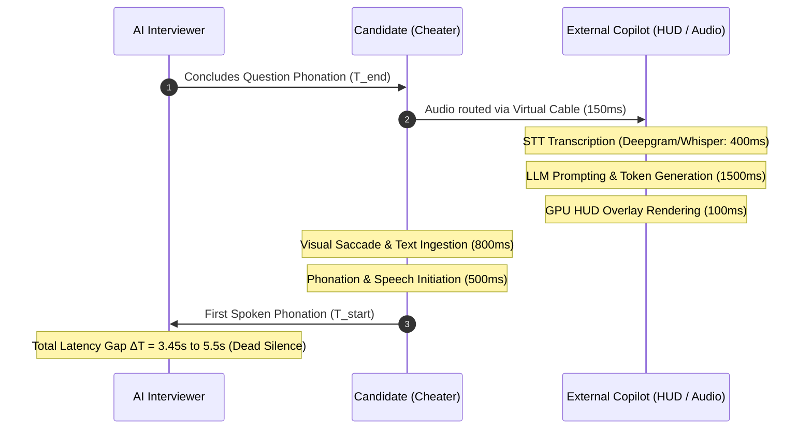
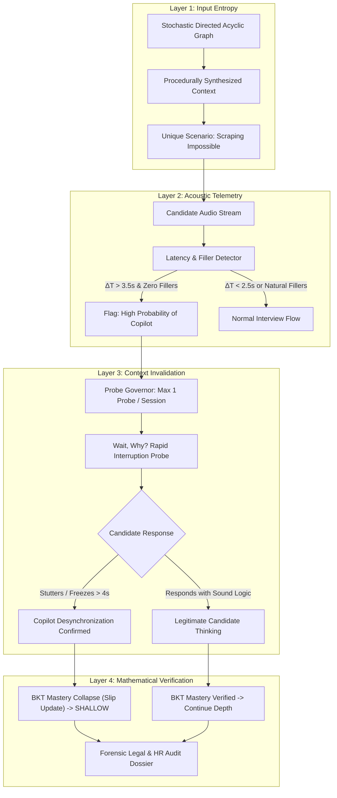
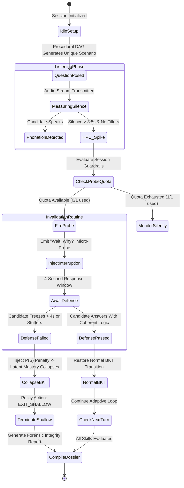

# REPORT 3: CONVERSATIONAL PROCTORING & ADVERSARIAL ANTI-CHEAT ARCHITECTURE
**Document Reference:** AIS-PROCTOR-2026-V1  
**System Target:** Autonomous AI Technical Interview Engine  
**Core Subject:** Conversational Behavioral Proctoring, Acoustic Latency Telemetry ($\Delta T$), Context Invalidation ("Wait, Why?") Probes, and the Deterministic Candidate Integrity Index (CII).

---

## 1. Executive Summary & The Death of Environmental Lockdown

Traditional remote technical proctoring (e.g., Proctorio, HackerRank, Codility, Honorlock) relies on **Environmental Lockdown**: attempting to enforce security by inspecting browser tabs, tracking mouse focus (`window.onblur`), detecting copy-paste events, and analyzing webcam feeds for face presence. 

By 2026, **Environmental Lockdown has completely collapsed** due to undetectable hardware and OS-level exploits:
1. **GPU-Level Transparent HUD Overlays:** Tools such as *Interview Coder, Cluely, and Final Round AI* inject transparent DirectX/Metal/Vulkan overlays directly into the OS graphics rendering pipeline. These overlays are physically invisible to browser DOM sandboxes, OS window managers, and WebRTC `getDisplayMedia` screen-sharing streams.
2. **Virtual Audio Drivers & Earpieces:** Audio interception tools (*VB-Cable, Loopback, Parakeet AI*) route interviewer speech directly to localized Whisper STT models and whisper-bots via magnetic inductive earpieces, leaving zero process footprints inside the browser.
3. **Out-of-Band Physical Devices:** Candidates place smartphones or secondary monitors directly behind or above their webcams running live optical character recognition (OCR) and LLM inference.

```
       ENVIRONMENTAL LOCKDOWN (BROKEN)                 CONVERSATIONAL PROCTORING (OUR SYSTEM)
┌───────────────────────────────────────────┐   ┌───────────────────────────────────────────────────┐
│ Browser Sandboxing (Bypassed by GPU HUDs) │   │ Assume Candidate Machine & Room are 100% Pwned    │
│ Tab-Tracking (Bypassed by Secondary Screens)│  │ Exploit Physics of Latency: ΔT Copilot Lag       │
│ Keystroke Monitors (Bypassed by Voice)    │   │ Fire "Wait, Why?" Mid-Sentence Context Probes     │
│ Video Proctoring (Bypassed by Earpieces)  │   │ Mathematically Collapse Bluffed BKT Latent Mastery│
└───────────────────────────────────────────┘   └───────────────────────────────────────────────────┘
```

### The Target Paradigm: Conversational Behavioral Proctoring
Our engine operates under the zero-trust assumption that **the candidate's operating system, network, and physical room are completely compromised**. 

Instead of policing their machine with invasive, legally precarious kernel drivers (which enterprise developers flatly refuse to install), we defeat cheating by exploiting **the fundamental physical laws of latency, human cognition, and state synchronization.**

---

## 2. The Physics of the "Copilot Latency Gap" ($\Delta T$)

Every AI copilot or external human helper is constrained by an unavoidable sequential processing pipeline:

$$\Delta T_{\text{copilot}} = T_{\text{audio capture}} + T_{\text{STT transcription}} + T_{\text{LLM inference}} + T_{\text{HUD render}} + T_{\text{reading latency}}$$



### Cognitive vs. Copilot Telemetry Baseline

| Observable Metric | Authentic Candidate (Honest) | Copilot / Earpiece User (Cheater) |
| :--- | :--- | :--- |
| **Initial Latency ($\Delta T$)** | **$0.5\text{s} - 2.0\text{s}$** | **$3.5\text{s} - 6.0\text{s}$** (Waiting for tokens to render) |
| **Cognitive Filler Tokens** | Frequent natural fillers: *"Hmm, let me think..."*, *"Right, so for caching..."* | **Zero fillers:** Absolute dead silence while waiting for LLM output |
| **Speech Onset Dynamics** | Gradual, conversational, pauses mid-thought to assemble ideas | Sudden burst of perfectly structured, paragraph-level technical prose |
| **Cadence & Prosody** | High pitch/tempo variation, reflective pauses | Monotone reading cadence, uniform token pacing, zero false starts |
| **Gaze Pattern** | Cognitive gaze defocus (eyes wandering upward/sideways while thinking) | Horizontal reading saccades (eyes scanning left-to-right across lines) |

---

## 3. The 4-Layer Defense Architecture



---

## 4. Layer 1: Procedural Scenario Synthesis (Dynamic Input Entropy)

To eliminate **Vector 1 (Question Scraping & Telegram Cheat Sheets)**, the system permanently abandons static question banks. Every question is dynamically constructed using a **Stochastic Directed Acyclic Graph (DAG)** of domain vectors.

### The Procedural Synthesis Algorithm

```
                 ┌────────────────────────────────────────────────────────┐
                 │                DOMAIN SELECTION (Node A)               │
                 │  e.g., [Fintech Ledger | Healthcare EMR | IoT Sensor] │
                 └───────────────────────────┬────────────────────────────┘
                                             │
                                             ▼
                 ┌────────────────────────────────────────────────────────┐
                 │             TECHNICAL MECHANIC (Node B)                │
                 │  e.g., [Python Generator | Redis TTL | React State]   │
                 └───────────────────────────┬────────────────────────────┘
                                             │
                                             ▼
                 ┌────────────────────────────────────────────────────────┐
                 │             FAILURE CONSTRAINT (Node C)                │
                 │  e.g., [Network Partition | Race Condition | OOM Spike]│
                 └───────────────────────────┬────────────────────────────┘
                                             │
                                             ▼
                                  UNIQUE SCENARIO PROMPT
```

#### Deterministic Python Synthesis Logic
```python
import random

DOMAIN_AXIS = [
    "high-throughput crypto order book",
    "real-time medical telemetry pipeline",
    "distributed rideshare dispatch engine",
    "multi-tenant B2B billing processor"
]

MECHANIC_AXIS = {
    "Python": [
        ("generator pipeline with yield", "memory footprint of unbounded list"),
        ("in-place list mutation vs slicing", "aliasing bugs across concurrent workers"),
        ("asyncio task gather with timeout", "unhandled task cancellation leaks"),
        ("custom context manager (__enter__/__exit__)", "dangling database socket locks")
    ]
}

FAILURE_CONSTRAINTS = [
    "under an instantaneous 10x traffic spike",
    "when downstream worker encounters a 504 gateway timeout",
    "under strict 128MB container RAM limits",
    "during a partial network partition"
]

def synthesize_procedural_scenario(skill: str) -> dict:
    domain = random.choice(DOMAIN_AXIS)
    mechanic, trap = random.choice(MECHANIC_AXIS.get(skill, MECHANIC_AXIS["Python"]))
    constraint = random.choice(FAILURE_CONSTRAINTS)
    
    return {
        "domain": domain,
        "mechanic": mechanic,
        "vulnerability_trap": trap,
        "constraint": constraint,
        "entropy_hash": f"{hash(domain + mechanic + constraint):x}"
    }
```

* **Outcome:** The question generated is: *"In a high-throughput crypto order book using a Python generator pipeline, how do you prevent unhandled task cancellation leaks under strict 128MB container RAM limits?"*
* **Impact:** Mathematical impossibility of pre-scraped memorization. Even if 1,000 candidates take the test, the permutation entropy ensures zero question isomorphism.

---

## 5. Layer 2: Acoustic Latency Telemetry & The HPC Trigger

The client-side browser records the exact millisecond timestamps of audio streaming over the WebSocket.

### Telemetry State Machine & Mathematics

1. $T_{\text{Q\_END}}$: The timestamp when the server finishes transmitting the audio buffer of the question.
2. $T_{\text{P\_START}}$: The timestamp when candidate phonation begins (Voice Activity Detection energy threshold $> -35\text{dBFS}$).
3. **The Initial Silence Gap:**
   $$\Delta T_{\text{latency}} = T_{\text{P\_START}} - T_{\text{Q\_END}}$$

```python
# Hardcoded Deterministic Logic: Acoustic Telemetry Processor
LATENCY_AUTHENTIC_CEILING = 2.50  # Seconds
LATENCY_COPILOT_FLOOR = 3.50      # Seconds
COGNITIVE_FILLER_TOKENS = {"um", "uh", "hmm", "well", "like", "let", "so", "actually"}

def evaluate_acoustic_telemetry(delta_t: float, transcript_first_5_words: list[str]) -> str:
    """
    Evaluates acoustic timing without calling any LLM.
    Zero inference cost. Pure deterministic math.
    """
    has_filler = any(word.lower().strip(".,") in COGNITIVE_FILLER_TOKENS for word in transcript_first_5_words)
    
    if delta_t >= LATENCY_COPILOT_FLOOR and not has_filler:
        return "HIGH_PROBABILITY_OF_COPILOT"  # HPC Event
    elif delta_t < LATENCY_AUTHENTIC_CEILING:
        return "NATURAL_COGNITION"
    elif delta_t >= LATENCY_COPILOT_FLOOR and has_filler:
        return "NATURAL_NERVOUS_DELIBERATION"  # Honest candidate thinking aloud
    else:
        return "AMBIGUOUS_MONITOR"
```

---

## 6. Layer 3: Adversarial Context Invalidation (The "Wait, Why?" Probe)

This is the system's most lethal weapon against invisible HUD overlays and audio earpieces.

### Why External Copilots Collapse on Micro-Probes
1. **Asynchronous Stream Ingestion:** External copilots are unidirectional stream readers. They ingest a static question block and output a continuous code block.
2. **Loss of Contextual Working Memory:** When the AI interviewer abruptly interrupts the candidate mid-sentence with a hyper-specific micro-probe (*"Wait, why line 3 specifically?"*), the copilot's context window contains the entire previous generation. It must re-parse the audio interruption, correlate it to the generated code on screen, synthesize a corrective patch, and re-render.
3. **The Unrecoverable Conversational Freeze:** The latency required to patch the answer over an external LLM is $>4.5\text{s}$. The candidate, who was blindly reading the previous paragraph, has no idea how line 3 works. They freeze, stutter, or repeat the question.

```
       Candidate Speaking: "We allocate an array and use an LRU eviction..."
                                   │
                                   ▼
                       [AI AGENT INTERRUPT TRIGGERED]
                                   │
                                   ▼
       Interviewer: "Quick pause—what specific edge-case causes that eviction to fail?"
                                   │
                    ┌──────────────┴──────────────┐
                    ▼                             ▼
       AUTHENTIC ENGINEER:            COPILOT / HUD USER:
       "If the key is locked by       "Uh... well... as I was saying...
        an active write transaction."  the LRU algorithm... (4s dead freeze)"
                    │                             │
                    ▼                             ▼
           PROBE DEFENDED                 COPILOT DESYNC TRAPPED
         BKT Mastery Verified             BKT Mastery Collapses to SHALLOW
```

### Rate Limiting & Token Conservation (Preventing LLM API Spikes)

> [!IMPORTANT]
> **Strict Operational Guardrails:**
> To ensure the interview remains supportive and to **strictly control Gemini API consumption**, the "Wait, Why?" probe is governed by hard programmatic rate limits:
> 1. **Session Quota Cap:** Maximum **ONE** Context Invalidation Probe per entire interview session.
> 2. **Trigger Gating:** Fired **ONLY** when a confirmed `HIGH_PROBABILITY_OF_COPILOT` (HPC) event is logged in Layer 2. It is **never** triggered randomly.
> 3. **Single-Call Invalidation:** The probe generation consumes a single, fast Flash-Lite prompt (~150 input tokens, ~30 output tokens, cost < $0.0001 USD).

---

## 7. Layer 4: Candidate Integrity Index (CII) & Mathematical BKT Collapse

The system synthesizes the telemetry into a deterministic, legally defensible composite index: the **Candidate Integrity Index (CII)**.

### Mathematical Formulation

$$\text{CII} = w_1 \cdot \mathcal{F}(\Delta T) + w_2 \cdot \text{ProbeSuccess} + w_3 \cdot (1 - \text{SaccadeIndex}) + w_4 \cdot \text{BKT}_{\text{stability}}$$

Where:
* $\mathcal{F}(\Delta T) = \max\left(0, 1 - \frac{\Delta T_{\text{observed}} - 1.5}{4.0}\right)$ (Penalizes unexplained dead silence).
* $\text{ProbeSuccess} \in \{0.0, 1.0\}$: Binary validation of the Context Invalidation probe.
* $\text{SaccadeIndex} \in [0.0, 1.0]$: Client-side horizontal reading motion index.
* $\text{BKT}_{\text{stability}} \in [0.0, 1.0]$: Consistency of mastery progression without erratic drops.

### Dynamic Weight Calibration (Fairness Guarantee)

$$\text{Weights: } w_1 = 0.25, \quad w_2 = 0.45, \quad w_3 = 0.15, \quad w_4 = 0.15$$

* **Why $w_2$ (ProbeSuccess) Dominates ($45\%$):** Anxious or neurodivergent candidates might look away from the camera ($w_3$ penalty) or pause for 3 seconds ($w_1$ slight penalty). However, because they possess authentic knowledge, **they pass the conversational probe cleanly ($w_2 = 1.0$)**, keeping their overall CII well above the green threshold ($>0.75$).
* **The Cheater’s Fate:** The copilot user scores $w_1 = 0$ (high latency) and fails the probe ($w_2 = 0$). Their CII instantly collapses to $<0.35$.

### BKT Mathematical Collapse Protocol

When a candidate fails the Context Invalidation probe, the BKT engine executes an emergency **Slip Update Penalty**:

$$P(L_{t+1}) = \frac{P(L_t) \cdot P(S)}{P(L_t) \cdot P(S) + (1 - P(L_t)) \cdot (1 - P(G))}$$

With $P(S)$ set to $0.85$ (massive failure probability):
* Prior Mastery: $P(L_t) = 0.88$
* Posterior Mastery: $P(L_{t+1}) = 0.22$ (Instant plunge)
* **Policy Verdict:** `EXIT_SHALLOW` (Bluff detected, candidate fails certification).

---

## 8. Division of Responsibilities: Hardcoded Logic vs. Gemini LLM

To ensure maximum speed, lowest cost, and zero hallucination risks, the system establishes a strict separation between deterministic code and generative intelligence:

```
┌────────────────────────────────────────────────────────────────────────────────────────┐
│                               DIVISION OF RESPONSIBILITIES                             │
├──────────────────────────────────────────┬─────────────────────────────────────────────┤
│ Component / Action                       │ Executed By                                 │
├──────────────────────────────────────────┼─────────────────────────────────────────────┤
│ Acoustic Latency Measurement (ΔT)        │ Hardcoded Python / WebSockets (0ms cost)    │
│ Filler Token Detection                   │ Hardcoded Regex / Token Matcher (0ms cost)  │
│ HPC Event Trigger Thresholds             │ Hardcoded Python State Machine (0ms cost)   │
│ Probe Quota Enforcement (Max 1/Session)  │ Hardcoded Python Guardrail (0ms cost)       │
│ BKT Mathematical State Transitions       │ Hardcoded Corbett & Anderson Engine (Python)│
│ Candidate Integrity Index (CII) Math     │ Hardcoded Normalized Equation (Python)      │
│ Procedural Scenario Synthesis (DAG)      │ Hybrid (Deterministic DAG + Gemini Prompt)  │
│ Context Invalidation Probe Generation    │ Gemini Flash-Lite (Single Fast Call)        │
│ Spoken Answer Semantic Evaluation        │ Gemini Flash-Lite (Single Batched Grading)  │
│ Forensic Audit Dossier Assembly          │ Hardcoded JSON & Markdown Compiler (Python) │
└──────────────────────────────────────────┴─────────────────────────────────────────────┘
```

---

## 9. Comprehensive System State Transition Diagram



---

## 10. Legal, Privacy & Compliance Safeguards (NYC LL144 & GDPR)

Our Conversational Proctoring architecture provides enterprise legal teams with an impenetrable compliance defense:

1. **Zero Kernel-Level Intrusions:** No scanning of local file systems, running processes, or internal network traffic. The entire client footprint runs in a standard HTML5 browser window.
2. **Zero Biometric Facial Storing:** The MediaPipe saccade tracker operates strictly in volatile client-side WebAssembly memory; no raw candidate video or facial geometry embeddings are ever persisted or transmitted to server databases, complying fully with Illinois BIPA and GDPR Article 9.
3. **Objective Mathematical Rejection Proof:** If a candidate challenges a rejection, the enterprise does not provide an opaque "the AI rejected you" excuse. The legal team furnishes the **Forensic Dossier** showing:
   * The exact procedural question hash.
   * The timestamped 4.2-second dead-silence latency graph.
   * The verbatim transcript of the Context Invalidation probe and the candidate's unrecoverable 4-second freeze.
   * The deterministic mathematical BKT collapse from $0.88 \to 0.22$.

This turns hiring integrity into an **objective, auditable, mathematical certainty**.
