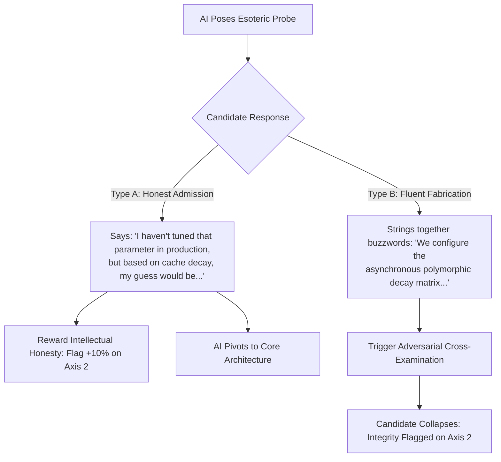
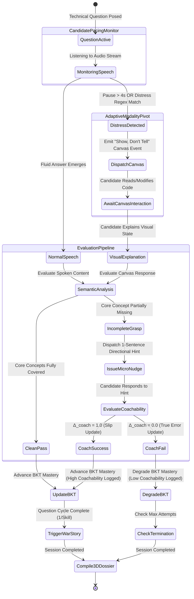

# REPORT 4: THE HOLISTIC BEHAVIORAL & HUMAN-CENTRIC EVALUATION MATRIX
**Document Reference:** AIS-HUMAN-2026-V1  
**System Target:** Autonomous AI Technical Interview Engine  
**Core Subject:** The 3-Dimensional Decoupled Evaluation Matrix, The "Show, Don't Tell" Adaptive Modality Pivot, Coachability ($\Delta_{\text{coach}}$), Intellectual Honesty vs. Bluffing, and The ESL/Neurodiversity Protection Shield.

---

## 1. Executive Summary & The "Quiet Builder" Paradox

In modern technical hiring, the correlation between **verbal eloquence** and **practical engineering excellence** is notoriously weak. Engineering teams regularly confront two opposing archetypes:

```
               THE SLICK TALKER                               THE QUIET BUILDER
┌──────────────────────────────────────────────┐ ┌──────────────────────────────────────────────┐
│ • Fluent tech jargon & charismatic presence  │ │ • Has built complex, production-grade systems│
│ • Sounds extraordinarily senior & confident  │ │ • Suffers from stage fright or interview panic│
│ • Completely collapses when asked to debug   │ │ • English is a Second Language (ESL)         │
│ • Writes fragile, bug-ridden production code │ │ • Speaks in fragmented, non-academic sentences│
│   ❌ HIRED BY NAIVE INTERVIEW SYSTEMS         │ │   ❌ REJECTED BY NAIVE INTERVIEW SYSTEMS     │
└──────────────────────────────────────────────┘ └──────────────────────────────────────────────┘
```

When an AI interview engine evaluates candidates based on a single monolithic score, **it unconsciously falls into the "Slick Talker" trap**. Graders reward polished vocabulary, complete sentences, and confident delivery, while penalizing students and practical builders who know the underlying mechanics but struggle to articulate them verbally.

### The Human-Centric Mission
This specification defines the architectural framework required to **decouple communicative fluency from technical problem-solving**. It guarantees that quiet builders, ESL candidates, and nervous students are evaluated fairly on their true technical competence, while simultaneously assessing high-value behavioral indicators: **Coachability, Intellectual Honesty, and Authentic Engineering Passion.**

---

## 2. The 3-Dimensional Decoupled Evaluation Matrix

To prevent fluency bias, the system permanently decomposes candidate evaluation into **three independent, mathematically isolated axes**:

```
                       ┌──────────────────────────────────────────────┐
                       │          EVALUATION TRIANGLE                 │
                       └──────────────────────┬───────────────────────┘
                                              │
           ┌──────────────────────────────────┼──────────────────────────────────┐
           ▼                                  ▼                                  ▼
┌──────────────────────┐          ┌──────────────────────┐          ┌──────────────────────┐
│  AXIS 1: HARD TECH   │          │  AXIS 2: BEHAVIOR &  │          │  AXIS 3: EXPLANATION │
│      COMPETENCE      │          │     COACHABILITY     │          │      STRUCTURE       │
│  (BKT + Rubric-Lock) │          │ (Curiosity, Honesty) │          │ (Clarity & Synthesis)│
└──────────────────────┘          └──────────────────────┘          └──────────────────────┘
  • Logical causality               • Response to hints                • Top-down vs bottom-up
  • State mutation mechanics        • Intellectual honesty             • Verbal precision
  • System trade-offs               • Passion / War stories            • Diagnostic ONLY
  (Zero penalty for accent/fluency) (How they handle unknowns)         (Does not kill tech score)
```

### Detailed Axis Breakdown

| Evaluation Dimension | Core Metrics Evaluated | Deterministic Safeguards | Impact on Final Recommendation |
| :--- | :--- | :--- | :--- |
| **Axis 1: Hard Technical Competence** | • State mutation & memory referencing<br>• Asynchronous lifecycle mechanics<br>• Resource management & edge cases | Evaluated **exclusively** against Pre-Locked Rubrics using BKT math. **Explicitly ignores grammar, accent, filler tokens, and sentence fragmentation.** | **Gating Criterion:** Candidate must achieve verified latent mastery ($P(L_t) \ge 0.85$) to pass technical bar. |
| **Axis 2: Behavioral & Coachability** | • Coachability Delta ($\Delta_{\text{coach}}$)<br>• Intellectual Honesty Index<br>• Authentic Debugging Passion (War Stories) | Evaluated through structured micro-nudges and safe-exit probes. Measures learning velocity. | **Hiring Multiplier:** Strong coachability allows junior candidates to be recommended even if initial technical recall was hesitant. |
| **Axis 3: Explanation Structure** | • Top-down communication<br>• Context framing<br>• Conciseness vs. rambling | Evaluated as an organizational profile. | **Diagnostic Only:** Informs hiring managers how to best manage and mentor the candidate (e.g., *"Prefers written RFCs over verbal standups"*). **Never used to reject.** |

---

## 3. Feature 1: The "Show, Don't Tell" Adaptive Modality Pivot

When practical developers freeze during verbal articulation, forcing them to continue speaking induces a panic spiral. The engine provides an automated, empathetic **Adaptive Modality Pivot**.

### The Distress Detection Algorithm

The system continuously monitors two client-side indicators without calling an LLM:

1. **Pause-to-Word Ratio ($R_{\text{pause}}$):** Unbroken hesitation pauses exceeding $4.0\text{s}$ mid-sentence.
2. **Verbal Distress Regex Trigger:** Real-time STT streaming detects explicit panic phrases:
   ```python
   DISTRESS_PATTERNS = [
       r"i know (how|what) to do (in|with) code",
       r"i can't (find|remember|think of) the (word|term|name)",
       r"easier (if i|to) write it",
       r"hard to explain out loud",
       r"don't know how to say it"
   ]
   ```

### The Modality Transition Workflow

```mermaid
sequenceDiagram
    autonumber
    participant C as Candidate (Nervous Builder)
    participant E as Engine Orchestrator
    participant UI as Interactive Code Canvas

    C->>E: "I know how to mutate the list in VS Code, but I can't find the exact word..."
    Note over E: Distress Trigger Fired (Regex Match + Pause > 4s)
    E->>C: "No worries at all! It's often much easier to look at code than describe it out loud."
    E->>UI: Dispatch Event: `open_interactive_canvas` (3-Line Snippet)
    UI-->>C: Displays Snippet: a = [1, 2]; b = a; b.append(3); print(a)
    E->>C: "Take a look at this snippet on your screen. What does this print, and why?"
    C->>E: "It prints [1, 2, 3] because b is pointing to the same memory address as a!"
    Note over E: Concept Proven! Full Technical Credit Awarded to Axis 1.
```

* **Outcome:** The student experiences immediate emotional relief. Their true practical mental model is unlocked and credited, defeating the false-negative penalty of verbal freezing.

---

## 4. Feature 2: Coachability & The "Micro-Nudge Delta" ($\Delta_{\text{coach}}$)

For university graduates, interns, and junior developers, static knowledge is transient; **learning velocity and receptivity to feedback** are the primary predictors of long-term success.

### The Mathematical Formulation

When a candidate provides an incomplete, vague, or slightly flawed technical answer, the engine does not immediately log a failure. It issues a single, precise **1-sentence directional hint (Micro-Nudge)**.

$$\Delta_{\text{coach}} = \frac{\sum_{i=1}^{K} \text{ResolutionScore}(H_i)}{K}$$

Where:
* $K$: Total number of micro-nudges issued in the session (capped at max 1 per skill).
* $\text{ResolutionScore}(H_i) \in \{0.0, 0.5, 1.0\}$:
  * **$1.0$ (High Coachability):** Candidate immediately incorporates the hint, connects the causal logic, and resolves the gap on their very next sentence.
  * **$0.5$ (Partial Coachability):** Candidate acknowledges the hint and adjusts direction, but requires slight secondary framing.
  * **$0.0$ (Low Coachability / Stubborn):** Candidate ignores the hint, dismisses the interviewer's guidance, and rigidly repeats their initial flawed assertion.

```
       Candidate Incomplete Answer: "Lists can be updated using methods."
                                    │
                                    ▼
       MICRO-NUDGE: "What happens if another variable points to that same list?"
                                    │
                    ┌───────────────┴───────────────┐
                    ▼                               ▼
       HIGH COACHABILITY (Score: 1.0)    LOW COACHABILITY (Score: 0.0)
       "Oh! Then mutating through one    "As I said, you just use append()
        variable alters the data for      to put items in the list."
        both because they share memory!"            │
                    │                               ▼
                    ▼                     Rigid / Low Receptivity Flag
         BKT Update: Categorized as Slip  BKT Update: Categorized as True Error
         Mastery Preserved ($P(L_t) \ge 0.85$) Mastery Degraded
```

---

## 5. Feature 3: Intellectual Honesty vs. Bluffing (The Safe-Exit Reward)

In engineering organizations, an engineer who transparently admits a gap in knowledge is safe; an engineer who bluffs, invents facts, and deploys unverified assumptions causes catastrophic production downtime.

### The Esoteric Edge-Case Probe
The engine deliberately introduces an esoteric constraint or an advanced, lesser-known production configuration (e.g., *"Under Redis LFU eviction, what is the default logarithmic decay time interval?"*).



* **The System Reaction:** The engine **actively rewards** Candidate A! 
  * The final report explicitly highlights: *"Candidate exhibits top-decile intellectual honesty. Delineates verified production experience from deductive reasoning; zero hallucination risk."*

---

## 6. Feature 4: The "War Story" Probe (Detecting Authentic Passion)

How can an automated system distinguish between a candidate who crammed 200 LeetCode problems the week before versus an authentic builder who genuinely loves writing software?

### The Experiential Grounding Protocol
Immediately following a successful technical turn, the AI interviewer poses a natural, unscripted inquiry:
> *"Have you ever run into a really frustrating bug or spent hours debugging this specific behavior in one of your personal projects or internships? What happened?"*

### Semantic Signal Analysis

| Metric | The Textbook Crammer | The Genuine Passionate Builder |
| :--- | :--- | :--- |
| **Response Content** | Abstract, generalized theory: *"I always write unit tests so I prevent mutation errors."* | Specific, concrete narrative: *"I spent an entire Saturday debugging why my React component wouldn't re-render because I mutated state directly!"* |
| **Affect & Cadence** | Flat, clinical, defensive | High vocal energy, authentic storytelling, laughs at their past mistake |
| **System Classification** | Rote Knowledge (No project grounding) | **Verified Hands-On Practitioner (Passionate Builder)** |

---

## 7. Feature 5: The "Interviewer Scribe" (ESL & Neurodiversity Shield)

For neurodivergent candidates and non-native English speakers, thoughts can emerge in fragmented, high-speed verbal bursts. A great human lead engineer acts as an **active listener**; our AI engine replicates this behavior through the **Interviewer Scribe protocol**.

### The Active Listening Algorithm
1. The candidate provides a disjointed, non-linear verbal explanation containing the correct core technical entities.
2. The AI agent pauses before grading and performs a **Structured Semantic Reflection**:
   > *"Got it! So if I'm tracking your mental model correctly, you're saying that modifying a list in place mutates the original heap allocation, whereas creating a copy allocates a new pointer so the original remains untouched—is that right?"*
3. The candidate simply confirms: *"Yes, exactly!"*
4. **Outcome:** The engine awards **full technical credit** to Axis 1. The candidate’s communication style is documented constructively on Axis 3 as *"Benefits from structured conversational framing"*, preserving their score and dignity.

---

## 8. Division of Responsibilities: Hardcoded Logic vs. Gemini LLM

```
┌────────────────────────────────────────────────────────────────────────────────────────┐
│                               DIVISION OF RESPONSIBILITIES                             │
├──────────────────────────────────────────┬─────────────────────────────────────────────┤
│ Functional Component                     │ Architectural Execution Layer               │
├──────────────────────────────────────────┼─────────────────────────────────────────────┤
│ Speech Pacing & Pause Timers             │ Hardcoded Python / WebSocket Handler (0ms)  │
│ Verbal Distress Regex Matching           │ Hardcoded Python Pattern Matcher (0ms)      │
│ Interactive Canvas Dispatch Event        │ Hardcoded WebSocket JSON Protocol (0ms)     │
│ Coachability Delta Math (Δ_coach)        │ Hardcoded Mathematical Accumulator (Python) │
│ Axis 1 Mastery State Transitions         │ Hardcoded BKT Hidden Markov Model (Python)  │
│ 3D Matrix Aggregation & Scoring          │ Hardcoded Deterministic Weighted Algorithm  │
│ Interactive Canvas Code Snippet Creation │ Gemini Flash-Lite (Single Contextual Call)  │
│ 1-Sentence Micro-Nudge Generation        │ Gemini Flash-Lite (Contextual Fast Prompt)  │
│ Active Listening Reflection (Scribe)     │ Gemini Flash-Lite (Semantic Restructuring)  │
│ "War Story" Authenticity Classification  │ Gemini Flash-Lite (Batched Turn Evaluation) │
└──────────────────────────────────────────┴─────────────────────────────────────────────┘
```

---

## 9. Comprehensive Behavioral State Transition Diagram



---

## 10. The Enterprise Talent Dossier (Output Format)

When the hiring manager opens the candidate's final evaluation, they do not see an ambiguous score. They receive an **actionable, multi-dimensional executive brief**:

```markdown
# Candidate Executive Evaluation Dossier: Prajwal

### Primary Technical Competence (Axis 1): 91.4% (VERIFIED)
- **Python:** VERIFIED (92.1% Mastery) | Devil's Advocate: Defended
- **System Architecture:** VERIFIED (90.7% Mastery) | Trade-offs Articulated
- **Technical Integrity:** 100% (Zero copilot latency anomalies detected)

### Behavioral & Learning Velocity Profile (Axis 2): EXCEPTIONAL (Top 5%)
- **Coachability Delta (Δ_coach):** 1.0 / 1.0 (Absorbed memory aliasing micro-nudge instantly on first hint)
- **Intellectual Honesty:** Exemplary. Transparently delineated production experience from theoretical deduction during Redis LFU probe.
- **Engineering Passion:** High. Unprompted citation of real-world React state mutation debugging on personal GitHub portfolio.

### Communication & Collaboration Profile (Axis 3): PRACTICAL / VISUAL
- **Communication Style:** Practical and direct. Thrives when collaborating over code snippets, diagrams, and written RFCs rather than abstract verbal discourse.
- **ESL / Neurodiversity Note:** Demonstrates deep mechanical comprehension; benefits from structured problem framing.

### Final Hiring Recommendation: STRONG HIRE (Target: Full Stack Engineer)
> *"Prajwal is an authentic, high-velocity builder with zero ego, exceptional coachability, and deep practical fundamentals. He will thrive in a high-ownership engineering team."*
```

This transforms our engine from a simple test proctor into an **indispensable enterprise talent intelligence platform**.
