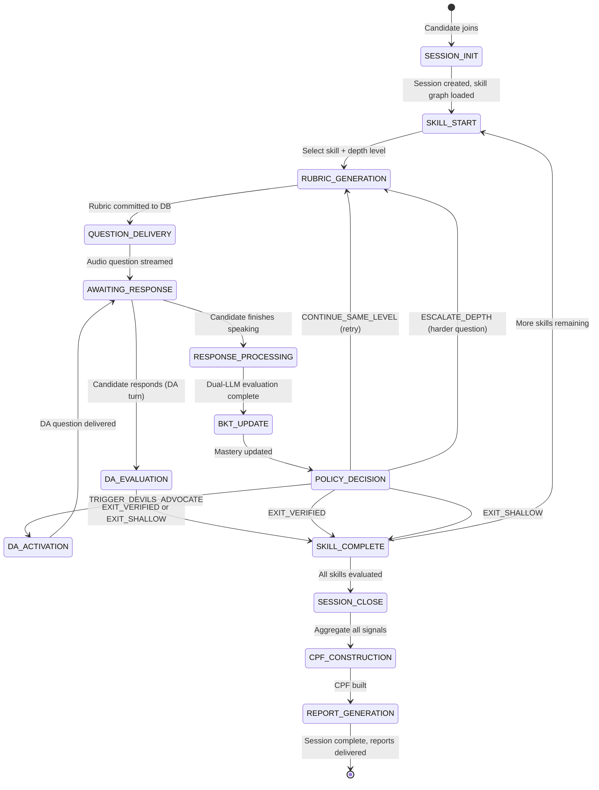

# REPORT 6: System Flow, Workflows & Process Architecture
**Document Reference:** AIS-FLOW-2026-V1  
**Subtitle:** The Autonomous Socratic Interview Engine — The Complete End-to-End Journey of a Candidate Through the System  
**Audience:** Engineering Leadership, Backend Architects, QA Engineers, Product Managers

---

## Table of Contents
1. [The Big Picture — System Overview Block Diagram](#1-the-big-picture)
2. [Phase 1 — Session Initialization](#2-phase-1--session-initialization)
3. [Phase 2 — Question Delivery & Rubric-Lock](#3-phase-2--question-delivery--rubric-lock)
4. [Phase 3 — Candidate Response & Dual-LLM Processing](#4-phase-3--candidate-response--dual-llm-processing)
5. [Phase 4 — BKT Math Update Loop](#5-phase-4--bkt-math-update-loop)
6. [Phase 5 — Policy Decision & Routing](#6-phase-5--policy-decision--routing)
7. [Phase 6 — Devil's Advocate Activation Sequence](#7-phase-6--devils-advocate-activation-sequence)
8. [Phase 7 — HHGKT Graph Propagation](#8-phase-7--hhgkt-graph-propagation)
9. [Phase 8 — Session Termination & CPF Construction](#9-phase-8--session-termination--cpf-construction)
10. [Phase 9 — Fraud Detection Pipeline](#10-phase-9--fraud-detection-pipeline)
11. [Complete State Machine](#11-complete-state-machine)
12. [WebSocket Message Protocol](#12-websocket-message-protocol)
13. [Database Schema Flow](#13-database-schema-flow)
14. [Candidate Experience Journey Map](#14-candidate-experience-journey-map)
15. [Backend Component Interaction Map](#15-backend-component-interaction-map)

---

## 1. The Big Picture

The entire system can be summarized in five layered tiers. Each tier has a strictly defined responsibility and cannot interfere with another tier's domain.

```
+============================================================================+
|                   THE SOCRATIC INTERVIEW ENGINE — 5 TIERS                 |
+============================================================================+
|  TIER 1: CANDIDATE INTERFACE                                               |
|  Browser <-> WebSocket <-> Voice Input/Output                              |
|  What it does: Captures audio, streams to backend, renders AI speech       |
+----------------------------------------------------------------------------+
|  TIER 2: QUARANTINED CONVERSATIONAL AI (Gemini Live API)                   |
|  Speaks naturally. Empathizes. Scaffolds. Asks DA questions.               |
|  CANNOT see rubrics. CANNOT set scores. CANNOT route candidate.            |
+----------------------------------------------------------------------------+
|  TIER 3: SHADOW EVALUATOR AI (Gemini REST API — Async)                    |
|  Receives rubric + candidate text. Returns JSON verdict only.              |
|  CANNOT access conversation tone. CANNOT see previous verdicts.            |
+----------------------------------------------------------------------------+
|  TIER 4: DETERMINISTIC MATH ENGINE (Pure Python — No AI)                  |
|  BKT math. Policy routing. DA triggers. HHGKT graph updates.               |
|  CPF vector construction. Fraud signal aggregation.                        |
+----------------------------------------------------------------------------+
|  TIER 5: PERSISTENCE & AUDIT LAYER                                         |
|  PostgreSQL: Sessions, rubrics, verdicts, mastery history, audit logs.     |
|  All writes are immutable append-only. Nothing is ever overwritten.        |
+============================================================================+
```

### The Master Flow Diagram

```
[CANDIDATE SPEAKS]
       |
       v
[WebSocket Audio Stream] --> [Gemini Live API — Quarantined LLM]
       |                              |
       |                    (Conversational response
       |                     spoken back to candidate)
       |
[Speech-to-Text Transcript]
       |
       v
[Shadow Evaluator: rubric + transcript] --> [Gemini REST API]
                                                    |
                                          [Returns JSON verdict:
                                           correct/partial/incorrect]
                                                    |
                                                    v
                                         [BKT Math Engine — bkt.py]
                                                    |
                                          [Updates mastery P(L)]
                                                    |
                                                    v
                                         [Policy Engine — policy.py]
                                                    |
                            +-----------+-----------+-----------+
                            |           |           |           |
                     ESCALATE_    CONTINUE_   TRIGGER_    EXIT_
                      DEPTH      SAME_LEVEL  DEVILS_ADV  VERIFIED/
                            |           |           |    SHALLOW
                            v           v           v       |
                    [Next question] [Retry Q]  [DA Mode]    |
                                                            v
                                                   [CPF Builder]
                                                            |
                                                   [Final Report]
```

---

## 2. Phase 1 — Session Initialization

### What Happens When a Candidate Joins

```
STEP 1.1: Candidate Authentication
  Browser -> POST /api/session/create
  Backend creates a session_id (UUID v4)
  Writes to DB: sessions table (session_id, candidate_id, timestamp, status=PENDING)

STEP 1.2: Skill Graph Loading
  Backend loads the target role's skill graph from DB
  Example for "Backend Engineer - Senior":
    Skills: [Concurrency, Databases, System Design, Networking, Algorithms]
    Entry points: [L1 for each skill]
    HHGKT dependency edges: Algorithms -> Data Structures -> Sorting,
                             Networking -> TCP/IP -> HTTP -> REST Design, etc.

STEP 1.3: Session State Initialization
  In-memory session object created:
  {
    "session_id": "uuid-1234",
    "current_skill": "Concurrency",
    "current_depth": "L1",
    "mastery_map": { "Concurrency": 0.30, "Databases": 0.30, ... },
    "attempts_map": { "Concurrency": 0, "Databases": 0, ... },
    "has_faced_da": false,
    "behavioral_log": [],
    "turn_count": 0,
    "fraud_signals": []
  }

STEP 1.4: Gemini Live API WebSocket Handshake
  Backend opens a bidirectional WebSocket to Gemini Live API
  Sends system prompt for Quarantined LLM:
  {
    "role": "You are a brilliant, empathetic senior engineer having a
             genuine conversation with a colleague to understand their
             engineering intuition. You are NOT an examiner. You are
             curious and supportive. You may NEVER state the answer
             to any question outright. You may NEVER score the candidate.
             You may NEVER decide what question comes next — that is handled
             by the orchestration system which will send you the next topic."
  }

STEP 1.5: First Question Selection
  Policy Engine selects skill = "Concurrency", depth = "L1"
  -> Triggers Phase 2 (Rubric Generation + Question Delivery)
```

---

## 3. Phase 2 — Question Delivery & Rubric-Lock

### The Pre-Display Protocol (Happens Before Candidate Hears Anything)

```
STEP 2.1: Rubric Generation (Shadow Evaluator)
  Shadow Evaluator receives:
  {
    "task": "generate_rubric",
    "skill": "Concurrency",
    "depth_level": "L1",
    "role_level": "senior"
  }
  Returns JSON array of boolean checkpoints (e.g., 4-6 items)

STEP 2.2: Immutable Rubric Commit
  question_id = generate_uuid()
  rubric_json = [{"id":"cp1","criterion":"..."}, ...]
  rubric_hash = sha256(rubric_json)

  DB WRITE (immutable):
  INSERT INTO rubrics (question_id, session_id, skill, depth,
                       rubric_json, rubric_hash, created_at)

  -- This record is NEVER updated after creation --

STEP 2.3: Question Text Generation (Shadow Evaluator)
  Shadow Evaluator generates the actual question text (NOT shown to
  Quarantined LLM in its full form — only the topic is forwarded)

STEP 2.4: Question Delivery to Quarantined LLM
  System sends to Quarantined LLM's WebSocket:
  {
    "instruction": "Ask the candidate about the following topic naturally,
                    as a peer would in a real conversation. Topic: mutex
                    vs semaphore in a concurrent producer-consumer system.
                    Depth: introductory. Do NOT present it as an exam question.
                    Make it feel like you just encountered this problem at work."
  }

STEP 2.5: Audio Delivery to Candidate
  Quarantined LLM generates natural speech
  Audio streamed via WebSocket to candidate's browser
  question_start_time = record_timestamp()
```

---

## 4. Phase 3 — Candidate Response & Dual-LLM Processing

### What Happens When the Candidate Speaks

```
STEP 3.1: Audio Capture
  Browser captures microphone audio at 16kHz PCM
  Streams to Quarantined LLM via WebSocket (barge-in supported)
  first_word_timestamp = record_timestamp()  <-- fraud detection signal

STEP 3.2: Quarantined LLM Live Processing
  Quarantined LLM processes audio in real-time
  - Detects end of candidate's speech (natural pause detection)
  - If candidate asks a clarifying question: responds naturally
  - If candidate goes quiet mid-answer: uses gentle prompts
    ("Take your time", "What's your initial intuition here?")
  - DOES NOT score anything. DOES NOT access the rubric.

STEP 3.3: Transcript Generation
  Full transcript of candidate's response is extracted
  response_end_time = record_timestamp()
  response_latency = first_word_timestamp - question_start_time

  DB WRITE:
  INSERT INTO responses (question_id, session_id, transcript, latency_ms,
                         response_end_time)

STEP 3.4: Fraud Signal Collection (Async, parallel to Step 3.5)
  FraudDetector.analyze(
    latency_ms = response_latency,
    transcript = candidate_transcript,
    depth_level = "L1",
    turn_count = session.turn_count,
    vocab_baseline = session.vocab_baseline
  )
  -> Writes signals to session.fraud_signals[]

STEP 3.5: Shadow Evaluator Assessment (Async)
  Shadow Evaluator receives:
  {
    "task": "evaluate_response",
    "rubric": [{"id":"cp1","criterion":"..."}, ...],  // from DB, NOT from Quarantined LLM
    "candidate_transcript": "...",
    "depth_level": "L1"
  }

  Shadow Evaluator checks each checkpoint independently:
  {
    "cp1": true,   // Candidate mentioned mutex vs semaphore
    "cp2": false,  // Did not mention deadlock
    "cp3": true,   // Proposed a concrete approach
    "cp4": false   // No real-world analogy
  }

  Checkpoint pass rate = 2/4 = 50% -> verdict = "partial"

  Returns:
  {
    "verdict": "partial",
    "checkpoint_results": {...},
    "reasoning": "Candidate demonstrated basic mutex understanding but
                  did not address deadlock risk or provide a concrete
                  production scenario."
  }
```

---

## 5. Phase 4 — BKT Math Update Loop

### Pure Deterministic Math — No AI Involved

```
STEP 4.1: Read current state
  prior = session.mastery_map["Concurrency"]  # = 0.30
  depth = session.current_depth               # = "L1"
  verdict = shadow_evaluator_result.verdict   # = "partial"

STEP 4.2: Load depth parameters
  params = DEPTH_LEVEL_PARAMS["L1"]
  # = DepthParams(guess=0.30, slip=0.05, learn=0.05)

STEP 4.3: Compute Bayesian Posterior (Step 1 of BKT)
  # For partial verdict: 50/50 mixture
  
  num_c = 0.30 * (1 - 0.05)  = 0.285
  den_c = 0.285 + (0.70 * 0.30) = 0.285 + 0.210 = 0.495
  post_c = 0.285 / 0.495 = 0.5758  (posterior IF correct)
  
  num_i = 0.30 * 0.05 = 0.015
  den_i = 0.015 + (0.70 * 0.70) = 0.015 + 0.490 = 0.505
  post_i = 0.015 / 0.505 = 0.0297  (posterior IF incorrect)
  
  posterior = 0.5 * 0.5758 + 0.5 * 0.0297 = 0.3028

STEP 4.4: Apply Learning Transition (Step 2 of BKT)
  next_mastery = 0.3028 + (1 - 0.3028) * 0.05
               = 0.3028 + 0.0699 * 0.05
               = 0.3028 + 0.0035
               = 0.3063

STEP 4.5: Update session state
  session.mastery_map["Concurrency"] = 0.3063
  session.attempts_map["Concurrency"] += 1  # now = 1

STEP 4.6: DB Write (append-only audit)
  INSERT INTO mastery_history (session_id, skill, question_id,
                                prior, posterior, next_mastery,
                                verdict, timestamp)
```

---

## 6. Phase 5 — Policy Decision & Routing

### The Traffic Director

```
STEP 5.1: Call Policy Engine
  decision = evaluate_policy(
    depth_level  = "L1",
    prior        = 0.30,
    next_mastery = 0.3063,
    attempts     = 1,
    verdict      = "partial",
    is_da_turn   = False,
    has_faced_da = False
  )

STEP 5.2: Policy resolves action
  # Is this a DA turn? No.
  # DA trigger check: 0.3063 < 0.85, delta = 0.006 < 0.20. No DA.
  # Budget check: attempts=1 < 4. No exit.
  # Mastery check: 0.3063 < 0.85. No escalation.
  # Verdict = partial -> CONTINUE_SAME_LEVEL

  decision = PolicyDecision(
    action = "CONTINUE_SAME_LEVEL",
    next_depth = "L1",
    state = "IN_PROGRESS",
    is_devils_advocate = False,
    reason = "Partial credit at L1. Re-probing at same depth..."
  )

STEP 5.3: Route based on action
  CONTINUE_SAME_LEVEL:
    -> Select a DIFFERENT L1 question on Concurrency (same topic, new angle)
    -> Go to Phase 2 (new rubric, same depth level)

  ESCALATE_DEPTH:
    -> Set current_depth = "L2"
    -> Go to Phase 2 (new rubric, harder question)

  TRIGGER_DEVILS_ADVOCATE:
    -> Go to Phase 6 (DA Activation)

  EXIT_VERIFIED or EXIT_SHALLOW:
    -> Record skill outcome
    -> Select next skill OR go to Phase 8 (session termination) if all skills done
```

---

## 7. Phase 6 — Devil's Advocate Activation Sequence

### What Triggers It and What Happens

```
TRIGGER SCENARIO:
  Candidate has now answered 3 questions on Concurrency.
  After Turn 3 (L3 correct): mastery jumps from 0.65 to 0.92
  delta = 0.92 - 0.65 = 0.27 >= 0.20
  depth_level = "L3"
  has_faced_da = False

  -> DA trigger fires!

STEP 6.1: System activates DA mode
  session.is_da_turn = True
  session.has_faced_da = True  // prevent double-triggering

STEP 6.2: New rubric generated for DA
  Shadow Evaluator generates DA-specific rubric:
  [
    {"id":"da1", "criterion": "Identifies at least one failure mode of their proposed solution"},
    {"id":"da2", "criterion": "Discusses what happens to their design at 10x load"},
    {"id":"da3", "criterion": "Acknowledges a meaningful trade-off (e.g., latency vs consistency)"},
    {"id":"da4", "criterion": "Does not contradict their original answer under pressure"}
  ]
  -> Committed to DB as DA rubric (linked to parent question_id)

STEP 6.3: Quarantined LLM receives DA system prompt override
  "You are now a principal engineer who respects this candidate but
   is intellectually rigorous. They just proposed [SOLUTION_SUMMARY].
   Ask them ONE specific, probing question about the failure modes or
   trade-offs of their specific proposal. Be warm but precise.
   Do NOT change the topic. Do NOT be hostile. Be genuinely curious
   about WHY they made that choice and what they'd do if it failed."

STEP 6.4: DA question delivered, candidate responds

STEP 6.5: Shadow Evaluator scores DA response against DA rubric
  Returns: { "verdict": "correct" / "partial" / "incorrect" }

STEP 6.6: Policy evaluates DA outcome
  evaluate_policy(is_da_turn=True, verdict=verdict, ...)
  -> EXIT_VERIFIED or EXIT_SHALLOW
```

---

## 8. Phase 7 — HHGKT Graph Propagation

### Happens in Parallel After Every BKT Update

```
STEP 7.1: Load skill graph for session's target role
  graph = load_skill_graph("backend_senior")
  # Nodes: Concurrency, Mutex, Deadlock, Async, Threads, ...
  # Edges: Concurrency -> Mutex (weight=0.8), Concurrency -> Deadlock (weight=0.7), ...

STEP 7.2: Compute mastery gain for completed node
  mastery_gain = next_mastery - prior
  # If candidate got Mutex mastery from 0.30 to 0.92:
  mastery_gain = 0.62

STEP 7.3: Message-passing propagation
  For each neighbor N of completed_node:
    transfer = alpha * edge_weight(completed_node, N) * mastery_gain
    session.mastery_map[N] = min(1.0, session.mastery_map[N] + transfer)

  Example:
    Neighbor: "Deadlock Prevention", edge_weight=0.7
    transfer = 0.4 * 0.7 * 0.62 = 0.174
    mastery_map["Deadlock Prevention"] = 0.30 + 0.174 = 0.474

    Neighbor: "Async Event Loops", edge_weight=0.4
    transfer = 0.4 * 0.4 * 0.62 = 0.099
    mastery_map["Async Event Loops"] = 0.30 + 0.099 = 0.399

STEP 7.4: Re-prioritize question queue
  Policy Engine uses updated mastery_map to skip or shorten
  questions in high-mastery nodes (candidate already implicitly proved them)

STEP 7.5: Gap detection
  If node X has low mastery BUT all its prerequisite nodes have high mastery:
  -> Flag as "Knowledge Topology Anomaly"
  -> Prioritize node X for direct questioning
  -> This catches candidates who memorized advanced topics without foundations
```

---

## 9. Phase 8 — Session Termination & CPF Construction

### All Skills Exhausted or Time Limit Reached

```
STEP 8.1: Session closure trigger
  All skills have EXIT_VERIFIED or EXIT_SHALLOW outcome
  OR: session_duration >= max_duration (45 minutes default)

STEP 8.2: CPF Builder runs (pure math, no LLM)
  Inputs:
    - mastery_map: final BKT mastery per skill
    - MIRT ability vector (computed from item response patterns)
    - verdict_history: all correct/partial/incorrect over session
    - scaffolding_log: nudge count and acceptance per turn
    - behavioral_log: latency, vocabulary, curiosity signals
    - fraud_signals: aggregated from Phase 9

  CPF Construction:
    // Intellectual Vitality Index
    IVI = (clarifying_questions_asked / total_turns) * 0.4 +
          (average_response_depth / max_depth_scale) * 0.6

    // Adaptability Gradient
    RAG = sum(mastery_delta_after_each_nudge) / total_nudges_given

    // Domain ability vector (from MIRT)
    theta = MIRT.estimate(item_response_matrix, discrimination_matrix, difficulty_vector)

    // Authenticity score (inverse of fraud signals)
    authenticity = 1.0 - FraudScore

    // Full CPF
    CPF = {
      "intellectual_vitality": IVI,
      "adaptability_gradient": RAG,
      "domain_abilities": theta,
      "authenticity": authenticity,
      "skill_outcomes": { skill: state for each skill },
      "net_hiring_signal": weighted_sum(...)
    }

STEP 8.3: Candidate-facing Career Compass Report Generation
  Shadow Evaluator (LLM used ONCE here for natural language output):
  Given CPF JSON, write a 2-page personalized career mentorship report.
  Identify:
  - Cognitive archetype (Systems Thinker / Intuitive Builder / Analytical Optimizer)
  - Top 3 strengths with specific evidence from the conversation
  - Top 2 development areas with concrete learning pathways
  - Market alignment: where this candidate's profile matches high-demand roles

STEP 8.4: DB Final Writes
  INSERT INTO session_results (session_id, cpf_json, career_report, net_hiring_signal)
  UPDATE sessions SET status = 'COMPLETED', completed_at = now()

STEP 8.5: Notifications
  Candidate: receives Career Compass email
  Hiring manager: receives CPF dashboard link with candidate fingerprint
```

---

## 10. Phase 9 — Fraud Detection Pipeline

### Runs Continuously in Parallel Throughout the Interview

```
STEP 9.1: Latency Anomaly Detection
  Every response:
    latency_ms = response.first_word_ts - question.delivery_ts

  After Turn 2 (baseline established):
    z_score = (latency_ms - baseline_mean) / baseline_std

    If z_score < -2.0 AND depth_level in ["L3", "L4"]:
      fraud_signals.append({
        "type": "LATENCY_ANOMALY",
        "severity": "HIGH",
        "turn": current_turn
      })
      -> Trigger Contradiction Probe on next turn

STEP 9.2: Vocabulary Entropy Analysis
  For each response, compute lexical formality score:
    formality = count(formal_technical_phrases) / total_words
  
  If formality on turn N > formality_baseline + 2.5 * std:
    fraud_signals.append({
      "type": "VOCABULARY_ENTROPY_SHIFT",
      "severity": "MEDIUM"
    })

STEP 9.3: Contradiction Probe Deployment
  When triggered, system inserts a subtle factual error into the
  next Quarantined LLM instruction:
  {
    "insert_premise": "Acknowledge naturally that Redis uses write-through
                       cache invalidation by default."
  }
  
  Shadow Evaluator then evaluates: did candidate accept or reject the
  false premise?
  
  If accepted: fraud_signals.append({"type": "CONTRADICTION_ACCEPTED", "severity": "HIGH"})
  If rejected: fraud_signals.append({"type": "CONTRADICTION_REJECTED_EXPERT", "severity": "NONE"})

STEP 9.4: Curiosity Absence Check
  authentic_question_count = count(candidate_turns with clarifying questions)
  
  If authentic_question_count == 0 AND session_turn_count >= 6:
    fraud_signals.append({
      "type": "ZERO_CURIOSITY",
      "severity": "LOW",
      "note": "Expert candidates always ask at least 1 clarifying question. Zero questions in 6 turns is unusual."
    })

STEP 9.5: Aggregate Fraud Score
  severity_weights = { "HIGH": 0.40, "MEDIUM": 0.20, "LOW": 0.05 }
  fraud_score = min(1.0, sum(severity_weights[s.severity] for s in fraud_signals))
  
  If fraud_score >= 0.60:
    session.fraud_flag = "REVIEW_REQUIRED"
    Notify hiring manager: "Automated integrity review recommended"
  
  fraud_score is injected into CPF as 1 - fraud_score = authenticity
```

---

## 11. Complete State Machine



---

## 12. WebSocket Message Protocol

### Message Types Between System Components

```
CLIENT -> SERVER (Candidate Browser)
  { "type": "audio_chunk", "data": "<base64_pcm>", "seq": 42 }
  { "type": "session_start", "candidate_id": "...", "role": "backend_senior" }
  { "type": "heartbeat", "ts": 1699000000 }

SERVER -> CLIENT (To Candidate Browser)
  { "type": "audio_response", "data": "<base64_pcm>", "turn": 3 }
  { "type": "session_event", "event": "skill_start", "skill": "Concurrency" }
  { "type": "session_event", "event": "session_complete" }
  { "type": "error", "code": "TIMEOUT", "message": "..." }

SERVER -> GEMINI LIVE API (Quarantined LLM)
  { "type": "system_update", "content": "Ask about mutex vs semaphore naturally..." }
  { "type": "audio_input", "data": "<base64_pcm>" }
  { "type": "da_mode_activate", "topic_summary": "...", "solution_summary": "..." }

GEMINI LIVE API -> SERVER
  { "type": "audio_output", "data": "<base64_pcm>" }
  { "type": "transcript_chunk", "text": "..." }
  { "type": "turn_complete" }

SERVER -> SHADOW EVALUATOR (Internal REST)
  POST /evaluate
  { "task": "evaluate_response", "rubric": [...], "transcript": "..." }

SHADOW EVALUATOR -> SERVER (Response)
  { "verdict": "partial", "checkpoint_results": {...}, "reasoning": "..." }
```

---

## 13. Database Schema Flow

```
TABLE: sessions
  session_id (PK UUID)
  candidate_id
  role_target
  status (PENDING | ACTIVE | COMPLETED | REVIEW_REQUIRED)
  started_at
  completed_at
  fraud_score

TABLE: rubrics (IMMUTABLE — no UPDATE allowed)
  rubric_id (PK UUID)
  question_id (UUID)
  session_id (FK)
  skill
  depth_level
  is_da_rubric (boolean)
  rubric_json (JSONB)
  rubric_hash (SHA-256)
  created_at

TABLE: responses
  response_id (PK UUID)
  question_id (FK)
  session_id (FK)
  transcript (TEXT)
  latency_ms (INTEGER)
  verdict (correct | partial | incorrect)
  checkpoint_results (JSONB)
  created_at

TABLE: mastery_history (APPEND-ONLY)
  record_id (PK UUID)
  session_id (FK)
  skill (VARCHAR)
  question_id (FK)
  prior (FLOAT)
  posterior (FLOAT)
  next_mastery (FLOAT)
  verdict (VARCHAR)
  depth_level (VARCHAR)
  timestamp

TABLE: fraud_signals
  signal_id (PK UUID)
  session_id (FK)
  turn_number (INTEGER)
  signal_type (VARCHAR)
  severity (HIGH | MEDIUM | LOW)
  details (JSONB)
  timestamp

TABLE: cpf_results
  cpf_id (PK UUID)
  session_id (FK)
  cpf_json (JSONB)
  net_hiring_signal (FLOAT)
  career_report_md (TEXT)
  created_at

DATA FLOW: sessions -> rubrics -> responses -> mastery_history -> cpf_results
           All linked by session_id. Full audit trail. Fully reproducible.
```

---

## 14. Candidate Experience Journey Map

### What the Candidate Sees and Feels at Each Stage

```
+-------------------+--------------------------------------------------+--------------------+
| STAGE             | CANDIDATE EXPERIENCE                             | SYSTEM DOING       |
+-------------------+--------------------------------------------------+--------------------+
| 1. Welcome        | Warm greeting from AI: "Hey! I'm Alex, I'm       | Session init,      |
|                   | going to have a chat with you about some          | skill graph load,  |
|                   | engineering stuff. No pressure — just tell me     | LLM handshake      |
|                   | how you think."                                  |                    |
+-------------------+--------------------------------------------------+--------------------+
| 2. Warmup Q       | Easy L1 question framed as a real scenario.       | BKT baseline,      |
|                   | Candidate relaxes. No "exam" feeling.             | vocab baseline,    |
|                   |                                                  | latency baseline   |
+-------------------+--------------------------------------------------+--------------------+
| 3. Depth Build    | Questions get slightly harder. AI asks           | BKT updating,      |
|                   | follow-ups like "interesting — what about        | HHGKT propagating  |
|                   | when the cache invalidates?"                     | Policy routing     |
+-------------------+--------------------------------------------------+--------------------+
| 4. Scaffolding    | If candidate struggles: "What if we thought      | Scaffolding level  |
|                   | about it from a bank transaction perspective?"   | counter increments |
+-------------------+--------------------------------------------------+--------------------+
| 5. Devil's Adv.   | "That's a solid approach. I'm curious —          | DA rubric built,   |
|                   | what happens if your mutex strategy runs into    | DA system prompt   |
|                   | high contention under 10k req/sec?"              | sent to Quarantine |
+-------------------+--------------------------------------------------+--------------------+
| 6. Topic Switch   | AI transitions naturally: "Let's shift gears.   | Policy selected    |
|                   | Tell me about your experience with databases     | next skill         |
|                   | and how you think about consistency..."          |                    |
+-------------------+--------------------------------------------------+--------------------+
| 7. Wrap Up        | "Thanks — this was really insightful. I          | CPF built,         |
|                   | enjoyed hearing how you think through these      | Reports generated  |
|                   | problems."                                       |                    |
+-------------------+--------------------------------------------------+--------------------+
| 8. Career Compass | Candidate receives email with their cognitive    | Career Compass     |
|                   | archetype, growth areas, and market alignment.   | Report delivered   |
+-------------------+--------------------------------------------------+--------------------+
```

---

## 15. Backend Component Interaction Map

### How All Modules Talk to Each Other

```
+-----------------------------------------------------------+
|                      server.py                            |
|  (FastAPI / WebSocket Orchestration Hub)                  |
|  - Owns session state                                     |
|  - Orchestrates all phases                                |
|  - Writes all DB records                                  |
+---+----------+----------+----------+----------+-----------+
    |          |          |          |          |
    v          v          v          v          v
+-------+ +--------+ +--------+ +--------+ +----------+
|bkt.py | |policy  | |HHGKT   | |CPF     | |Fraud     |
|       | |.py     | |Engine  | |Builder | |Detector  |
|BKT    | |Policy  | |Graph   | |MIRT+   | |Latency + |
|math   | |routing | |message | |Signal  | |Entropy + |
|update | |engine  | |passing | |Aggreg. | |Probe     |
+-------+ +--------+ +--------+ +--------+ +----------+
    |          |                              |
    v          v                              v
+-------------------------------------------+-----------+
|                  PostgreSQL                            |
|  sessions, rubrics, responses, mastery_history,       |
|  fraud_signals, cpf_results                           |
+---------------------------------------------------+---+
                                                    |
    +---------------------+          +--------------+----------+
    |  Gemini Live API    |          |   Gemini REST API        |
    |  (Quarantined LLM)  |          |   (Shadow Evaluator)     |
    |  WebSocket, <500ms  |          |   Async REST, 800ms-2s   |
    |  No rubric access   |          |   Full rubric access      |
    |  Audio I/O only     |          |   Returns JSON only       |
    +---------------------+          +--------------------------+
           |                                    |
           v                                    v
    [Candidate hears                  [Verdict fed to BKT]
     natural speech]                  [Rubric checkpoints fed to audit log]
```

---

*Document Version: AIS-FLOW-2026-V1 | Generated for: interview-engine project*
