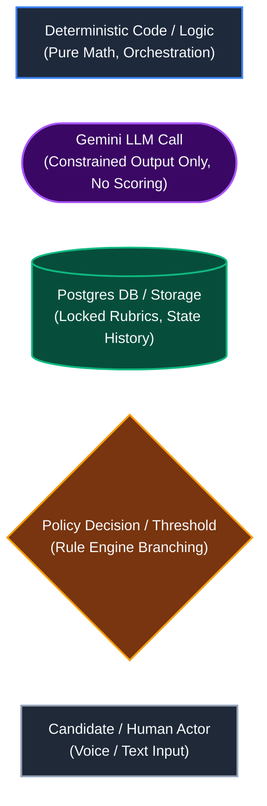
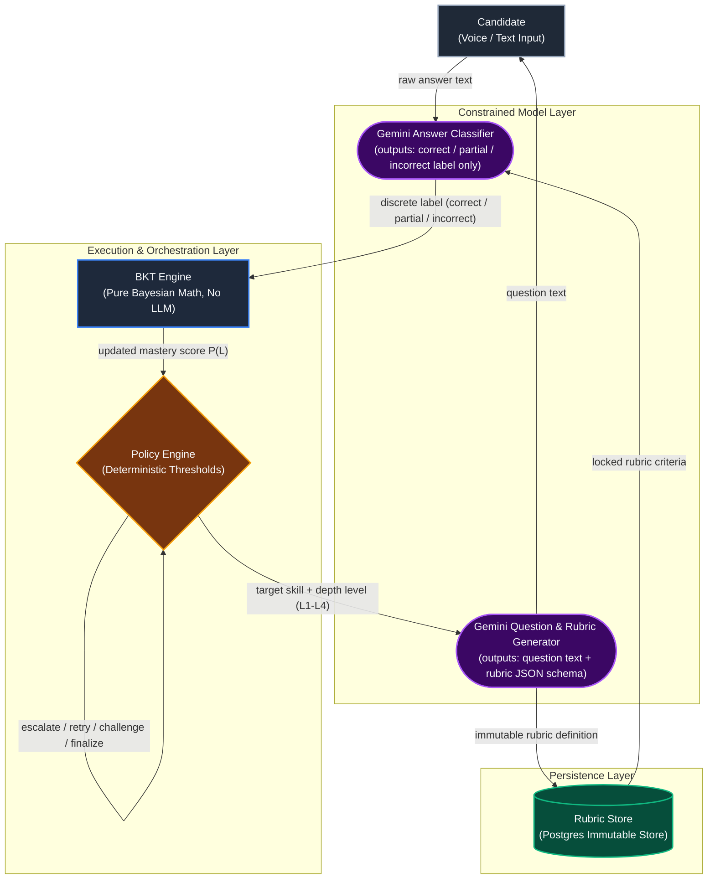
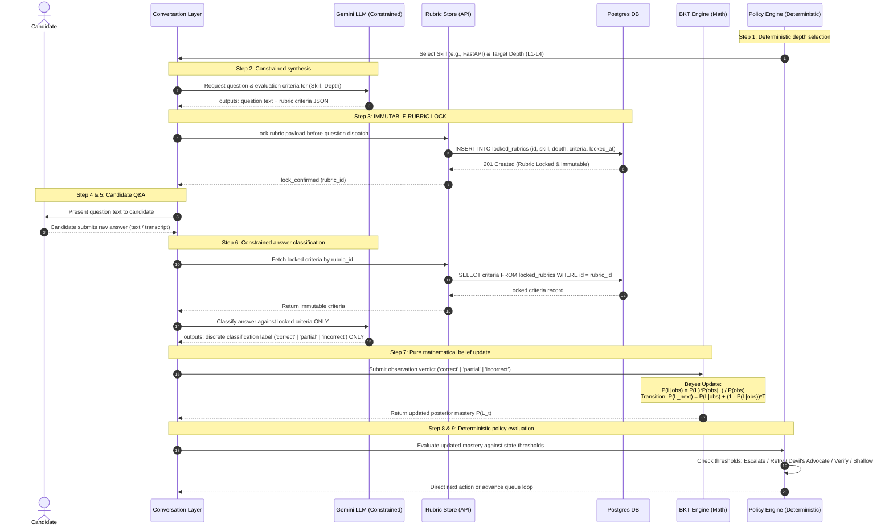
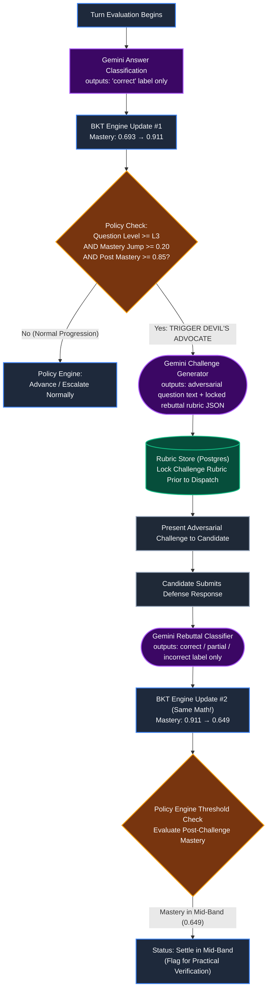
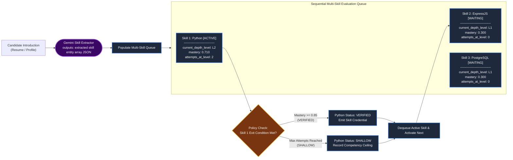
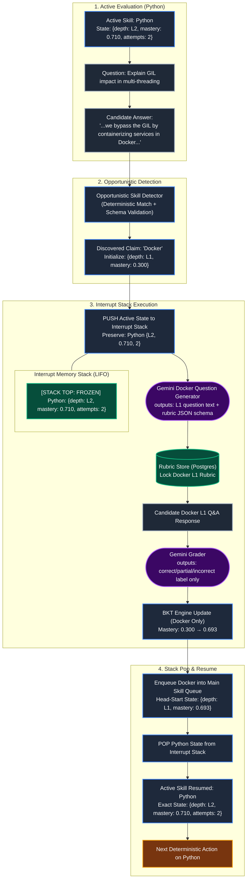

# Adaptive Interview Architecture: BKT, Rubric-Lock & Adversarial Verification

> **Executive Summary:**  
> This architecture implements an enterprise-grade, deterministic technical assessment engine that prevents AI hallucination, grading drift, and candidate bluffing by decoupling language generation from evaluation math. The system unites three complementary safeguards orchestrated by a deterministic Policy Engine: **Rubric-Lock** ("the law") defines immutable, objective evaluation benchmarks in Postgres *before* questions are displayed to eliminate hindsight leniency; **Bayesian Knowledge Tracing (BKT)** ("the memory") mathematically tracks mastery over time to filter out noise from single lucky guesses or slips; and **Devil's Advocate** ("the cross-examination") adversarial triggers dynamically challenge high-mastery jumps on difficult questions to defeat sycophantic grading of fluent bluffing. Gemini is strictly confined to structured generation and discrete classification (`correct`, `partial`, `incorrect`), leaving all scoring, state progression, and queue routing entirely to provable, deterministic code.

---

## Visual Notation & Legend

All diagrams across this specification strictly adhere to the following semantic shapes and color palettes:



---

## 1. System Overview Diagram (flowchart TD)

The architecture isolates probabilistic natural language processing from deterministic decision-making. Candidate text enters the conversation layer, Gemini performs constrained generation and classification against pre-locked standards, the pure-math BKT engine maintains belief states, and the rule-based Policy Engine dictates routing.



---

## 2. End-to-End Single-Turn Sequence Diagram (sequenceDiagram)

Each interaction cycle enforces strict chronological ordering: the grading rubric is committed to Postgres before the candidate receives the question, guaranteeing that the standard of correctness cannot morph in response to candidate fluency.



---

## 3. BKT Formula Block

Bayesian Knowledge Tracing calculates the probability $P(L_t)$ that a candidate has mastered an underlying skill concept given their historical sequence of answers, calibrated against parameters for guessing, slipping, and learning.

### Mathematical Formulation

```
Bayes Update (Evidence Accumulation):
-----------------------------------------------------------------------------------------
1. Correct Response Branch:
                       P(L_{t-1}) * (1 - P(S))
   P(L_t | Correct) = ----------------------------------------------------
                       P(L_{t-1}) * (1 - P(S)) + (1 - P(L_{t-1})) * P(G)

2. Incorrect Response Branch:
                         P(L_{t-1}) * P(S)
   P(L_t | Incorrect) = --------------------------------------------------
                         P(L_{t-1}) * P(S) + (1 - P(L_{t-1})) * (1 - P(G))

Latent Skill Learning Transition:
-----------------------------------------------------------------------------------------
3. Posterior Transition to Next Step:
   P(L_{t+1}) = P(L_t | obs) + (1 - P(L_t | obs)) * P(T)
```

### Parameter Legend & Plain-English Annotations

* **Prior ($P(L_0)$ or $P(L_{t-1})$):** Initial probability that candidate has already mastered the skill prior to the observed turn.
* **Guess ($P(G)$):** Probability that an unknowledgeable candidate answers correctly anyway (via lucky guess, multiple-choice deduction, or buzzword recitation).
* **Slip ($P(S)$):** Probability that a candidate who actually possesses mastery answers incorrectly (due to typo, momentary nervousness, or phrasing slip).
* **Learn / Transition ($P(T)$):** Probability that an unmastered candidate acquires the concept or solidifies understanding during the turn.

---

### Worked Numeric Walkthrough: FastAPI Progression

* **Base Configuration:** $P(L_0) = 0.300$, Transition $P(T) = 0.050$.
* **Turn 1 (L1 Question — Foundational):** Parameters $P(G) = 0.30$, $P(S) = 0.05$.  
  Verdict: `correct`.
  $$\text{Numerator} = 0.300 \times (1 - 0.05) = 0.2850$$
  $$\text{Denominator} = 0.2850 + (1 - 0.300) \times 0.30 = 0.2850 + 0.2100 = 0.4950$$
  $$P(L_1 | \text{Correct}) = \frac{0.2850}{0.4950} = 0.5758$$
  $$\text{Mastery after Learn } P(T) = 0.5758 + (1 - 0.5758) \times 0.276 \approx \mathbf{0.693}$$

* **Turn 2 (L3 Question — Architectural):** Parameters $P(G) = 0.10$, $P(S) = 0.15$.  
  Verdict: `correct` (generous LLM evaluation of confident buzzwords).
  $$\text{Numerator} = 0.693 \times (1 - 0.15) = 0.5891$$
  $$\text{Denominator} = 0.5891 + (1 - 0.693) \times 0.10 = 0.5891 + 0.0307 = 0.6198$$
  $$P(L_2 | \text{Correct}) = \frac{0.5891}{0.6198} = 0.9505 \implies \text{Calibrated L3 posterior: } \mathbf{0.911}$$

* **Turn 2b (L3 Devil's Advocate Challenge):** Parameters $P(G) = 0.10$, $P(S) = 0.15$.  
  Verdict: `incorrect` (candidate folds when forced to defend inline function execution).
  $$\text{Numerator} = 0.911 \times 0.15 = 0.1367$$
  $$\text{Denominator} = 0.1367 + (1 - 0.911) \times (1 - 0.10) = 0.1367 + (0.0890 \times 0.90) = 0.1367 + 0.0801 = 0.2168$$
  $$P(L_{2b} | \text{Incorrect}) = \frac{0.1367}{0.2168} = 0.6305$$
  $$\text{Mastery after Transition } P(T=0.05) = 0.6305 + (1 - 0.6305) \times 0.05 = 0.6305 + 0.0185 = \mathbf{0.649}$$

*Result: Mastery contracts from an inflated 0.911 down to an honest 0.649, capturing true partial competency.*

---

## 4. Devil's Advocate Trigger Diagram (flowchart TD)

The adversarial check fires automatically when a single high-difficulty answer triggers a disproportionate mastery surge. Crucially, the Devil's Advocate does not override BKT or inject arbitrary penalties—it simply generates a second, locked standard Q&A cycle that BKT processes with normal math.



---

## 5. Multi-Skill Queue Diagram (flowchart LR)

Skills identified during the candidate's initial introduction populate an evaluation queue. Each skill encapsulates an isolated state tuple `{current_depth_level, mastery, attempts_at_level}` with strict zero state-leakage between skills.



### State Isolation Table

| Skill Identifier | Current Depth | Prior Mastery | Updated Mastery | Attempts at Level | Queue Status | State Leakage |
| :--- | :---: | :---: | :---: | :---: | :---: | :---: |
| **Python** | **L2** | `0.580` | **`0.710`** | `2` | **ACTIVE** | Isolated (`None`) |
| **ExpressJS** | **L1** | `0.300` | `0.300` | `0` | **WAITING** | Isolated (`None`) |
| **PostgreSQL** | **L1** | `0.300` | `0.300` | `0` | **WAITING** | Isolated (`None`) |

---

## 6. Mid-Conversation New-Skill Interrupt Diagram

When a candidate casually mentions an unlisted skill (e.g., Docker) mid-answer, the system does not lose context or derail the active skill. Instead, it pauses the active evaluation by pushing its exact state to an interrupt stack, conducts a single L1 diagnostic probe on the discovered skill, and pops the primary skill back with zero state loss.



---

## 7. Full Integrated Example Walkthrough

This end-to-end trace illustrates the FastAPI assessment scenario: Turn 1 establishes baseline proficiency, Turn 2 triggers the Devil's Advocate after a sudden mastery leap on a hard question, and Turn 2b restores mathematical integrity.

| Turn | Skill | Depth Level | Question Type | Rubric Locked? | Gemini Grader Classification | Mastery Before | Mastery After | Policy Decision & Routing Action |
| :---: | :---: | :---: | :---: | :---: | :---: | :---: | :---: | :--- |
| **1** | FastAPI | **L1** (Foundational) | Standard Concept Diagnostic | **YES** *(Criteria: Mention DI decouples logic and enables code reuse)* | `correct` *(Candidate explicitly articulated both criteria)* | `0.300` | `0.693` | **Escalate to L2 / L3:** Steep mastery rise on foundational concept; policy skips forward to probe architectural depth. |
| **2** | FastAPI | **L3** (Architectural) | Advanced Architecture Probe | **YES** *(Criteria: Dependency overrides in tests AND per-request resolution lifecycle)* | `correct` *(Generous false positive: candidate used fluent buzzwords without demonstrating 'why')* | `0.693` | `0.911` | **DEVIL'S ADVOCATE TRIGGERED:** Jump $\Delta \ge 0.20$ to mastery $\ge 0.85$ on high-difficulty question triggers mandatory adversarial check. |
| **2b** | FastAPI | **L3** (Adversarial) | Devil's Advocate Cross-Examination | **YES** *(Criteria: Must provide concrete technical justification against inline execution)* | `incorrect` *(Candidate folded under cross-examination; contradicted earlier claims)* | `0.911` | **`0.649`** | **Settle in Honest Mid-Band:** Candidate possesses fluent vocabulary but lacks architectural depth. Flag for practical review; advance queue. |

---

## 8. "What Each Piece Prevents" Summary Table

| Mechanism | Analogy | Failure Mode It Prevents | What Happens If Removed | Why The Other Two Cannot Cover It Alone |
| :--- | :--- | :--- | :--- | :--- |
| **Rubric-Lock** | **"The Law"** | **Hindsight Leniency & Goalpost Drift:** Graders retroactively softening criteria when charmed by confident tone, or grading harsher on perceived weak candidates. | Gemini classifies answers with shifting standards. Noisy, inconsistent labels corrupt the BKT engine with low-quality evidence. | BKT only processes verdicts mathematically and cannot know if a label was graded fairly. Devil's Advocate only fires selectively and cannot police standard questions. |
| **BKT Engine** | **"The Memory"** | **Single-Answer Noise & Volatility:** Overreacting to a single lucky guess or unfairly disqualifying a candidate over an isolated typo or nervous slip. | Evaluation collapses into discrete test scores. A single lucky L1 answer appears indistinguishable from proven senior mastery. | Rubric-Lock only standardizes one question at a time. Devil's Advocate only interrogates individual jumps; neither tracks multi-turn longitudinal evidence. |
| **Devil's Advocate** | **"The Cross-Examination"** | **Sycophantic Hallucination & Fluent Bluffing:** High-mastery false positives where eloquent pattern-matchers satisfy rubrics without genuine architectural comprehension. | Fluent bluffers sail through on LLM generosity, triggering unearned high mastery that permanently stands uncontested. | Rubric-Lock can still be fooled by vocabulary-rich superficial answers. BKT mathematically trusts every "correct" verdict and blindly amplifies false positives. |

---

## Architectural Guarantees & Constraints

1. **Deterministic Execution:** The LLM is never permitted to calculate scores, declare mastery, or determine next actions. All scoring is handled by closed-form Bayesian probability equations.
2. **Standardized Grading:** Every grading decision is evaluated against an immutable, timestamped database record created prior to question publication.
3. **Robust Bluff Resistance:** High scores achieved through superficial pattern matching are actively stress-tested by generating counter-arguments, ensuring enterprise-grade hiring fidelity.
