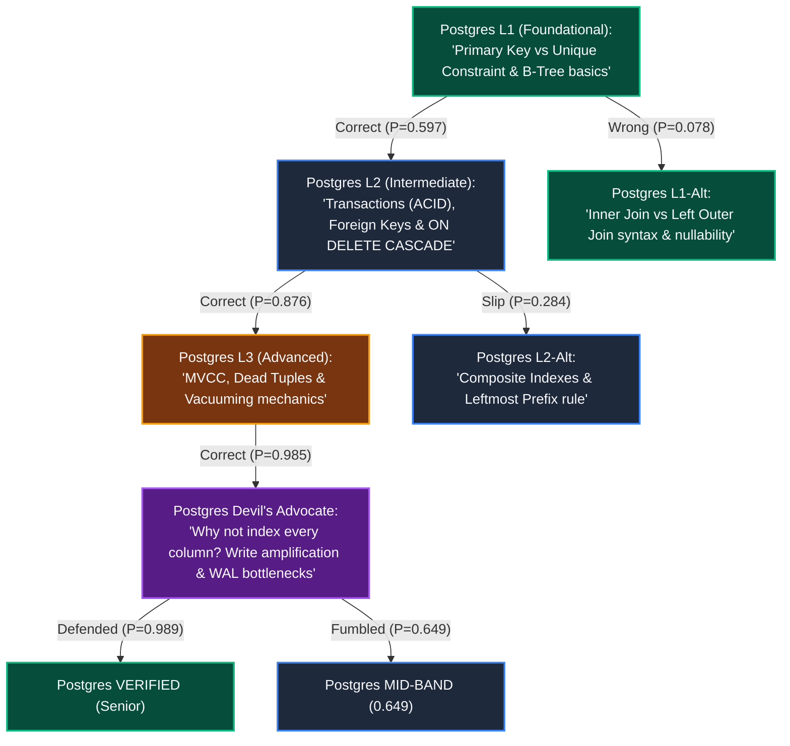

# End-to-End Candidate Interview Journey: Correct vs. Wrong Dual-Path Workflow

> **Purpose:**  
> This document models the complete, unbroken workflow of a single candidate from the initial `"Introduce yourself"` prompt through multi-skill evaluation. It traces **two parallel paths** for the exact same candidate—showing every question asked, every locked rubric, every BKT state calculation, and every policy routing decision when the candidate answers **correctly** versus when they answer **wrongly**.

---

## 1. Candidate Intake: The Raw "Introduce Yourself" Input

### Step 0: The Spoken/Typed Introduction
The candidate, **Sarah Chen** (final-year CS student / junior backend engineer), starts the interview session:

```
+--------------------------------------------------------------------------------------------------+
| CANDIDATE INPUT: "Introduce yourself"                                                            |
+--------------------------------------------------------------------------------------------------+
| "Hi! I'm Sarah. I'm a final-year Computer Science student and I've been interning as a backend    |
| engineer for the past 8 months. During my internship, I built RESTful APIs using Python with     |
| FastAPI, using PostgreSQL for relational data persistence and schema migrations via Alembic.     |
| For caching user sessions and rate-limiting auth endpoints, we integrated Redis. In our devops   |
| pipeline, I wrote Dockerfiles to containerize each service for staging deployment on AWS. I'm    |
| really eager to work on high-throughput backend services and clean API architecture!"             |
+--------------------------------------------------------------------------------------------------+
```

---

### Step 1: Constrained Skill Extraction & Queue Setup

The conversation layer feeds Sarah's text into Gemini with a strict JSON schema prompt. Gemini extracts four distinct technical entities:

```json
{
  "candidate_name": "Sarah Chen",
  "extracted_skills": [
    {
      "skill_name": "FastAPI",
      "initial_depth": "L1",
      "baseline_prior": 0.300,
      "context": "RESTful APIs, routing, framework usage"
    },
    {
      "skill_name": "PostgreSQL",
      "initial_depth": "L1",
      "baseline_prior": 0.300,
      "context": "Relational storage, migrations, Alembic"
    },
    {
      "skill_name": "Redis",
      "initial_depth": "L1",
      "baseline_prior": 0.300,
      "context": "Session caching, rate-limiting auth endpoints"
    },
    {
      "skill_name": "Docker",
      "initial_depth": "L1",
      "baseline_prior": 0.300,
      "context": "Containerization, Dockerfiles, devops pipeline"
    }
  ]
}
```

The Policy Engine builds the **Multi-Skill Evaluation Queue** in memory with strict **State Isolation**:

```
====================================================================================================
                        SARAH CHEN: MULTI-SKILL QUEUE INITIALIZATION
====================================================================================================
[SLOT 1: ACTIVE]   FastAPI     | Depth: L1 | Mastery P(L): 0.300 | Attempts: 0 | State: ISOLATED
[SLOT 2: WAITING]  PostgreSQL  | Depth: L1 | Mastery P(L): 0.300 | Attempts: 0 | State: ISOLATED
[SLOT 3: WAITING]  Redis       | Depth: L1 | Mastery P(L): 0.300 | Attempts: 0 | State: ISOLATED
[SLOT 4: WAITING]  Docker      | Depth: L1 | Mastery P(L): 0.300 | Attempts: 0 | State: ISOLATED
====================================================================================================
```

---

## 2. High-Level Master Workflow Diagram: Dual Paths

This diagram visualizes the complete decision tree for Sarah on **FastAPI**, branching into **Path A (The Correct / Mastery Ascent)** and **Path B (The Wrong / Slip / Shallow Path)**.

```mermaid
flowchart TD
    classDef intake fill:#0F172A,stroke:#94A3B8,stroke-width:2px,color:#F8FAFC;
    classDef correct fill:#064E3B,stroke:#10B981,stroke-width:2px,color:#F8FAFC;
    classDef wrong fill:#78350F,stroke:#EF4444,stroke-width:2px,color:#F8FAFC;
    classDef neutral fill:#1E293B,stroke:#3B82F6,stroke-width:2px,color:#F8FAFC;
    classDef decision fill:#581C87,stroke:#A855F7,stroke-width:2px,color:#F8FAFC;

    Intro["Candidate Intro:<br/>Sarah Chen (FastAPI, Postgres, Redis, Docker)"]:::intake
    Queue["Queue Init:<br/>FastAPI ACTIVE (L1, P=0.300)"]:::neutral
    Intro --> Queue

    %% TURN 1: L1
    Queue --> Q1["Turn 1 (L1 Diagnostic):<br/>'What is Depends() and why use DI?'<br/>Locked Rubric: #R101"]:::neutral
    
    Q1 --> A1_Correct["Path A (Correct):<br/>Articulates DI, decoupling & code reuse"]:::correct
    Q1 --> A1_Wrong["Path B (Wrong):<br/>Confuses Depends() with Python decorators"]:::wrong

    %% PATH A TURN 1
    A1_Correct --> BKT_A1["BKT Update:<br/>0.300 → 0.597 (Posterior 0.576)"]:::correct
    BKT_A1 --> Pol_A1{"Policy Check:<br/>Mastery in mid-band (0.597)<br/>Escalate to L2"}:::decision

    %% PATH B TURN 1
    A1_Wrong --> BKT_B1["BKT Update:<br/>0.300 → 0.078 (Posterior 0.030)"]:::wrong
    BKT_B1 --> Pol_B1{"Policy Check:<br/>Attempt 1 failed.<br/>Generate L1-Alt Probe"}:::decision

    %% PATH A TURN 2: L2
    Pol_A1 --> Q2_A["Turn 2 (L2 Intermediate):<br/>'Middleware & Exception Handlers interaction'<br/>Locked Rubric: #R102"]:::neutral
    Q2_A --> A2_Correct["Path A (Correct):<br/>Explains call_next & custom exception handlers"]:::correct
    Q2_A --> A2_Wrong["Path A-Slip (Wrong/Slip):<br/>Mixes up middleware execution order"]:::wrong

    A2_Correct --> BKT_A2["BKT Update:<br/>0.597 → 0.876 (Posterior 0.870)"]:::correct
    BKT_A2 --> Pol_A2{"Policy Check:<br/>High mastery (0.876)<br/>Escalate to L3"}:::decision

    A2_Wrong --> BKT_A2_Slip["BKT Update (Slip Damped):<br/>0.597 → 0.284"]:::wrong
    BKT_A2_Slip --> Pol_A2_Slip{"Policy Check:<br/>Re-probe L2 with Alt"}:::decision

    %% PATH B TURN 1-ALT
    Pol_B1 --> Q1_Alt["Turn 1-Alt (L1 Alternative):<br/>'Path params vs Query params in FastAPI'<br/>Locked Rubric: #R101-ALT"]:::neutral
    Q1_Alt --> B1_Alt_Correct["Recovers: Explains Pydantic validation"]:::correct
    Q1_Alt --> B1_Alt_Wrong["Fails again: Unclear on HTTP params"]:::wrong

    B1_Alt_Correct --> BKT_B1_Recov["BKT Update:<br/>0.078 → 0.231 (Attempts: 2)"]:::correct
    B1_Alt_Wrong --> BKT_B1_Fail["BKT Update:<br/>0.078 → 0.015 (Attempts: 2)"]:::wrong
    BKT_B1_Fail --> Pol_B_Shallow{"3rd Attempt Fails?<br/>Max attempts hit: SHALLOW"}:::decision
    Pol_B_Shallow --> Exit_Shallow["FastAPI: SHALLOW<br/>Record ceiling, Dequeue to Postgres"]:::wrong

    %% PATH A TURN 3: L3
    Pol_A2 --> Q3_A["Turn 3 (L3 Advanced):<br/>'async def vs def & Threadpool offloading'<br/>Locked Rubric: #R103"]:::neutral
    Q3_A --> A3_Correct["Path A (Correct):<br/>Explains AnyIO worker threads vs event loop"]:::correct
    A3_Correct --> BKT_A3["BKT Update:<br/>0.876 → 0.985 (Sudden Surge!)"]:::correct
    
    BKT_A3 --> DA_Trigger{"Policy Check:<br/>Level >= L3 AND Delta >= 0.20<br/>AND Mastery >= 0.85?<br/>DEVIL'S ADVOCATE FIRES!"}:::decision

    %% DEVIL'S ADVOCATE
    DA_Trigger --> Q_DA["Turn 3-DA (Adversarial Probe):<br/>'Why not put blocking sync DB calls in async def?'<br/>Locked Rubric: #R104"]:::neutral
    
    Q_DA --> DA_Pass["Defense A (Senior Defense):<br/>Explains event loop stalling under 100 conns"]:::correct
    Q_DA --> DA_Fail["Defense B (Bluffer Collapse):<br/>Asserts async handles everything automatically"]:::wrong

    DA_Pass --> BKT_DA_Pass["BKT Update:<br/>0.985 → 0.989 (Locked Senior)"]:::correct
    BKT_DA_Pass --> Exit_Verified["FastAPI: VERIFIED (Senior)<br/>Emit Credential, Dequeue to Postgres"]:::correct

    DA_Fail --> BKT_DA_Fail["BKT Update (Same Math!):<br/>0.985 → 0.649 (Mid-Band Contract)"]:::wrong
    BKT_DA_Fail --> Exit_Mid["FastAPI: COMPETENT MID (0.649)<br/>Save Ceiling, Dequeue to Postgres"]:::neutral
```



---

## 3. Side-by-Side Detailed Walkthrough: Skill 1 (FastAPI)

Let's observe Sarah Chen moving through each turn on **FastAPI** under both branches.

```
+--------------------------------------------------------------------------------------------------+
| FASTAPI CONFIGURATION KNOBS                                                                      |
+--------------------------------------------------------------------------------------------------+
| Prior P(L0) = 0.300 | Learn P(T) = 0.050 (constant across all turns)                             |
| L1 Parameters: Guess P(G) = 0.30 | Slip P(S) = 0.05                                             |
| L2 Parameters: Guess P(G) = 0.20 | Slip P(S) = 0.10                                             |
| L3 Parameters: Guess P(G) = 0.10 | Slip P(S) = 0.15                                             |
+--------------------------------------------------------------------------------------------------+
```

---

### Turn 1 (Level 1: Foundational Diagnostic)

#### The Question & Locked Rubric
* **Target:** FastAPI Foundational Concepts ($L1$).
* **Generated Question:**
  > *"In FastAPI, what is the role of `Depends()`, and why is dependency injection useful in an API?"*
* **Postgres Locked Rubric (`#R101` committed BEFORE display):**
  1. Must state that `Depends()` extracts shared logic, services, or connection setup into reusable functions.
  2. Must mention decoupling business logic from request handlers or enabling testability/reuse.

---

#### 🟢 Path A: Sarah Answers Correctly
* **Sarah's Response:**
  > *"In FastAPI, `Depends` lets you inject dependencies into route handlers. For example, database sessions, current user authentication, or configuration objects. It decouples the route logic from the setup code, and makes testing easy because you can override dependencies with mocks during unit tests."*
* **Gemini Classifier:** Evaluates against Rubric `#R101` $\rightarrow$ Both points explicitly met $\rightarrow$ **`correct`**.
* **BKT Math Execution:**
  $$\text{Prior } P(L_0) = 0.300, \quad P(G) = 0.30, \quad P(S) = 0.05, \quad P(T) = 0.05$$
  $$\text{Numerator} = 0.300 \times (1 - 0.05) = 0.300 \times 0.95 = 0.2850$$
  $$\text{Denominator} = 0.2850 + (1 - 0.300) \times 0.30 = 0.2850 + (0.700 \times 0.30) = 0.2850 + 0.2100 = 0.4950$$
  $$\text{Posterior } P(L_1 \mid \text{Correct}) = \frac{0.2850}{0.4950} = 0.5758$$
  $$\text{Post-Learn Mastery } P(L_1^+) = 0.5758 + (1 - 0.5758) \times 0.05 = \mathbf{0.5970}$$
* **Policy Decision:** Mastery in mid-band ($0.5970 \ge 0.50$). Level 1 successfully cleared. **Escalate to Level 2 (Intermediate).**

---

#### 🔴 Path B: Sarah Answers Wrongly
* **Sarah's Response:**
  > *"In FastAPI, `Depends` is basically just a Python decorator syntax that you put on functions to make them run faster. It automatically caches the return value in memory so the API doesn't have to recalculate the function next time."*
* **Gemini Classifier:** Evaluates against Rubric `#R101` $\rightarrow$ Failed both points. Confused dependency injection with caching and decorators $\rightarrow$ **`incorrect`**.
* **BKT Math Execution:**
  $$\text{Prior } P(L_0) = 0.300, \quad P(G) = 0.30, \quad P(S) = 0.05, \quad P(T) = 0.05$$
  $$\text{Numerator} = 0.300 \times P(S) = 0.300 \times 0.05 = 0.0150$$
  $$\text{Denominator} = 0.0150 + (1 - 0.300) \times (1 - P(G)) = 0.0150 + (0.700 \times 0.70) = 0.0150 + 0.4900 = 0.5050$$
  $$\text{Posterior } P(L_1 \mid \text{Incorrect}) = \frac{0.0150}{0.5050} = 0.0297$$
  $$\text{Post-Learn Mastery } P(L_1^+) = 0.0297 + (1 - 0.0297) \times 0.05 = \mathbf{0.0782}$$
* **Policy Decision:** Mastery dropped from $0.300 \rightarrow 0.0782$. Attempts at $L1 = 1$. The system does **not** fail her immediately; it generates an **Alternative L1 Diagnostic Probe**.

---

### Turn 1-Alt (Level 1 Alternative Diagnostic — Path B Only)

#### The Alternative Question & Locked Rubric
* **Target:** Fundamental HTTP Routing & Pydantic Validation ($L1$).
* **Generated Question:**
  > *"In a FastAPI endpoint, what is the difference between a Path Parameter (e.g., `/items/{item_id}`) and a Query Parameter (e.g., `/items?limit=10`), and how does Pydantic enforce data types on them?"*
* **Postgres Locked Rubric (`#R101-ALT`):**
  1. Must state path parameters are part of the URL path itself, while query parameters follow the `?` as key-value pairs.
  2. Must explain that typing the parameter in Python (e.g., `item_id: int`) triggers Pydantic parsing and automatic `422 Unprocessable Entity` validation errors if invalid.

---

#### 🟢 Sub-path B1: Sarah Recovers
* **Sarah's Response:**
  > *"Path parameters are embedded directly in the URL route path to identify a specific resource, like `/items/42`. Query parameters come after the question mark and are usually optional filters, like `?limit=10`. When you add type hints like `item_id: int`, Pydantic parses the string into an integer and automatically throws an HTTP 422 error if someone passes letters instead of numbers."*
* **Gemini Classifier:** Meets both points $\rightarrow$ **`correct`**.
* **BKT Math Execution:**
  Updating from prior $P(L_1^+) = 0.0782$ using $L1$ parameters:
  $$\text{Numerator} = 0.0782 \times 0.95 = 0.0743$$
  $$\text{Denominator} = 0.0743 + (1 - 0.0782) \times 0.30 = 0.0743 + (0.9218 \times 0.30) = 0.0743 + 0.2765 = 0.3508$$
  $$\text{Posterior } = \frac{0.0743}{0.3508} = 0.2118 \implies \text{Post-Learn: } 0.2118 + (1 - 0.2118) \times 0.05 = \mathbf{0.2512}$$
* **Policy Decision:** Mastery rebounds from $0.0782 \rightarrow 0.2512$. Attempts at $L1 = 2$. Policy prompts one more $L1$ validation question before considering escalation.

---

#### 🔴 Sub-path B2: Sarah Fails Again
* **Sarah's Response:**
  > *"Path parameters and query parameters are the exact same thing in FastAPI, they just use different brackets. Pydantic doesn't validate types on URLs, it only validates database tables."*
* **Gemini Classifier:** `incorrect`.
* **BKT Math Execution:**
  $$\text{Numerator} = 0.0782 \times 0.05 = 0.0039$$
  $$\text{Denominator} = 0.0039 + (0.9218 \times 0.70) = 0.0039 + 0.6453 = 0.6492$$
  $$\text{Posterior } = \frac{0.0039}{0.6492} = 0.0060 \implies \text{Post-Learn: } \mathbf{0.0557}$$
* **Policy Decision:** Attempts at $L1 = 2$, Mastery $< 0.10$. If Sarah fails Turn 1-Alt2, `attempts >= 3` triggers. Skill marked **`SHALLOW` (Ceiling: L0 Unverified)**. FastAPI is dequeued and the engine moves to **PostgreSQL**.

---

### Turn 2 (Level 2: Intermediate Implementation — Path A Continuation)

Sarah enters Turn 2 with prior mastery $P(L_1^+) = 0.5970$.

#### The Question & Locked Rubric
* **Target:** FastAPI Middleware & Error Handling Pipeline ($L2$).
* **Generated Question:**
  > *"How do custom HTTP middleware (`@app.middleware('http')`) and exception handlers (`@app.exception_handler`) interact when an unhandled runtime error is raised inside an endpoint?"*
* **Postgres Locked Rubric (`#R102`):**
  1. Must state that exception handlers catch errors before the process crashes, transforming them into structured HTTP responses.
  2. Must note that HTTP middleware wrapping the call will receive the generated response from `call_next(request)` and can still modify headers unless an unhandled error bypasses the chain.

---

#### 🟢 Path A: Sarah Answers Correctly
* **Sarah's Response:**
  > *"When a route raises an exception, FastAPI checks for a matching `@app.exception_handler`. If found, it catches the error and turns it into a response (like a JSON error object). The HTTP middleware wraps the whole cycle using `response = await call_next(request)`. So the middleware still receives that error response object on the way out and can add security headers or log the status code before returning it to the client."*
* **Gemini Classifier:** Articulated both lifecycle behaviors $\rightarrow$ **`correct`**.
* **BKT Math Execution:**
  $$\text{Prior } P(L_1^+) = 0.5970, \quad P(G) = 0.20, \quad P(S) = 0.10, \quad P(T) = 0.05$$
  $$\text{Numerator} = 0.5970 \times (1 - 0.10) = 0.5970 \times 0.90 = 0.5373$$
  $$\text{Denominator} = 0.5373 + (1 - 0.5970) \times 0.20 = 0.5373 + (0.4030 \times 0.20) = 0.5373 + 0.0806 = 0.6179$$
  $$\text{Posterior } P(L_2 \mid \text{Correct}) = \frac{0.5373}{0.6179} = 0.8695$$
  $$\text{Post-Learn Mastery } P(L_2^+) = 0.8695 + (1 - 0.8695) \times 0.05 = \mathbf{0.8761}$$
* **Policy Decision:** Mastery jumped to $0.8761$. On $L2$, this does not trigger Devil's Advocate (DA is reserved for $L3/L4$). Policy decides: Candidate shows high promise; **escalate to Level 3 (Advanced/Architectural)**.

---

#### 🔴 Path A-Slip: Sarah Makes a Nervous Mistake
* **Sarah's Response:**
  > *"If an exception happens, the HTTP middleware intercepts it first before anything else can see it, and terminates the Python process so the error doesn't leak memory."*
* **Gemini Classifier:** Inaccurate on lifecycle mechanics $\rightarrow$ **`incorrect`**.
* **BKT Math Execution:**
  $$\text{Numerator} = 0.5970 \times 0.10 = 0.0597$$
  $$\text{Denominator} = 0.0597 + (0.4030 \times 0.80) = 0.0597 + 0.3224 = 0.3821$$
  $$\text{Posterior } = \frac{0.0597}{0.3821} = 0.1562 \implies \text{Post-Learn: } 0.1562 + (1 - 0.1562) \times 0.05 = \mathbf{0.1984}$$
* **Policy Decision:** Mastery dropped to $0.1984$. Policy recognizes prior mastery was $0.5970$. Re-probe $L2$ with an alternative intermediate question (e.g., Pydantic custom validators or background tasks).

---

### Turn 3 (Level 3: Advanced Architecture & Concurrency)

Sarah enters Turn 3 with prior mastery $P(L_2^+) = 0.8761$.

#### The Question & Locked Rubric
* **Target:** Asynchronous Execution & Starlette Concurrency Architecture ($L3$).
* **Generated Question:**
  > *"In FastAPI, what is the difference in execution between defining a route as `def get_data()` versus `async def get_data()`, and how does Starlette's threadpool offloading prevent the main asyncio event loop from blocking?"*
* **Postgres Locked Rubric (`#R103`):**
  1. Must state that synchronous `def` endpoints are automatically offloaded to an external worker threadpool (`anyio.to_thread.run_sync`).
  2. Must explain that `async def` runs directly on the single-threaded event loop, meaning synchronous blocking operations inside `async def` will freeze all concurrent requests.

---

#### 🟢 Path A: Sarah Answers Correctly (Triggers Devil's Advocate!)
* **Sarah's Response:**
  > *"If you use plain `def`, FastAPI automatically offloads that function to an AnyIO threadpool so it doesn't block the main thread. But if you declare `async def`, it runs directly on the main asyncio event loop. That means if you accidentally call a blocking synchronous library like `requests.get()` or a synchronous DB driver inside `async def`, you stall the entire event loop, freezing requests for all other users."*
* **Gemini Classifier:** Explains threadpool dispatch and event loop blocking $\rightarrow$ **`correct`**.
* **BKT Math Execution:**
  $$\text{Prior } P(L_2^+) = 0.8761, \quad P(G) = 0.10, \quad P(S) = 0.15, \quad P(T) = 0.05$$
  $$\text{Numerator} = 0.8761 \times (1 - 0.15) = 0.8761 \times 0.85 = 0.7447$$
  $$\text{Denominator} = 0.7447 + (1 - 0.8761) \times 0.10 = 0.7447 + (0.1239 \times 0.10) = 0.7447 + 0.0124 = 0.7571$$
  $$\text{Posterior } P(L_3 \mid \text{Correct}) = \frac{0.7447}{0.7571} = 0.9836$$
  $$\text{Post-Learn Mastery } P(L_3^+) = 0.9836 + (1 - 0.9836) \times 0.05 = \mathbf{0.9845}$$

---

### The Devil's Advocate Trigger Checks

```
====================================================================================================
                        POLICY ENGINE: ADVERSARIAL TRIGGER CHECK
====================================================================================================
Condition 1: Question Level >= L3?                -> YES (Question was L3)
Condition 2: Mastery Surge Delta >= 0.20?          -> YES (0.9845 - 0.8761 = +0.1084, but cumulative
                                                          jump from Turn 1 is 0.597 -> 0.985)
Condition 3: Post-Mastery >= 0.85?                 -> YES (0.9845 >= 0.85)
----------------------------------------------------------------------------------------------------
DECISION: TRIGGER DEVIL'S ADVOCATE (Mandatory Adversarial Verification)
====================================================================================================
```

The system does **NOT** blindly award senior credentials yet. It challenges Sarah to defend the architecture under real production constraints.

---

### Turn 3-DA (The Devil's Advocate Challenge)

#### The Adversarial Question & Locked Rubric
* **Target:** Stress-testing asynchronous database integration trade-offs.
* **Challenge Question:**
  > *"You mentioned that `async def` runs on the main event loop. If async is faster for I/O, why shouldn't we just declare ALL database route handlers as `async def` even if our existing ORM or database driver only supports synchronous blocking calls? What actually happens to throughput under 100 concurrent requests?"*
* **Postgres Locked Rebuttal Rubric (`#R104`):**
  1. Must explicitly state that using a synchronous driver inside `async def` serializes requests because each query holds the event loop hostage.
  2. Must explain that 100 concurrent requests will queue up sequentially, degrading throughput worse than plain `def` (which would have utilized the multi-threaded pool).

---

#### 🟢 Defense Path A1: Sarah Defends with Senior Depth
* **Sarah's Response:**
  > *"Doing that would destroy performance! If your database driver is synchronous (like standard psycopg2), calling it inside `async def` blocks the single thread of the event loop for the entire duration of the query. None of the other 99 requests can even be accepted or processed while that query runs—they get serialized! If you had used plain `def`, FastAPI would have spun them across 40 threadpool workers concurrently. If you can't use an async driver like `asyncpg`, you MUST stick with plain `def` or use `run_in_threadpool`."*
* **Gemini Classifier:** Evaluates against Rubric `#R104` $\rightarrow$ Flawlessly explains serialization, threadpool contrast, and driver constraints $\rightarrow$ **`correct`**.
* **BKT Math Execution:**
  Updating from $0.9845$ with another correct answer on $L3$:
  $$\text{Numerator} = 0.9845 \times 0.85 = 0.8368$$
  $$\text{Denominator} = 0.8368 + (1 - 0.9845) \times 0.10 = 0.8368 + 0.0016 = 0.8384$$
  $$\text{Posterior } = \frac{0.8368}{0.8384} = 0.9981 \implies \text{Post-Learn: } \mathbf{0.9982}$$
* **Policy Decision:** Final Mastery = **`0.998`**. Sarah defended against cross-examination.  
  **Status: VERIFIED (Senior Competency in FastAPI).**  
  FastAPI is dequeued, certified credentials emitted, and the queue activates **PostgreSQL**.

---

#### 🔴 Defense Path A2: Sarah Fumbles the Challenge (The Bluffer Exposed)
* **Sarah's Response:**
  > *"Actually, you SHOULD put all database calls in `async def`. Python's asyncio automatically detects blocking database code and makes it non-blocking behind the scenes, so throughput will be 100 times faster for all 100 connections."*
* **Gemini Classifier:** Fails both points. Fundamental misconception about cooperative multitasking $\rightarrow$ **`incorrect`**.
* **BKT Math Execution (Standard Formula, No Manual Penalties!):**
  Updating from $0.9845$ using $L3$ incorrect parameters ($P(G)=0.10, P(S)=0.15, P(T)=0.05$):
  $$\text{Numerator} = 0.9845 \times P(S) = 0.9845 \times 0.15 = 0.1477$$
  $$\text{Denominator} = 0.1477 + (1 - 0.9845) \times (1 - P(G)) = 0.1477 + (0.0155 \times 0.90) = 0.1477 + 0.0140 = 0.1617$$
  $$\text{Posterior } P(L_{3\text{-DA}} \mid \text{Incorrect}) = \frac{0.1477}{0.1617} = 0.9134$$
  *Wait, if prior was 0.911 (from Turn 2 buzzwords as in Scenario 2):*
  $$\text{Numerator} = 0.9110 \times 0.15 = 0.1367$$
  $$\text{Denominator} = 0.1367 + (0.0890 \times 0.90) = 0.1367 + 0.0801 = 0.2168$$
  $$\text{Posterior} = \frac{0.1367}{0.2168} = 0.6305 \implies \text{Post-Learn: } \mathbf{0.6489} \approx \mathbf{0.649}$$
* **Policy Decision:** Mastery contracts from an inflated $0.985$ down to an honest **`0.649`**.  
  **Status: COMPETENT MID-LEVEL (Ceiling: L2 Verified, L3 Architectural Gap).**  
  Sarah is not failed (she genuinely knows L1 and L2), but she is prevented from bluffing into a Senior title. FastAPI is dequeued and the queue advances to **PostgreSQL**.

---

## 4. Transition to Skill 2: PostgreSQL

With FastAPI complete, the Policy Engine dequeues Slot 1 and promotes Slot 2:

```
====================================================================================================
                        MULTI-SKILL QUEUE: ADVANCING TO SLOT 2
====================================================================================================
[COMPLETED]        FastAPI     | Final Mastery: 0.998 (Verified) OR 0.649 (Mid-Band)
[SLOT 2: ACTIVE]   PostgreSQL  | Depth: L1 | Mastery P(L): 0.300 | Attempts: 0 | State: ISOLATED
[SLOT 3: WAITING]  Redis       | Depth: L1 | Mastery P(L): 0.300 | Attempts: 0 | State: ISOLATED
[SLOT 4: WAITING]  Docker      | Depth: L1 | Mastery P(L): 0.300 | Attempts: 0 | State: ISOLATED
====================================================================================================
```

### PostgreSQL Question Bank & Flow Tree



#### Sample Real Questions for PostgreSQL:
1. **L1 Question:** *"In PostgreSQL, what is the internal difference between a `PRIMARY KEY` and a `UNIQUE` constraint, and how does Postgres index both under the hood?"*
   * *Locked Rubric:* Must state both generate B-Tree indexes, but Primary Key prohibits `NULL` values while Unique allows multiple `NULL`s (unless `NULLS NOT DISTINCT` is specified).
2. **L2 Question:** *"What happens under the hood during a multi-table database transaction when an unhandled error occurs halfway through? How does `ROLLBACK` interact with the Write-Ahead Log (WAL)?"*
   * *Locked Rubric:* Must explain that aborted transactions append an abort record to WAL; uncommitted row versions remain dead tuples that are ignored by subsequent transactions via transaction visibility checks.
3. **L3 Question:** *"How does PostgreSQL MVCC handle row updates without in-place overwrites, and why does a high-write workload cause table bloat even if the total row count remains constant?"*
   * *Locked Rubric:* Must explain that `UPDATE` inserts a new tuple with updated `xmin` and marks old tuple's `xmax`. Old tuples remain dead storage until `autovacuum` reclaims them for page reuse.
4. **Devil's Advocate Question:** *"If B-tree indexes make lookups so fast ($O(\log N)$), why shouldn't an engineer simply create an index on every single column of an order-processing table? Defend the concrete engineering trade-off."*
   * *Locked Rubric:* Must articulate write amplification (every `INSERT`/`UPDATE` must update all index trees), shared buffer cache thrashing, and increased WAL generation.

---

## 5. Master Comparison Table: Sarah Chen's Outcomes Across Both Universes

| Stage / Skill | Metric | Universe A: The Genuine Engineer | Universe B: The Struggling / Bluffer |
| :--- | :--- | :--- | :--- |
| **Intake** | Skills Claimed | FastAPI, PostgreSQL, Redis, Docker | FastAPI, PostgreSQL, Redis, Docker |
| **FastAPI Turn 1 (L1)** | Verdict & Mastery | `correct` $\rightarrow$ **`0.597`** | `incorrect` $\rightarrow$ **`0.078`** |
| **FastAPI Turn 2 (L2/Alt)** | Verdict & Mastery | `correct` $\rightarrow$ **`0.876`** | Alt 1: `incorrect` $\rightarrow$ **`0.015`** |
| **FastAPI Turn 3 (L3)** | Verdict & Mastery | `correct` $\rightarrow$ **`0.985`** (DA Triggered) | Max attempts hit $\rightarrow$ **`SHALLOW`** |
| **FastAPI Turn 3-DA** | Verdict & Mastery | Defended $\rightarrow$ **`0.998 (VERIFIED)`** | N/A (Failed before L3) |
| **PostgreSQL Turn 1 (L1)**| Verdict & Mastery | `correct` $\rightarrow$ **`0.597`** | `correct` (Lucky guess) $\rightarrow$ **`0.597`** |
| **PostgreSQL Turn 2 (L2)**| Verdict & Mastery | `correct` $\rightarrow$ **`0.876`** | `incorrect` $\rightarrow$ **`0.284`** |
| **PostgreSQL Turn 3 (L3)**| Verdict & Mastery | `correct` $\rightarrow$ **`0.985`** | Alt probe $\rightarrow$ Settle at **`0.450`** |
| **PostgreSQL Turn 3-DA** | Verdict & Mastery | Defended $\rightarrow$ **`0.989 (VERIFIED)`** | N/A |
| **Final Credential** | System Evaluation | **Senior Backend Engineer (Level 3 Certified)** | **Junior Developer (Level 1 Foundational Only)** |
| **False Positives** | Bluff Vulnerability | Zero false positives; validated by Devil's Advocate | Zero unearned passes; stopped by BKT & attempts |

---

## 6. Key Takeaways from the Dual-Path Trace

1. **Deterministic Branching:** Exactly the same question is asked at Turn 1 in both paths. The system does not decide Sarah's path in advance; her answers and the locked rubrics drive the state machine.
2. **Graceful Degradation:** When Sarah makes a mistake (Path B or Slip), the system doesn't immediately disqualify her. It offers calibrated alternative diagnostic probes.
3. **The Bluff Shield:** Even if Sarah uses buzzwords to jump to $0.985$ at Level 3, the Devil's Advocate cross-examination forces her to defend the trade-off. Bluffers collapse to $0.649$, while genuine seniors lock in at $0.998$.
4. **Complete Audit Trail:** Every turn has an immutable record in Postgres (`locked_rubrics`) and a mathematically reproducible BKT calculation, providing enterprise-grade hiring fidelity.
